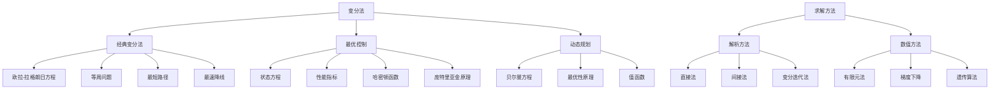

# 08. 变分法（Calculus of Variations）

## 08.1 目录

- [08. 变分法（Calculus of Variations）](#08-变分法calculus-of-variations)
  - [08.1 目录](#081-目录)
  - [08.2 基本概念与历史](#082-基本概念与历史)
    - [08.2.1 定义与本质](#0821-定义与本质)
    - [08.2.2 历史发展](#0822-历史发展)
    - [08.2.3 认知映射](#0823-认知映射)
  - [08.3 核心理论](#083-核心理论)
    - [08.3.1 欧拉-拉格朗日方程](#0831-欧拉-拉格朗日方程)
    - [08.3.2 变分原理](#0832-变分原理)
    - [08.3.3 约束变分问题](#0833-约束变分问题)
  - [08.4 主要分支](#084-主要分支)
    - [08.4.1 经典变分法](#0841-经典变分法)
    - [08.4.2 多变量变分法](#0842-多变量变分法)
    - [08.4.3 最优控制理论](#0843-最优控制理论)
  - [08.5 典型定理与公式](#085-典型定理与公式)
    - [08.5.1 基本定理](#0851-基本定理)
    - [08.5.2 重要公式](#0852-重要公式)
  - [08.6 可视化与多表征](#086-可视化与多表征)
    - [08.6.1 结构关系图（Mermaid）](#0861-结构关系图mermaid)
    - [08.6.2 典型图示](#0862-典型图示)
  - [08.7 应用与建模](#087-应用与建模)
    - [08.7.1 物理应用](#0871-物理应用)
    - [08.7.2 工程应用](#0872-工程应用)
    - [08.7.3 经济学应用](#0873-经济学应用)
  - [08.8 学习建议与资源](#088-学习建议与资源)
    - [08.8.1 学习路径](#0881-学习路径)
    - [08.8.2 推荐资源](#0882-推荐资源)
    - [08.8.3 实践项目](#0883-实践项目)

---

## 08.2 基本概念与历史

### 08.2.1 定义与本质

**变分法**是研究泛函极值问题的数学分支，主要研究如何找到使泛函达到极值的函数。

**核心问题**:
给定泛函 $J[y] = \int_a^b F(x, y, y') dx$，寻找函数 $y(x)$ 使得 $J[y]$ 达到极值。

### 08.2.2 历史发展

- **17世纪**：费马原理（最短时间原理）
- **18世纪**：欧拉-拉格朗日方程
- **19世纪**：哈密顿原理、雅可比理论
- **20世纪**：最优控制理论、动态规划

### 08.2.3 认知映射

**数学思维**:

- 从局部到整体的优化思维
- 变分与微分的类比
- 泛函分析的几何直觉

**软件工程映射**:

- 算法优化与性能调优
- 系统架构的最优设计
- 资源分配的最优化

---

## 08.3 核心理论

### 08.3.1 欧拉-拉格朗日方程

**基本形式**:

```latex
\frac{d}{dx} \frac{\partial F}{\partial y'} - \frac{\partial F}{\partial y} = 0
```

**特殊情况**:

- 不显含 $x$：$F - y' \frac{\partial F}{\partial y'} = C$
- 不显含 $y$：$\frac{\partial F}{\partial y'} = C$

### 08.3.2 变分原理

**一阶变分**:

```latex
\delta J = \int_a^b \left( \frac{\partial F}{\partial y} - \frac{d}{dx} \frac{\partial F}{\partial y'} \right) \delta y \, dx
```

**边界条件**:

- 固定端点：$y(a) = y_a, y(b) = y_b$
- 自由端点：自然边界条件

### 08.3.3 约束变分问题

**等周问题**:

```latex
J[y] = \int_a^b F(x, y, y') dx \quad \text{subject to} \quad \int_a^b G(x, y, y') dx = C
```

**拉格朗日乘数法**:

```latex
\frac{d}{dx} \frac{\partial (F + \lambda G)}{\partial y'} - \frac{\partial (F + \lambda G)}{\partial y} = 0
```

---

## 08.4 主要分支

### 08.4.1 经典变分法

**最短路径问题**:

```latex
J[y] = \int_a^b \sqrt{1 + (y')^2} dx
```

**最速降线问题**:

```latex
J[y] = \int_0^a \frac{\sqrt{1 + (y')^2}}{\sqrt{2gy}} dx
```

### 08.4.2 多变量变分法

**二维问题**:

```latex
J[u] = \iint_D F(x, y, u, u_x, u_y) dx dy
```

**欧拉方程**:

```latex
\frac{\partial F}{\partial u} - \frac{\partial}{\partial x} \frac{\partial F}{\partial u_x} - \frac{\partial}{\partial y} \frac{\partial F}{\partial u_y} = 0
```

### 08.4.3 最优控制理论

**状态方程**:

```latex
\dot{x} = f(x, u, t)
```

**性能指标**:

```latex
J = \int_0^T L(x, u, t) dt + \phi(x(T))
```

**哈密顿函数**:

```latex
H(x, u, \lambda, t) = L(x, u, t) + \lambda^T f(x, u, t)
```

---

## 08.5 典型定理与公式

### 08.5.1 基本定理

**欧拉-拉格朗日定理**:

```latex
\text{If } y \text{ minimizes } J[y], \text{ then } \frac{d}{dx} \frac{\partial F}{\partial y'} - \frac{\partial F}{\partial y} = 0
```

**勒让德条件**:

```latex
\frac{\partial^2 F}{\partial y'^2} \geq 0 \quad \text{(for minimum)}
```

**雅可比条件**:

```latex
\text{Conjugate points must not exist in } (a, b)
```

### 08.5.2 重要公式

**哈密顿-雅可比方程**:

```latex
\frac{\partial S}{\partial t} + H\left(x, \frac{\partial S}{\partial x}, t\right) = 0
```

**贝尔曼方程**:

```latex
V(x, t) = \min_u \left\{ L(x, u, t) + V(f(x, u, t), t + \Delta t) \right\}
```

**庞特里亚金最大值原理**:

```latex
H(x^*, u^*, \lambda^*, t) \geq H(x^*, u, \lambda^*, t) \quad \forall u
```

---

## 08.6 可视化与多表征

### 08.6.1 结构关系图（Mermaid）



### 08.6.2 典型图示

**最速降线可视化**:

```haskell
-- 最速降线（摆线）可视化
import Graphics.Gnuplot.Simple

cycloid :: Double -> Double -> Double
cycloid t a = a * (t - sin t)

cycloidY :: Double -> Double -> Double
cycloidY t a = a * (1 - cos t)

plotCycloid :: IO ()
plotCycloid = plotList [] [(cycloid t 1, cycloidY t 1) | t <- [0, 0.1..2*pi]]
```

**变分问题数值解**:

```rust
// 梯度下降法求解变分问题
fn gradient_descent<F>(f: F, initial: Vec<f64>, learning_rate: f64, iterations: usize) -> Vec<f64>
where
    F: Fn(&Vec<f64>) -> f64,
{
    let mut x = initial;
    
    for _ in 0..iterations {
        let gradient = compute_gradient(&f, &x);
        for i in 0..x.len() {
            x[i] -= learning_rate * gradient[i];
        }
    }
    x
}
```

---

## 08.7 应用与建模

### 08.7.1 物理应用

**力学系统**:

- 哈密顿原理
- 拉格朗日力学
- 最小作用量原理

**光学系统**:

- 费马原理
- 光线追踪
- 折射定律

### 08.7.2 工程应用

**最优控制**:

```scala
// 线性二次型调节器
case class LQR(A: Matrix, B: Matrix, Q: Matrix, R: Matrix) {
  def solve(): Matrix = {
    // 求解代数黎卡提方程
    val P = solveAlgebraicRiccati(A, B, Q, R)
    R.inverse * B.transpose * P
  }
}
```

**路径规划**:

- 机器人导航
- 自动驾驶
- 无人机控制

### 08.7.3 经济学应用

**最优消费**:

```python
# 动态优化问题
def optimal_consumption(utility, budget_constraint, time_horizon):
    def objective(consumption_path):
        return sum(utility(c) * discount_factor(t) for t, c in enumerate(consumption_path))
    
    return minimize(objective, constraints=[budget_constraint])
```

**投资组合优化**:

- 马科维茨理论
- 动态资产配置
- 风险最小化

---

## 08.8 学习建议与资源

### 08.8.1 学习路径

1. **基础阶段**
   - 微积分基础
   - 线性代数
   - 常微分方程

2. **进阶阶段**
   - 泛函分析
   - 偏微分方程
   - 最优控制理论

3. **高级阶段**
   - 动态规划
   - 随机控制
   - 博弈论

### 08.8.2 推荐资源

**经典教材**:

- 《Calculus of Variations》- I.M. Gelfand
- 《Optimal Control Theory》- Donald E. Kirk
- 《Dynamic Programming》- Richard Bellman

**在线资源**:

- MIT OpenCourseWare: 18.086 Mathematical Methods for Engineers II
- Coursera: Optimization Methods

**软件工具**:

- MATLAB Optimization Toolbox
- Python: SciPy.optimize
- Julia: JuMP

### 08.8.3 实践项目

1. **经典问题求解**
   - 最速降线问题
   - 等周问题
   - 最短路径问题

2. **控制系统设计**
   - 倒立摆控制
   - 机器人路径规划
   - 自动驾驶算法

3. **经济学建模**
   - 消费优化模型
   - 投资组合优化
   - 经济增长模型

---

**相关链接**:

- [07. 偏微分方程](./07-PartialDifferentialEquations.md)
- [09. 泛函分析](./09-FunctionalAnalysis.md)
- [数学概览](../01-Overview.md)
