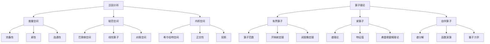

# 09. 泛函分析（Functional Analysis）

## 09.1 目录

- [09. 泛函分析（Functional Analysis）](#09-泛函分析functional-analysis)
  - [09.1 目录](#091-目录)
  - [09.2 基本概念与历史](#092-基本概念与历史)
    - [09.2.1 定义与本质](#0921-定义与本质)
    - [09.2.2 历史发展](#0922-历史发展)
    - [09.2.3 认知映射](#0923-认知映射)
  - [09.3 核心理论](#093-核心理论)
    - [09.3.1 度量空间与拓扑](#0931-度量空间与拓扑)
    - [09.3.2 赋范空间](#0932-赋范空间)
    - [09.3.3 内积空间](#0933-内积空间)
  - [09.4 主要分支](#094-主要分支)
    - [09.4.1 线性算子理论](#0941-线性算子理论)
    - [09.4.2 谱理论](#0942-谱理论)
    - [09.4.3 泛函理论](#0943-泛函理论)
  - [09.5 典型定理与公式](#095-典型定理与公式)
    - [09.5.1 基本定理](#0951-基本定理)
    - [09.5.2 重要公式](#0952-重要公式)
  - [09.6 可视化与多表征](#096-可视化与多表征)
    - [09.6.1 结构关系图（Mermaid）](#0961-结构关系图mermaid)
    - [09.6.2 典型图示](#0962-典型图示)
  - [09.7 应用与建模](#097-应用与建模)
    - [09.7.1 量子力学](#0971-量子力学)
    - [09.7.2 信号处理](#0972-信号处理)
    - [09.7.3 机器学习](#0973-机器学习)
  - [09.8 学习建议与资源](#098-学习建议与资源)
    - [09.8.1 学习路径](#0981-学习路径)
    - [09.8.2 推荐资源](#0982-推荐资源)
    - [09.8.3 实践项目](#0983-实践项目)

---

## 09.2 基本概念与历史

### 09.2.1 定义与本质

**泛函分析**是研究无限维向量空间及其上的线性算子的数学分支，是分析学与代数学的完美结合。

**核心对象**:

- 巴拿赫空间（Banach spaces）
- 希尔伯特空间（Hilbert spaces）
- 线性算子（Linear operators）
- 泛函（Functionals）

### 09.2.2 历史发展

- **19世纪**：傅里叶分析、积分方程理论
- **20世纪初**：希尔伯特空间理论
- **20世纪中期**：巴拿赫空间、算子理论
- **现代**：非线性泛函分析、算子代数

### 09.2.3 认知映射

**数学思维**:

- 从有限维到无限维的抽象思维
- 几何与分析的统一视角
- 算子与函数的类比

**软件工程映射**:

- 函数式编程的数学基础
- 无限数据结构的设计
- 抽象代数在编程中的应用

---

## 09.3 核心理论

### 09.3.1 度量空间与拓扑

**度量空间**:

```latex
(X, d) \text{ where } d: X \times X \to \mathbb{R}^+ \text{ satisfies:}
```

- 正定性：$d(x, y) \geq 0$
- 对称性：$d(x, y) = d(y, x)$
- 三角不等式：$d(x, z) \leq d(x, y) + d(y, z)$

**完备性**:

```latex
\text{Every Cauchy sequence converges in } X
```

### 09.3.2 赋范空间

**范数**:

```latex
\| \cdot \|: X \to \mathbb{R}^+ \text{ satisfies:}
```

- 正定性：$\|x\| \geq 0$
- 齐次性：$\|\alpha x\| = |\alpha| \|x\|$
- 三角不等式：$\|x + y\| \leq \|x\| + \|y\|$

**巴拿赫空间**:

```latex
\text{Complete normed vector space}
```

### 09.3.3 内积空间

**内积**:

```latex
\langle \cdot, \cdot \rangle: H \times H \to \mathbb{C} \text{ satisfies:}
```

- 共轭对称性：$\langle x, y \rangle = \overline{\langle y, x \rangle}$
- 线性性：$\langle \alpha x + \beta y, z \rangle = \alpha \langle x, z \rangle + \beta \langle y, z \rangle$
- 正定性：$\langle x, x \rangle \geq 0$

**希尔伯特空间**:

```latex
\text{Complete inner product space}
```

---

## 09.4 主要分支

### 09.4.1 线性算子理论

**有界线性算子**:

```latex
T: X \to Y \text{ such that } \|Tx\| \leq M\|x\| \text{ for some } M > 0
```

**算子范数**:

```latex
\|T\| = \sup_{\|x\| = 1} \|Tx\|
```

**对偶空间**:

```latex
X^* = \{f: X \to \mathbb{C} \mid f \text{ is continuous linear}\}
```

### 09.4.2 谱理论

**特征值与特征向量**:

```latex
Tx = \lambda x \text{ for some } \lambda \in \mathbb{C}
```

**谱集**:

```latex
\sigma(T) = \{\lambda \in \mathbb{C} \mid T - \lambda I \text{ is not invertible}\}
```

**紧算子**:

```latex
T \text{ maps bounded sets to relatively compact sets}
```

### 09.4.3 泛函理论

**线性泛函**:

```latex
f: X \to \mathbb{C} \text{ such that } f(\alpha x + \beta y) = \alpha f(x) + \beta f(y)
```

**里斯表示定理**:

```latex
\text{For Hilbert space } H, \text{ every } f \in H^* \text{ has form } f(x) = \langle x, y \rangle
```

---

## 09.5 典型定理与公式

### 09.5.1 基本定理

**哈恩-巴拿赫定理**:

```latex
\text{Every linear functional on subspace can be extended to whole space}
```

**开映射定理**:

```latex
\text{Surjective bounded linear operator between Banach spaces is open}
```

**闭图像定理**:

```latex
\text{Closed linear operator with closed graph is bounded}
```

### 09.5.2 重要公式

**投影定理**:

```latex
\text{For closed subspace } M \subset H, \text{ every } x \in H \text{ has unique decomposition:}
x = P_M x + P_{M^\perp} x
```

**里斯-费舍尔定理**:

```latex
L^2[a,b] \text{ is isomorphic to } \ell^2
```

**谱分解定理**:

```latex
T = \int_{\sigma(T)} \lambda \, dE(\lambda)
```

---

## 09.6 可视化与多表征

### 09.6.1 结构关系图（Mermaid）



### 09.6.2 典型图示

**希尔伯特空间可视化**:

```haskell
-- 希尔伯特空间中的正交投影
import Data.Vector

orthogonalProjection :: Vector Double -> Vector Double -> Vector Double
orthogonalProjection u v = 
    let proj = (u `dot` v) / (v `dot` v)
    in scale proj v

dot :: Vector Double -> Vector Double -> Double
dot u v = sum $ zipWith (*) (toList u) (toList v)
```

**算子谱分析**:

```rust
// 矩阵算子的特征值计算
fn eigenvalue_decomposition(matrix: &Matrix) -> (Vec<f64>, Matrix) {
    // 使用QR算法计算特征值
    let mut a = matrix.clone();
    let mut q = Matrix::identity(a.rows());
    
    for _ in 0..100 {
        let (q_new, r) = qr_decomposition(&a);
        a = r * q_new;
        q = q * q_new;
    }
    
    let eigenvalues = a.diagonal();
    (eigenvalues, q)
}
```

---

## 09.7 应用与建模

### 09.7.1 量子力学

**波函数空间**:

```latex
L^2(\mathbb{R}^3) \text{ with inner product } \langle \psi, \phi \rangle = \int \psi^* \phi \, d^3x
```

**哈密顿算子**:

```latex
H = -\frac{\hbar^2}{2m} \nabla^2 + V(x)
```

**薛定谔方程**:

```latex
i\hbar \frac{\partial \psi}{\partial t} = H\psi
```

### 09.7.2 信号处理

**傅里叶变换**:

```scala
// 希尔伯特空间中的傅里叶变换
case class FourierTransform(signal: Vector[Complex]) {
  def transform(): Vector[Complex] = {
    val n = signal.length
    (0 until n).map { k =>
      signal.zipWithIndex.map { case (x, j) =>
        x * Complex.exp(-2 * Pi * i * k * j / n)
      }.sum / sqrt(n)
    }.toVector
  }
}
```

**小波分析**:

- 多分辨率分析
- 正交小波基
- 时频分析

### 09.7.3 机器学习

**核方法**:

```python
# 再生核希尔伯特空间
class RKHS:
    def __init__(self, kernel):
        self.kernel = kernel
    
    def representer_theorem(self, data, labels):
        # 表示定理：最优解在数据张成的子空间中
        alpha = solve_linear_system(kernel_matrix, labels)
        return lambda x: sum(alpha[i] * self.kernel(x, data[i]) for i in range(len(data)))
```

**函数逼近**:

- 神经网络作为函数空间
- 万能逼近定理
- 正则化理论

---

## 09.8 学习建议与资源

### 09.8.1 学习路径

1. **基础阶段**
   - 实分析基础
   - 线性代数
   - 拓扑学基础

2. **进阶阶段**
   - 度量空间理论
   - 巴拿赫空间
   - 希尔伯特空间

3. **高级阶段**
   - 算子理论
   - 谱理论
   - 非线性泛函分析

### 09.8.2 推荐资源

**经典教材**:

- 《Functional Analysis》- Walter Rudin
- 《Linear Operators in Hilbert Spaces》- Joachim Weidmann
- 《Introduction to Hilbert Space》- Sterling K. Berberian

**在线资源**:

- MIT OpenCourseWare: 18.102 Introduction to Functional Analysis
- Coursera: Functional Analysis

**软件工具**:

- MATLAB: Symbolic Math Toolbox
- Python: SciPy, NumPy
- Julia: LinearAlgebra

### 09.8.3 实践项目

1. **数值分析应用**
   - 有限元方法
   - 谱方法
   - 边界元方法

2. **信号处理**
   - 傅里叶分析
   - 小波变换
   - 滤波器设计

3. **机器学习**
   - 核方法实现
   - 支持向量机
   - 神经网络理论

---

**相关链接**:

- [08. 变分法](./08-CalculusOfVariations.md)
- [10. 调和分析](./10-HarmonicAnalysis.md)
- [数学概览](../01-Overview.md)
