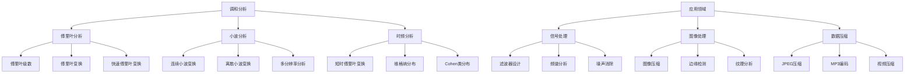

# 10. 调和分析（Harmonic Analysis）

## 10.1 目录

- [10. 调和分析（Harmonic Analysis）](#10-调和分析harmonic-analysis)
  - [10.1 目录](#101-目录)
  - [10.2 基本概念与历史](#102-基本概念与历史)
    - [10.2.1 定义与本质](#1021-定义与本质)
    - [10.2.2 历史发展](#1022-历史发展)
    - [10.2.3 认知映射](#1023-认知映射)
  - [10.3 核心理论](#103-核心理论)
    - [10.3.1 傅里叶分析](#1031-傅里叶分析)
    - [10.3.2 调和函数](#1032-调和函数)
    - [10.3.3 $L^p$空间理论](#1033-lp空间理论)
  - [10.4 主要分支](#104-主要分支)
    - [10.4.1 小波分析](#1041-小波分析)
    - [10.4.2 时频分析](#1042-时频分析)
    - [10.4.3 群上的调和分析](#1043-群上的调和分析)
  - [10.5 典型定理与公式](#105-典型定理与公式)
    - [10.5.1 基本定理](#1051-基本定理)
    - [10.5.2 重要公式](#1052-重要公式)
  - [10.6 可视化与多表征](#106-可视化与多表征)
    - [10.6.1 结构关系图（Mermaid）](#1061-结构关系图mermaid)
    - [10.6.2 典型图示](#1062-典型图示)
  - [10.7 应用与建模](#107-应用与建模)
    - [10.7.1 信号处理](#1071-信号处理)
    - [10.7.2 图像处理](#1072-图像处理)
    - [10.7.3 数据科学](#1073-数据科学)
  - [10.8 学习建议与资源](#108-学习建议与资源)
    - [10.8.1 学习路径](#1081-学习路径)
    - [10.8.2 推荐资源](#1082-推荐资源)
    - [10.8.3 实践项目](#1083-实践项目)

---

## 10.2 基本概念与历史

### 10.2.1 定义与本质

**调和分析**是研究函数在频域和时域之间转换关系的数学分支，是傅里叶分析的自然推广。

**核心思想**:

- 将复杂函数分解为简单的基本成分（如正弦波、小波等），从而揭示其内在结构。

### 10.2.2 历史发展

- **18世纪**：傅里叶级数理论
- **19世纪**：傅里叶变换、调和函数
- **20世纪初**：勒贝格积分、$L^p$空间
- **20世纪中期**：小波分析、时频分析
- **现代**：多尺度分析、压缩感知

### 10.2.3 认知映射

**数学思维**:

- 局部与整体的关系
- 时域与频域的对应
- 多尺度分解思想

**软件工程映射**:

- 信号处理算法
- 数据压缩技术
- 模式识别方法

---

## 10.3 核心理论

### 10.3.1 傅里叶分析

**傅里叶级数**:

```latex
f(x) = \frac{a_0}{2} + \sum_{n=1}^{\infty} (a_n \cos nx + b_n \sin nx)
```

**傅里叶系数**:

```latex
a_n = \frac{1}{\pi} \int_{-\pi}^{\pi} f(x) \cos nx \, dx, \quad b_n = \frac{1}{\pi} \int_{-\pi}^{\pi} f(x) \sin nx \, dx
```

**傅里叶变换**:

```latex
\hat{f}(\xi) = \int_{-\infty}^{\infty} f(x) e^{-2\pi i \xi x} \, dx
```

### 10.3.2 调和函数

**拉普拉斯方程**:

```latex
\Delta u = \frac{\partial^2 u}{\partial x^2} + \frac{\partial^2 u}{\partial y^2} = 0
```

**平均值性质**:

```latex
u(x_0) = \frac{1}{2\pi} \int_0^{2\pi} u(x_0 + re^{i\theta}) \, d\theta
```

**最大值原理**:

```latex
\text{Harmonic functions attain their maximum on the boundary}
```

### 10.3.3 $L^p$空间理论

**$L^p$范数**:

```latex
\|f\|_p = \left( \int_X |f|^p \, d\mu \right)^{1/p}
```

**赫尔德不等式**:

```latex
\|fg\|_1 \leq \|f\|_p \|g\|_q \quad \text{where} \quad \frac{1}{p} + \frac{1}{q} = 1
```

**里斯-索林定理**:

```latex
\text{Fourier transform is bounded on } L^p \text{ for } 1 < p < \infty
```

---

## 10.4 主要分支

### 10.4.1 小波分析

**连续小波变换**:

```latex
W_f(a,b) = \frac{1}{\sqrt{|a|}} \int_{-\infty}^{\infty} f(t) \psi\left(\frac{t-b}{a}\right) \, dt
```

**离散小波变换**:

```latex
c_{j,k} = \int_{-\infty}^{\infty} f(t) \psi_{j,k}(t) \, dt
```

**多分辨率分析**:

```latex
\cdots \subset V_{-1} \subset V_0 \subset V_1 \subset \cdots
```

### 10.4.2 时频分析

**短时傅里叶变换**:

```latex
STFT_f(t,\omega) = \int_{-\infty}^{\infty} f(\tau) g(\tau-t) e^{-i\omega\tau} \, d\tau
```

**维格纳分布**:

```latex
W_f(t,\omega) = \int_{-\infty}^{\infty} f\left(t+\frac{\tau}{2}\right) f^*\left(t-\frac{\tau}{2}\right) e^{-i\omega\tau} \, d\tau
```

### 10.4.3 群上的调和分析

**局部紧群**:

```latex
\text{Group } G \text{ with Haar measure } \mu
```

**群表示**:

```latex
\pi: G \to GL(V) \text{ such that } \pi(gh) = \pi(g)\pi(h)
```

**彼得-外尔定理**:

```latex
L^2(G) = \bigoplus_{\pi \in \hat{G}} V_\pi \otimes V_\pi^*
```

---

## 10.5 典型定理与公式

### 10.5.1 基本定理

**傅里叶反演公式**:

```latex
f(x) = \int_{-\infty}^{\infty} \hat{f}(\xi) e^{2\pi i \xi x} \, d\xi
```

**帕塞瓦尔定理**:

```latex
\|f\|_2^2 = \|\hat{f}\|_2^2
```

**普朗歇尔定理**:

```latex
\langle f, g \rangle = \langle \hat{f}, \hat{g} \rangle
```

### 10.5.2 重要公式

**卷积定理**:

```latex
\widehat{f * g} = \hat{f} \cdot \hat{g}
```

**不确定性原理**:

```latex
\|xf\|_2 \| \xi \hat{f} \|_2 \geq \frac{1}{4\pi} \|f\|_2^2
```

**泊松求和公式**:

```latex
\sum_{n=-\infty}^{\infty} f(n) = \sum_{n=-\infty}^{\infty} \hat{f}(n)
```

---

## 10.6 可视化与多表征

### 10.6.1 结构关系图（Mermaid）



### 10.6.2 典型图示

**傅里叶变换可视化**:

```haskell
-- 快速傅里叶变换实现
import Data.Complex
import Data.Vector

fft :: Vector (Complex Double) -> Vector (Complex Double)
fft xs
  | length xs == 1 = xs
  | otherwise = 
      let n = length xs
          half = n `div` 2
          evens = fft $ fromList [xs ! i | i <- [0,2..n-1]]
          odds = fft $ fromList [xs ! i | i <- [1,3..n-1]]
          twiddle k = cis (-2 * pi * fromIntegral k / fromIntegral n)
      in fromList $ concat [[evens ! k + twiddle k * odds ! k, 
                             evens ! k - twiddle k * odds ! k] | k <- [0..half-1]]
```

**小波变换实现**:

```rust
// 离散小波变换
fn discrete_wavelet_transform(signal: &[f64], wavelet: &Wavelet) -> Vec<f64> {
    let mut coefficients = Vec::new();
    let mut approximation = signal.to_vec();
    
    while approximation.len() > 1 {
        let (approx, detail) = wavelet.decompose(&approximation);
        coefficients.extend_from_slice(&detail);
        approximation = approx;
    }
    
    coefficients.extend_from_slice(&approximation);
    coefficients
}
```

---

## 10.7 应用与建模

### 10.7.1 信号处理

**数字滤波器**:

```scala
// 低通滤波器设计
case class LowPassFilter(cutoff: Double, sampleRate: Double) {
  def filter(signal: Vector[Double]): Vector[Double] = {
    val normalizedCutoff = cutoff / (sampleRate / 2)
    val filterCoeffs = designButterworth(normalizedCutoff, order = 4)
    applyFilter(signal, filterCoeffs)
  }
}
```

**频谱分析**:

- 功率谱密度估计
- 频率成分识别
- 谐波分析

### 10.7.2 图像处理

**图像压缩**:

```python
# JPEG压缩算法
def jpeg_compress(image):
    # 1. 颜色空间转换
    ycbcr = rgb_to_ycbcr(image)
    
    # 2. 分块DCT变换
    blocks = split_into_blocks(ycbcr, 8)
    dct_blocks = [dct2d(block) for block in blocks]
    
    # 3. 量化
    quantized = [quantize(block, quality_matrix) for block in dct_blocks]
    
    # 4. 熵编码
    return entropy_encode(quantized)
```

**边缘检测**:

- 小波边缘检测
- 多尺度分析
- 纹理特征提取

### 10.7.3 数据科学

**时间序列分析**:

```python
# 小波去噪
def wavelet_denoising(signal, wavelet='db4', level=3):
    # 小波分解
    coeffs = pywt.wavedec(signal, wavelet, level=level)
    
    # 阈值处理
    threshold = np.sqrt(2 * np.log(len(signal)))
    coeffs[1:] = [pywt.threshold(c, threshold, mode='soft') for c in coeffs[1:]]
    
    # 重构
    return pywt.waverec(coeffs, wavelet)
```

**模式识别**:

- 特征提取
- 分类算法
- 异常检测

---

## 10.8 学习建议与资源

### 10.8.1 学习路径

1. **基础阶段**
   - 实分析基础
   - 线性代数
   - 复分析基础

2. **进阶阶段**
   - 傅里叶分析
   - 泛函分析
   - 测度论

3. **高级阶段**
   - 小波分析
   - 群表示论
   - 现代调和分析

### 10.8.2 推荐资源

**经典教材**:

- 《Harmonic Analysis》- Elias M. Stein
- 《A First Course in Harmonic Analysis》- Anton Deitmar
- 《Wavelets and Multiscale Analysis》- Yves Meyer

**在线资源**:

- MIT OpenCourseWare: 18.103 Fourier Analysis
- Coursera: Digital Signal Processing

**软件工具**:

- MATLAB: Signal Processing Toolbox
- Python: SciPy, PyWavelets
- Julia: DSP.jl

### 10.8.3 实践项目

1. **信号处理应用**
   - 音频处理系统
   - 图像压缩算法
   - 实时滤波器设计

2. **数据分析**
   - 时间序列预测
   - 模式识别系统
   - 异常检测算法

3. **工程应用**
   - 振动分析
   - 声学处理
   - 通信系统设计

---

**相关链接**:

- [09. 泛函分析](./09-FunctionalAnalysis.md)
- [11. 概率论](./11-ProbabilityTheory.md)
- [数学概览](../01-Overview.md)
