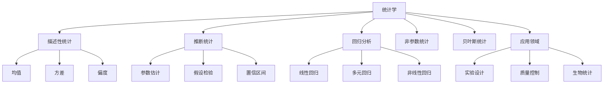

# 12. 统计学（Statistics）

## 12.1 目录

- [12. 统计学（Statistics）](#12-统计学statistics)
  - [12.1 目录](#121-目录)
  - [12.2 基本概念与历史](#122-基本概念与历史)
    - [12.2.1 定义与本质](#1221-定义与本质)
    - [12.2.2 历史发展](#1222-历史发展)
    - [12.2.3 认知映射](#1223-认知映射)
  - [12.3 核心理论](#123-核心理论)
    - [12.3.1 描述性统计](#1231-描述性统计)
    - [12.3.2 推断统计](#1232-推断统计)
    - [12.3.3 回归分析](#1233-回归分析)
  - [12.4 主要分支](#124-主要分支)
    - [12.4.1 参数统计](#1241-参数统计)
    - [12.4.2 非参数统计](#1242-非参数统计)
    - [12.4.3 贝叶斯统计](#1243-贝叶斯统计)
  - [12.5 典型定理与公式](#125-典型定理与公式)
    - [12.5.1 基本定理](#1251-基本定理)
    - [12.5.2 重要公式](#1252-重要公式)
  - [12.6 可视化与多表征](#126-可视化与多表征)
    - [12.6.1 结构关系图（Mermaid）](#1261-结构关系图mermaid)
    - [12.6.2 典型图示](#1262-典型图示)
  - [12.7 应用与建模](#127-应用与建模)
    - [12.7.1 实验设计与数据分析](#1271-实验设计与数据分析)
    - [12.7.2 质量控制与工业统计](#1272-质量控制与工业统计)
    - [12.7.3 生物统计与医学研究](#1273-生物统计与医学研究)
  - [12.8 学习建议与资源](#128-学习建议与资源)
    - [12.8.1 学习路径](#1281-学习路径)
    - [12.8.2 推荐资源](#1282-推荐资源)
    - [12.8.3 实践项目](#1283-实践项目)

---

## 12.2 基本概念与历史

### 12.2.1 定义与本质

**统计学**是收集、分析、解释和呈现数据的科学，是概率论的应用和推广。

**核心思想**: 从样本推断总体，从数据中发现规律，为决策提供科学依据。

### 12.2.2 历史发展

- **17世纪**: 人口统计、保险统计
- **18世纪**: 最小二乘法、正态分布
- **19世纪**: 回归分析、相关分析
- **20世纪初**: 假设检验、置信区间
- **现代**: 贝叶斯统计、机器学习统计

### 12.2.3 认知映射

**数学思维**:

- 归纳推理思维
- 不确定性量化
- 模型选择与验证

**软件工程映射**:

- 数据分析流程
- 统计软件设计
- 机器学习框架

---

## 12.3 核心理论

### 12.3.1 描述性统计

**集中趋势**:

```latex
\text{均值: } \bar{x} = \frac{1}{n} \sum_{i=1}^n x_i
```

**离散程度**:

```latex
\text{方差: } s^2 = \frac{1}{n-1} \sum_{i=1}^n (x_i - \bar{x})^2
```

**分布形状**:

```latex
\text{偏度: } \gamma_1 = \frac{E[(X-\mu)^3]}{\sigma^3}, \quad \text{峰度: } \gamma_2 = \frac{E[(X-\mu)^4]}{\sigma^4} - 3
```

### 12.3.2 推断统计

**参数估计**:

```latex
\text{点估计: } \hat{\theta} = T(X_1, \ldots, X_n)
```

**区间估计**:

```latex
P(\theta_L \leq \theta \leq \theta_U) = 1 - \alpha
```

**假设检验**:

```latex
H_0: \theta = \theta_0 \quad \text{vs} \quad H_1: \theta \neq \theta_0
```

### 12.3.3 回归分析

**线性回归**:

```latex
Y = \beta_0 + \beta_1 X_1 + \cdots + \beta_p X_p + \epsilon
```

**最小二乘估计**:

```latex
\hat{\beta} = (X^T X)^{-1} X^T Y
```

**决定系数**:

```latex
R^2 = 1 - \frac{SSE}{SST} = \frac{SSR}{SST}
```

---

## 12.4 主要分支

### 12.4.1 参数统计

**正态分布推断**:

```latex
\text{样本均值: } \bar{X} \sim N(\mu, \frac{\sigma^2}{n})
```

**t检验**:

```latex
T = \frac{\bar{X} - \mu_0}{s/\sqrt{n}} \sim t_{n-1}
```

**F检验**:

```latex
F = \frac{s_1^2}{s_2^2} \sim F_{n_1-1, n_2-1}
```

### 12.4.2 非参数统计

**符号检验**:

```latex
S = \sum_{i=1}^n I(X_i > \mu_0) \sim Bin(n, 0.5)
```

**Wilcoxon秩和检验**:

```latex
W = \sum_{i=1}^{n_1} R_i
```

**Kolmogorov-Smirnov检验**:

```latex
D = \sup_x |F_n(x) - F_0(x)|
```

### 12.4.3 贝叶斯统计

**贝叶斯定理**:

```latex
P(\theta|X) = \frac{P(X|\theta) P(\theta)}{P(X)}
```

**后验分布**:

```latex
P(\theta|X) \propto P(X|\theta) P(\theta)
```

**贝叶斯估计**:

```latex
\hat{\theta}_{Bayes} = E[\theta|X]
```

---

## 12.5 典型定理与公式

### 12.5.1 基本定理

**中心极限定理**:

```latex
\frac{\bar{X} - \mu}{\sigma/\sqrt{n}} \xrightarrow{d} N(0,1)
```

**大数定律**:

```latex
\bar{X} \xrightarrow{P} \mu
```

**Cramér-Rao下界**:

```latex
Var(\hat{\theta}) \geq \frac{1}{I(\theta)}
```

### 12.5.2 重要公式

**置信区间**:

```latex
\bar{x} \pm t_{\alpha/2, n-1} \frac{s}{\sqrt{n}}
```

**p值**:

```latex
p = P(T \geq t_{obs} | H_0)
```

**似然函数**:

```latex
L(\theta|X) = \prod_{i=1}^n f(X_i|\theta)
```

---

## 12.6 可视化与多表征

### 12.6.1 结构关系图（Mermaid）



### 12.6.2 典型图示

**统计分布可视化（Haskell）**:

```haskell
-- 正态分布与t分布比较
import Graphics.Gnuplot.Simple

normalDensity :: Double -> Double -> Double
normalDensity x = (1 / sqrt (2 * pi)) * exp (-x^2 / 2)

tDensity :: Int -> Double -> Double
tDensity df x = gamma ((df + 1) / 2) / (sqrt (df * pi) * gamma (df / 2)) * 
                (1 + x^2 / df) ** (-(df + 1) / 2)

plotDistributions :: IO ()
plotDistributions = plotLists [] [
    [(x, normalDensity x) | x <- [-3, -2.9..3]],
    [(x, tDensity 5 x) | x <- [-3, -2.9..3]]
]
```

**回归分析流程图**:


**控制图实现（Python）**:

```python
import numpy as np
import matplotlib.pyplot as plt

def plot_control_chart(data, subgroup_size=5):
    subgroups = [data[i:i+subgroup_size] for i in range(0, len(data), subgroup_size)]
    means = [np.mean(sg) for sg in subgroups]
    ranges = [np.max(sg) - np.min(sg) for sg in subgroups]
    overall_mean = np.mean(means)
    avg_range = np.mean(ranges)
    A2 = {2: 1.880, 3: 1.023, 4: 0.729, 5: 0.577}
    ucl = overall_mean + A2[subgroup_size] * avg_range
    lcl = overall_mean - A2[subgroup_size] * avg_range
    plt.plot(means, marker='o')
    plt.axhline(overall_mean, color='g', linestyle='--', label='均值')
    plt.axhline(ucl, color='r', linestyle='--', label='UCL')
    plt.axhline(lcl, color='b', linestyle='--', label='LCL')
    plt.legend()
    plt.title('控制图')
    plt.show()
```

---

## 12.7 应用与建模

### 12.7.1 实验设计与数据分析

- 随机化实验（A/B测试、临床试验）
- 因子设计与方差分析（ANOVA）
- 多重比较与假设检验

**Python示例：A/B测试假设检验**:

```python
import numpy as np
from scipy.stats import ttest_ind

group_a = np.random.normal(0, 1, 100)
group_b = np.random.normal(0.2, 1, 100)
stat, p = ttest_ind(group_a, group_b)
print(f"t统计量: {stat}, p值: {p}")
```

### 12.7.2 质量控制与工业统计

- 控制图与过程能力分析
- 六西格玛方法（Cp、Cpk）
- 可靠性分析与寿命分布

**Rust示例：寿命分布仿真**:

```rust
// 指数分布寿命模拟
fn simulate_lifetimes(lambda: f64, n: usize) -> Vec<f64> {
    use rand::Rng;
    let mut rng = rand::thread_rng();
    (0..n).map(|_| -((1.0 - rng.gen::<f64>()).ln()) / lambda).collect()
}
```

### 12.7.3 生物统计与医学研究

- 生存分析（Kaplan-Meier、Cox回归）
- 流行病学（病例对照、队列研究）
- 遗传统计与多组学数据分析

**Scala示例：Kaplan-Meier生存曲线**:

```scala
case class SurvivalData(time: Array[Double], event: Array[Int])

def kaplanMeier(data: SurvivalData): Array[(Double, Double)] = {
  val n = data.time.length
  val sorted = data.time.zip(data.event).sortBy(_._1)
  var atRisk = n.toDouble
  var survival = 1.0
  var result = List[(Double, Double)]()
  for ((t, e) <- sorted) {
    if (e == 1) survival *= (atRisk - 1) / atRisk
    atRisk -= 1
    result = (t, survival) :: result
  }
  result.reverse.toArray
}
```

---

## 12.8 学习建议与资源

### 12.8.1 学习路径

1. **基础阶段**:
   - 概率论基础
   - 描述性统计
   - 基本推断方法

2. **进阶阶段**:
   - 回归分析
   - 实验设计
   - 非参数方法

3. **高级阶段**:
   - 贝叶斯统计
   - 时间序列分析
   - 多元统计分析

### 12.8.2 推荐资源

**经典教材**:

- 《Mathematical Statistics》- John E. Freund
- 《Applied Linear Regression Models》- Kutner et al.
- 《Design and Analysis of Experiments》- Montgomery

**在线资源**:

- MIT OpenCourseWare: 18.05 Introduction to Probability and Statistics
- Coursera: Statistics with R

**软件工具**:

- R: 统计计算
- Python: SciPy, StatsModels
- SAS: 商业统计软件

### 12.8.3 实践项目

1. **数据分析项目**:
   - 探索性数据分析
   - 统计建模
   - 结果可视化

2. **实验设计**:
   - A/B测试设计
   - 质量控制实验
   - 临床试验设计

3. **应用统计**:
   - 金融数据分析
   - 生物统计应用
   - 社会科学研究

---

**相关链接**:

- [11. 概率论](./11-ProbabilityTheory.md)
- [13. 数值分析](./13-NumericalAnalysis.md)
- [数学概览](../01-Overview.md)
