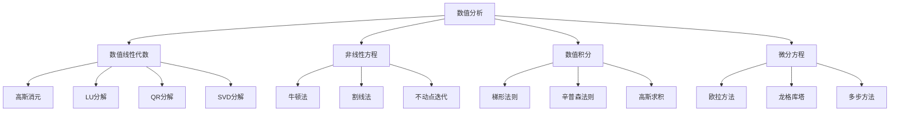

# 13. 数值分析（Numerical Analysis）

## 13.1 目录

- [13. 数值分析（Numerical Analysis）](#13-数值分析numerical-analysis)
  - [13.1 目录](#131-目录)
  - [13.2 基本概念与历史](#132-基本概念与历史)
    - [13.2.1 定义与本质](#1321-定义与本质)
    - [13.2.2 历史发展](#1322-历史发展)
    - [13.2.3 认知映射](#1323-认知映射)
  - [13.3 核心理论](#133-核心理论)
    - [13.3.1 误差分析](#1331-误差分析)
    - [13.3.2 条件数](#1332-条件数)
    - [13.3.3 稳定性](#1333-稳定性)
  - [13.4 主要分支](#134-主要分支)
    - [13.4.1 数值线性代数](#1341-数值线性代数)
    - [13.4.2 非线性方程求解](#1342-非线性方程求解)
    - [13.4.3 数值积分](#1343-数值积分)
  - [13.5 典型定理与公式](#135-典型定理与公式)
    - [13.5.1 基本定理](#1351-基本定理)
    - [13.5.2 重要公式](#1352-重要公式)
  - [13.6 可视化与多表征](#136-可视化与多表征)
    - [13.6.1 结构关系图（Mermaid）](#1361-结构关系图mermaid)
    - [13.6.2 典型图示](#1362-典型图示)
  - [13.7 应用与建模](#137-应用与建模)
    - [13.7.1 科学计算](#1371-科学计算)
    - [13.7.2 工程仿真](#1372-工程仿真)
    - [13.7.3 金融建模](#1373-金融建模)
  - [13.8 学习建议与资源](#138-学习建议与资源)
    - [13.8.1 学习路径](#1381-学习路径)
    - [13.8.2 推荐资源](#1382-推荐资源)
    - [13.8.3 实践项目](#1383-实践项目)

---

## 13.2 基本概念与历史

### 13.2.1 定义与本质

**数值分析**是研究用数值方法求解数学问题的学科，是数学理论与计算机科学的桥梁。

**核心思想**：将连续数学问题离散化，用有限精度计算逼近精确解，并分析误差和稳定性。

### 13.2.2 历史发展

- **古代**：巴比伦、希腊的数值方法
- **17-18世纪**：牛顿法、欧拉方法
- **19世纪**：插值理论、数值积分
- **20世纪**：有限元法、快速算法
- **现代**：并行计算、高精度算法

### 13.2.3 认知映射

**数学思维**:

- 近似与精确的平衡
- 误差分析与控制
- 算法稳定性思维

**软件工程映射**:

- 数值算法实现
- 计算精度控制
- 性能优化技术

---

## 13.3 核心理论

### 13.3.1 误差分析

**绝对误差**:

```latex
E_a = |x - \hat{x}|
```

**相对误差**:

```latex
E_r = \frac{|x - \hat{x}|}{|x|}
```

**机器精度**:

```latex
\epsilon = 2^{-(p-1)} \text{ for p-bit precision}
```

### 13.3.2 条件数

**问题条件数**:

```latex
\kappa = \frac{\|f(x + \Delta x) - f(x)\|}{\|\Delta x\|} \cdot \frac{\|x\|}{\|f(x)\|}
```

**矩阵条件数**:

```latex
\kappa(A) = \|A\| \cdot \|A^{-1}\|
```

### 13.3.3 稳定性

**前向稳定性**:

```latex
\|f(x) - f(\hat{x})\| \leq K \|x - \hat{x}\|
```

**后向稳定性**:

```latex
\|f(x) - f(\hat{x})\| \leq \epsilon \|f(x)\|
```

---

## 13.4 主要分支

### 13.4.1 数值线性代数

**LU分解**:

```latex
A = LU \text{ where } L \text{ is lower triangular, } U \text{ is upper triangular}
```

**QR分解**:

```latex
A = QR \text{ where } Q \text{ is orthogonal, } R \text{ is upper triangular}
```

**特征值问题**:

```latex
Ax = \lambda x \Rightarrow \text{Power iteration, QR algorithm}
```

### 13.4.2 非线性方程求解

**牛顿法**:

```latex
x_{n+1} = x_n - \frac{f(x_n)}{f'(x_n)}
```

**割线法**:

```latex
x_{n+1} = x_n - f(x_n) \frac{x_n - x_{n-1}}{f(x_n) - f(x_{n-1})}
```

**不动点迭代**:

```latex
x_{n+1} = g(x_n)
```

### 13.4.3 数值积分

**梯形法则**:

```latex
\int_a^b f(x) dx \approx \frac{h}{2} [f(a) + 2\sum_{i=1}^{n-1} f(x_i) + f(b)]
```

**辛普森法则**:

```latex
\int_a^b f(x) dx \approx \frac{h}{3} [f(a) + 4\sum_{i=1}^{n/2} f(x_{2i-1}) + 2\sum_{i=1}^{n/2-1} f(x_{2i}) + f(b)]
```

**高斯求积**:

```latex
\int_{-1}^1 f(x) dx \approx \sum_{i=1}^n w_i f(x_i)
```

---

## 13.5 典型定理与公式

### 13.5.1 基本定理

**泰勒定理**:

```latex
f(x) = f(a) + f'(a)(x-a) + \frac{f''(a)}{2!}(x-a)^2 + \cdots + \frac{f^{(n)}(a)}{n!}(x-a)^n + R_n
```

**拉格朗日插值**:

```latex
P(x) = \sum_{i=0}^n f(x_i) \prod_{j \neq i} \frac{x - x_j}{x_i - x_j}
```

**误差界**:

```latex
|f(x) - P(x)| \leq \frac{M_{n+1}}{(n+1)!} \prod_{i=0}^n |x - x_i|
```

### 13.5.2 重要公式

**龙格现象**:

```latex
\text{High-degree polynomial interpolation can oscillate wildly}
```

**收敛阶**:

```latex
\lim_{n \to \infty} \frac{|e_{n+1}|}{|e_n|^p} = C
```

**稳定性条件**:

```latex
|\lambda_i| \leq 1 \text{ for all eigenvalues of iteration matrix}
```

---

## 13.6 可视化与多表征

### 13.6.1 结构关系图（Mermaid）



### 13.6.2 典型图示

**牛顿法收敛可视化**:

```haskell
-- 牛顿法实现
import Graphics.Gnuplot.Simple

newtonMethod :: (Double -> Double) -> (Double -> Double) -> Double -> [Double]
newtonMethod f f' x0 = iterate step x0
  where step x = x - f x / f' x

-- 示例：求解 x^2 - 4 = 0
f :: Double -> Double
f x = x^2 - 4

f' :: Double -> Double
f' x = 2*x

plotNewton :: IO ()
plotNewton = do
    let iterations = take 10 $ newtonMethod f f' 3.0
    plotList [] $ zip [0..] iterations
```

**数值积分实现**:

```rust
// 梯形法数值积分
fn trapezoidal_rule<F>(f: F, a: f64, b: f64, n: usize) -> f64
where
    F: Fn(f64) -> f64,
{
    let h = (b - a) / n as f64;
    let mut sum = 0.5 * (f(a) + f(b));
    for i in 1..n {
        sum += f(a + i as f64 * h);
    }
    sum * h
}
```

**线性方程组求解可视化**:


---

## 13.7 应用与建模

### 13.7.1 科学计算

- 有限元分析（结构力学、热传导、流体力学）
- 谱方法（量子力学、气象模拟）
- 边界元法（电磁场、声学）

**Python示例：有限元法一维弹性杆**:

```python
import numpy as np
from scipy.sparse import diags
from scipy.sparse.linalg import spsolve

# 一维弹性杆有限元
n = 10
k = 1.0  # 刚度
f = np.ones(n)  # 外力
A = diags([k, -2*k, k], [-1, 0, 1], shape=(n, n)).tocsc()
u = spsolve(A, f)
print("位移解：", u)
```

### 13.7.2 工程仿真

- 结构分析：桥梁、建筑、机械零件
- 流体力学：空气动力学、血流模拟
- 热传导：电子元件散热、能源系统

**Rust示例：热传导一维差分法**:

```rust
// 一维热传导方程差分求解
fn heat_equation_1d(u0: &mut [f64], alpha: f64, dx: f64, dt: f64, steps: usize) {
    let n = u0.len();
    let mut u = u0.to_vec();
    for _ in 0..steps {
        let mut u_new = u.clone();
        for i in 1..n-1 {
            u_new[i] = u[i] + alpha * dt / (dx*dx) * (u[i-1] - 2.0*u[i] + u[i+1]);
        }
        u = u_new;
    }
    u0.copy_from_slice(&u);
}
```

### 13.7.3 金融建模

- 期权定价（Black-Scholes方程数值解）
- 风险管理（蒙特卡洛模拟）
- 投资组合优化（数值最优化）

**Scala示例：蒙特卡洛期权定价**:

```scala
import scala.util.Random

def monteCarloOptionPrice(S0: Double, K: Double, r: Double, sigma: Double, T: Double, n: Int): Double = {
  val rand = new Random()
  val payoffSum = (1 to n).map { _ =>
    val ST = S0 * math.exp((r - 0.5 * sigma * sigma) * T + sigma * math.sqrt(T) * rand.nextGaussian())
    math.max(ST - K, 0)
  }.sum
  math.exp(-r * T) * payoffSum / n
}
```

---

## 13.8 学习建议与资源

### 13.8.1 学习路径

1. **基础阶段**
   - 线性代数基础
   - 微积分基础
   - 编程基础

2. **进阶阶段**
   - 数值线性代数
   - 数值积分
   - 微分方程数值解

3. **高级阶段**
   - 有限元方法
   - 谱方法
   - 并行计算

### 13.8.2 推荐资源

**经典教材**:

- 《Numerical Analysis》- Burden & Faires
- 《Numerical Recipes》- Press et al.
- 《Finite Element Methods》- Brenner & Scott

**在线资源**:

- MIT OpenCourseWare: 18.330 Introduction to Numerical Analysis
- Coursera: Numerical Methods for Engineers

**软件工具**:

- MATLAB: 数值计算
- Python: NumPy, SciPy
- Julia: 高性能数值计算

### 13.8.3 实践项目

1. **算法实现**
   - 线性方程组求解器
   - 数值积分程序
   - 微分方程求解器

2. **科学计算应用**
   - 有限元分析程序
   - 流体力学模拟
   - 结构优化算法

3. **工程仿真**
   - 热传导分析
   - 应力分析
   - 振动分析

---

**相关链接**:

- [12. 统计学](./12-Statistics.md)
- [14. 优化理论](./14-OptimizationTheory.md)
- [数学概览](../01-Overview.md)
