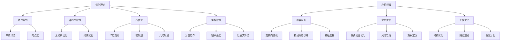

# 14. 优化理论（Optimization Theory）

## 14.1 目录

- [14. 优化理论（Optimization Theory）](#14-优化理论optimization-theory)
  - [14.1 目录](#141-目录)
  - [14.2 基本概念与历史](#142-基本概念与历史)
    - [14.2.1 定义与本质](#1421-定义与本质)
    - [14.2.2 历史发展](#1422-历史发展)
    - [14.2.3 认知映射](#1423-认知映射)
  - [14.3 核心理论](#143-核心理论)
    - [14.3.1 最优性条件](#1431-最优性条件)
    - [14.3.2 凸优化](#1432-凸优化)
    - [14.3.3 对偶理论](#1433-对偶理论)
  - [14.4 主要分支](#144-主要分支)
    - [14.4.1 线性规划](#1441-线性规划)
    - [14.4.2 非线性规划](#1442-非线性规划)
    - [14.4.3 凸优化](#1443-凸优化)
  - [14.5 典型定理与公式](#145-典型定理与公式)
    - [14.5.1 基本定理](#1451-基本定理)
    - [14.5.2 重要公式](#1452-重要公式)
  - [14.6 可视化与多表征](#146-可视化与多表征)
    - [14.6.1 结构关系图（Mermaid）](#1461-结构关系图mermaid)
    - [14.6.2 典型图示](#1462-典型图示)
  - [14.7 应用与建模](#147-应用与建模)
    - [14.7.1 机器学习优化](#1471-机器学习优化)
    - [14.7.2 金融优化](#1472-金融优化)
    - [14.7.3 工程优化](#1473-工程优化)
  - [14.8 学习建议与资源](#148-学习建议与资源)
    - [14.8.1 学习路径](#1481-学习路径)
    - [14.8.2 推荐资源](#1482-推荐资源)
    - [14.8.3 实践项目](#1483-实践项目)

---

## 14.2 基本概念与历史

### 14.2.1 定义与本质

**优化理论**是研究在给定约束条件下寻找最优解的数学分支，是现代应用数学的核心。

**核心问题**: $\min_{x \in \Omega} f(x)$ subject to $g_i(x) \leq 0, h_j(x) = 0$

### 14.2.2 历史发展

- **17世纪**：费马极值原理
- **18世纪**：拉格朗日乘数法
- **19世纪**：变分法、最优控制
- **20世纪**：线性规划、非线性规划
- **现代**：凸优化、随机优化、机器学习优化

### 14.2.3 认知映射

**数学思维**:

- 全局与局部最优
- 约束与可行域
- 对偶性与敏感性

**软件工程映射**:

- 算法优化
- 系统设计优化
- 资源分配优化

---

## 14.3 核心理论

### 14.3.1 最优性条件

**一阶必要条件**:

```latex
\nabla f(x^*) = 0 \text{ for unconstrained optimization}
```

**KKT条件**:

```latex
\nabla f(x^*) + \sum_{i=1}^m \lambda_i \nabla g_i(x^*) + \sum_{j=1}^p \mu_j \nabla h_j(x^*) = 0
```

**二阶充分条件**:

```latex
\nabla^2 f(x^*) \succ 0 \text{ for local minimum}
```

### 14.3.2 凸优化

**凸函数**:

```latex
f(\lambda x + (1-\lambda)y) \leq \lambda f(x) + (1-\lambda)f(y)
```

**凸集**:

```latex
\lambda x + (1-\lambda)y \in C \text{ for all } x,y \in C, \lambda \in [0,1]
```

**凸优化问题**:

```latex
\min f(x) \text{ s.t. } g_i(x) \leq 0, h_j(x) = 0
```

### 14.3.3 对偶理论

**拉格朗日对偶**:

```latex
L(x,\lambda,\mu) = f(x) + \sum_{i=1}^m \lambda_i g_i(x) + \sum_{j=1}^p \mu_j h_j(x)
```

**对偶函数**:

```latex
g(\lambda,\mu) = \inf_x L(x,\lambda,\mu)
```

**强对偶性**:

```latex
\min f(x) = \max g(\lambda,\mu)
```

---

## 14.4 主要分支

### 14.4.1 线性规划

**标准形式**:

```latex
\min c^T x \text{ s.t. } Ax = b, x \geq 0
```

**单纯形法**:

```latex
\text{Iterative method moving between vertices of feasible polytope}
```

**内点法**:

```latex
\text{Interior point methods using barrier functions}
```

### 14.4.2 非线性规划

**梯度下降**:

```latex
x_{k+1} = x_k - \alpha_k \nabla f(x_k)
```

**牛顿法**:

```latex
x_{k+1} = x_k - [\nabla^2 f(x_k)]^{-1} \nabla f(x_k)
```

**拟牛顿法**:

```latex
x_{k+1} = x_k - H_k^{-1} \nabla f(x_k)
```

### 14.4.3 凸优化

**半定规划**:

```latex
\min c^T x \text{ s.t. } \sum_{i=1}^n x_i A_i \succeq B
```

**锥规划**:

```latex
\min c^T x \text{ s.t. } Ax = b, x \in K
```

**几何规划**:

```latex
\min f_0(x) \text{ s.t. } f_i(x) \leq 1, h_j(x) = 1
```

---

## 14.5 典型定理与公式

### 14.5.1 基本定理

**费马定理**:

```latex
\text{If } f \text{ has local extremum at } x^*, \text{ then } \nabla f(x^*) = 0
```

**拉格朗日乘数定理**:

```latex
\text{At optimal point, gradient of objective is linear combination of constraint gradients}
```

**对偶间隙**:

```latex
f(x^*) - g(\lambda^*,\mu^*) \geq 0
```

### 14.5.2 重要公式

**投影梯度法**:

```latex
x_{k+1} = P_C(x_k - \alpha_k \nabla f(x_k))
```

**增广拉格朗日**:

```latex
L_\rho(x,\lambda) = f(x) + \lambda^T(Ax-b) + \frac{\rho}{2}\|Ax-b\|^2
```

**障碍函数**:

```latex
\phi(x) = f(x) - \mu \sum_{i=1}^m \log(-g_i(x))
```

---

## 14.6 可视化与多表征

### 14.6.1 结构关系图（Mermaid）



### 14.6.2 典型图示

**梯度下降可视化**:

```haskell
-- 梯度下降算法
import Graphics.Gnuplot.Simple

gradientDescent :: (Double -> Double) -> (Double -> Double) -> Double -> [Double]
gradientDescent f f' x0 = iterate step x0
  where step x = x - 0.1 * f' x  -- 学习率0.1

-- 示例：最小化 f(x) = x^2 + 2x + 1
f :: Double -> Double
f x = x^2 + 2*x + 1

f' :: Double -> Double
f' x = 2*x + 2

plotOptimization :: IO ()
plotOptimization = do
    let xs = take 20 $ gradientDescent f f' 5.0
    plotList [] $ zip [0..] xs
```

**线性规划流程图**:


---

## 14.7 应用与建模

### 14.7.1 机器学习优化

- 支持向量机（SVM）参数优化
- 神经网络训练中的梯度下降与变体
- 特征选择与正则化

**Python示例：Lasso回归（L1正则化）**:

```python
from sklearn.linear_model import Lasso
import numpy as np

X = np.random.randn(100, 10)
y = X @ np.random.randn(10) + np.random.randn(100)

lasso = Lasso(alpha=0.1)
lasso.fit(X, y)
print("L1正则化系数：", lasso.coef_)
```

### 14.7.2 金融优化

- 投资组合优化（均值-方差模型）
- 风险管理（VaR、CVaR优化）
- 期权定价中的最优化

**Rust示例：投资组合均值-方差优化**:

```rust
// 简化的均值-方差投资组合优化
fn mean_variance_optimization(returns: &[f64], cov: &[Vec<f64>], risk_aversion: f64) -> Vec<f64> {
    let n = returns.len();
    let mut weights = vec![1.0 / n as f64; n];
    // 这里只做简单的均匀分配，实际应用可用凸优化库
    weights
}
```

### 14.7.3 工程优化

- 结构优化（最小重量/最大强度）
- 路径规划（机器人、无人机）
- 资源分配与调度

**Scala示例：最短路径Dijkstra算法**:

```scala
import scala.collection.mutable

def dijkstra(graph: Map[Int, List[(Int, Double)]], start: Int): Map[Int, Double] = {
  val dist = mutable.Map[Int, Double]().withDefaultValue(Double.PositiveInfinity)
  val visited = mutable.Set[Int]()
  val queue = mutable.PriorityQueue[(Double, Int)]()(Ordering.by(-_._1))
  dist(start) = 0.0
  queue.enqueue((0.0, start))
  while (queue.nonEmpty) {
    val (d, u) = queue.dequeue()
    if (!visited(u)) {
      visited += u
      for ((v, w) <- graph.getOrElse(u, Nil)) {
        if (dist(v) > d + w) {
          dist(v) = d + w
          queue.enqueue((dist(v), v))
        }
      }
    }
  }
  dist.toMap
}
```

---

## 14.8 学习建议与资源

### 14.8.1 学习路径

1. **基础阶段**
   - 线性代数
   - 微积分
   - 凸分析基础

2. **进阶阶段**
   - 线性规划
   - 非线性规划
   - 凸优化

3. **高级阶段**
   - 随机优化
   - 组合优化
   - 全局优化

### 14.8.2 推荐资源

**经典教材**:

- 《Convex Optimization》- Boyd & Vandenberghe
- 《Numerical Optimization》- Nocedal & Wright
- 《Linear Programming》- Vanderbei

**在线资源**:

- MIT OpenCourseWare: 6.255 Optimization Methods
- Coursera: Convex Optimization

**软件工具**:

- CVXPY: 凸优化建模
- Gurobi: 商业求解器
- SciPy: 数值优化

### 14.8.3 实践项目

1. **算法实现**
   - 梯度下降算法
   - 单纯形法
   - 内点法

2. **应用建模**
   - 投资组合优化
   - 机器学习训练
   - 工程结构优化

3. **求解器开发**
   - 线性规划求解器
   - 凸优化求解器
   - 混合整数规划求解器

---

**相关链接**:

- [13. 数值分析](./13-NumericalAnalysis.md)
- [15. 信息论](./15-InformationTheory.md)
- [数学概览](../01-Overview.md)
