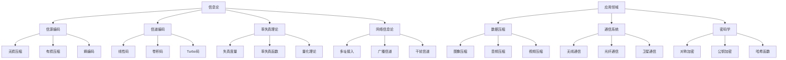

# 15. 信息论（Information Theory）

## 15.1 目录

- [15. 信息论（Information Theory）](#15-信息论information-theory)
  - [15.1 目录](#151-目录)
  - [15.2 基本概念与历史](#152-基本概念与历史)
    - [15.2.1 定义与本质](#1521-定义与本质)
    - [15.2.2 历史发展](#1522-历史发展)
    - [15.2.3 认知映射](#1523-认知映射)
  - [15.3 核心理论](#153-核心理论)
    - [15.3.1 信息度量](#1531-信息度量)
    - [15.3.2 互信息](#1532-互信息)
    - [15.3.3 信道容量](#1533-信道容量)
  - [15.4 主要分支](#154-主要分支)
    - [15.4.1 信源编码](#1541-信源编码)
    - [15.4.2 信道编码](#1542-信道编码)
    - [15.4.3 率失真理论](#1543-率失真理论)
  - [15.5 典型定理与公式](#155-典型定理与公式)
    - [15.5.1 基本定理](#1551-基本定理)
    - [15.5.2 重要公式](#1552-重要公式)
  - [15.6 可视化与多表征](#156-可视化与多表征)
    - [15.6.1 结构关系图（Mermaid）](#1561-结构关系图mermaid)
    - [15.6.2 典型图示](#1562-典型图示)
  - [15.7 应用与建模](#157-应用与建模)
    - [15.7.1 数据压缩](#1571-数据压缩)
    - [15.7.2 通信系统](#1572-通信系统)
    - [15.7.3 信息安全与加密](#1573-信息安全与加密)
  - [15.8 学习建议与资源](#158-学习建议与资源)
    - [15.8.1 学习路径](#1581-学习路径)
    - [15.8.2 推荐资源](#1582-推荐资源)
    - [15.8.3 实践项目](#1583-实践项目)

---

## 15.2 基本概念与历史

### 15.2.1 定义与本质

**信息论**是研究信息传输、存储和处理的数学理论，为通信、密码学和数据科学提供理论基础。

**核心思想**:

- 用数学方法量化信息，研究信息的本质、传输极限和处理效率。

### 15.2.2 历史发展

- **1948年**：香农发表《通信的数学理论》
- **1950年代**：信道编码理论
- **1960年代**：率失真理论
- **1970年代**：网络信息论
- **现代**：量子信息论、网络编码

### 15.2.3 认知映射

**数学思维**:

- 信息量化思维
- 不确定性度量
- 编码与解码理论

**软件工程映射**:

- 数据压缩算法
- 错误检测与纠正
- 加密与安全

---

## 15.3 核心理论

### 15.3.1 信息度量

**香农熵**:

```latex
H(X) = -\sum_{i=1}^n p_i \log_2 p_i
```

**联合熵**:

```latex
H(X,Y) = -\sum_{i,j} p(x_i,y_j) \log_2 p(x_i,y_j)
```

**条件熵**:

```latex
H(X|Y) = -\sum_{i,j} p(x_i,y_j) \log_2 p(x_i|y_j)
```

### 15.3.2 互信息

**互信息定义**:

```latex
I(X;Y) = H(X) - H(X|Y) = H(Y) - H(Y|X)
```

**互信息性质**:

```latex
I(X;Y) \geq 0, \quad I(X;Y) = I(Y;X)
```

**数据处理不等式**:

```latex
I(X;Y) \geq I(X;Z) \text{ if } Z = f(Y)
```

### 15.3.3 信道容量

**离散无记忆信道**:

```latex
C = \max_{p(x)} I(X;Y)
```

**香农公式**:

```latex
C = W \log_2(1 + \frac{P}{N_0W})
```

**信道编码定理**:

```latex
\text{For } R < C, \text{ reliable communication is possible}
```

---

## 15.4 主要分支

### 15.4.1 信源编码

**无损压缩**:

```latex
\text{Source coding theorem: } H(X) \leq L \leq H(X) + 1
```

**霍夫曼编码**:

```latex
\text{Optimal prefix code for given probability distribution}
```

**算术编码**:

```latex
\text{Variable-length encoding using cumulative probabilities}
```

### 15.4.2 信道编码

**线性码**:

```latex
C = \{x \in \mathbb{F}_2^n : Hx^T = 0\}
```

**卷积码**:

```latex
\text{Sliding window encoding with memory}
```

**Turbo码**:

```latex
\text{Iterative decoding with soft information}
```

### 15.4.3 率失真理论

**失真度量**:

```latex
d(x,\hat{x}) \text{ - distortion between source and reconstruction}
```

**率失真函数**:

```latex
R(D) = \min_{p(\hat{x}|x): E[d(X,\hat{X})] \leq D} I(X;\hat{X})
```

**率失真定理**:

```latex
\text{For } R > R(D), \text{ distortion } D \text{ is achievable}
```

---

## 15.5 典型定理与公式

### 15.5.1 基本定理

**香农第一定理（无损编码）**:

```latex
\text{The minimum average codeword length is } H(X)
```

**香农第二定理（信道编码）**:

```latex
\text{Reliable communication is possible if } R < C
```

**香农第三定理（率失真）**:

```latex
\text{Distortion } D \text{ is achievable if } R > R(D)
```

### 15.5.2 重要公式

**Kraft不等式**:

```latex
\sum_{i=1}^n 2^{-l_i} \leq 1
```

**Fano不等式**:

```latex
H(X|Y) \leq H(P_e) + P_e \log_2(|X|-1)
```

**信道容量的计算**:

```latex
C = \max_{p(x)} \sum_{x,y} p(x) p(y|x) \log_2 \frac{p(y|x)}{\sum_x p(x) p(y|x)}
```

---

## 15.6 可视化与多表征

### 15.6.1 结构关系图（Mermaid）



### 15.6.2 典型图示

**香农熵计算与霍夫曼编码（Haskell）**:

```haskell
-- 香农熵计算
shannonEntropy :: [Double] -> Double
shannonEntropy probs = -sum [p * logBase 2 p | p <- probs, p > 0]

-- 霍夫曼编码树结构
 data HuffmanTree = Leaf Char Double | Node Double HuffmanTree HuffmanTree

buildHuffmanTree :: [(Char, Double)] -> HuffmanTree
buildHuffmanTree = ... -- 省略具体实现
```

**信道编码流程图**:


**信道容量计算（Rust）**:

```rust
// 计算二元对称信道容量
fn bsc_capacity(p: f64) -> f64 {
    if p == 0.0 || p == 1.0 { return 1.0; }
    let h = |x: f64| if x == 0.0 || x == 1.0 { 0.0 } else { -x * x.log2() - (1.0 - x) * (1.0 - x).log2() };
    1.0 - h(p)
}
```

---

## 15.7 应用与建模

### 15.7.1 数据压缩

- 图像压缩（JPEG、PNG、WebP）
- 音频压缩（MP3、AAC、Opus）
- 视频压缩（H.264、AV1）

**Python示例：霍夫曼编码实现**:

```python
import heapq
from collections import Counter, namedtuple

class Node(namedtuple("Node", ["freq", "char", "left", "right"])):
    def __lt__(self, other):
        return self.freq < other.freq

def build_huffman_tree(text):
    freq = Counter(text)
    heap = [Node(f, c, None, None) for c, f in freq.items()]
    heapq.heapify(heap)
    while len(heap) > 1:
        n1 = heapq.heappop(heap)
        n2 = heapq.heappop(heap)
        heapq.heappush(heap, Node(n1.freq + n2.freq, None, n1, n2))
    return heap[0]
```

### 15.7.2 通信系统

- 无线通信（信道容量、调制编码）
- 卫星通信（信道分配、抗干扰）
- 光纤通信（误码率、纠错码）

**Rust示例：卷积码编码器**:

```rust
// 简单卷积码编码器
fn convolutional_encode(input: &[u8]) -> Vec<u8> {
    let mut state = 0u8;
    let mut output = Vec::new();
    for &bit in input {
        state = ((state << 1) | bit) & 0b111;
        let out1 = (state & 0b101).count_ones() % 2;
        let out2 = (state & 0b111).count_ones() % 2;
        output.push(out1 as u8);
        output.push(out2 as u8);
    }
    output
}
```

### 15.7.3 信息安全与加密

- 对称加密（AES、DES）
- 公钥加密（RSA、ECC）
- 哈希函数与信息论安全

**Scala示例：SHA-256哈希计算**:

```scala
import java.security.MessageDigest

def sha256(s: String): String = {
  val md = MessageDigest.getInstance("SHA-256")
  md.update(s.getBytes("UTF-8"))
  md.digest.map("%02x".format(_)).mkString
}
```

---

## 15.8 学习建议与资源

### 15.8.1 学习路径

1. **基础阶段**
   - 概率论基础
   - 离散数学
   - 线性代数

2. **进阶阶段**
   - 香农信息论
   - 编码理论
   - 信道编码

3. **高级阶段**
   - 网络信息论
   - 量子信息论
   - 网络编码

### 15.8.2 推荐资源

**经典教材**:

- 《Elements of Information Theory》- Cover & Thomas
- 《Information Theory, Inference, and Learning Algorithms》- MacKay
- 《Coding Theory》- van Lint

**在线资源**:

- MIT OpenCourseWare: 6.441 Information Theory
- Coursera: Information Theory

**软件工具**:

- Python: NumPy, SciPy
- MATLAB: Communications Toolbox
- C++: IT++ Library

### 15.8.3 实践项目

1. **编码实现**
   - 霍夫曼编码器
   - 卷积码编解码器
   - LZ77压缩算法

2. **通信系统**
   - 数字调制解调
   - 信道估计
   - 错误控制编码

3. **数据压缩**
   - 图像压缩算法
   - 音频压缩
   - 视频编码

---

**相关链接**:

- [14. 优化理论](./14-OptimizationTheory.md)
- [16. 控制理论](./16-ControlTheory.md)
- [数学概览](../01-Overview.md)
