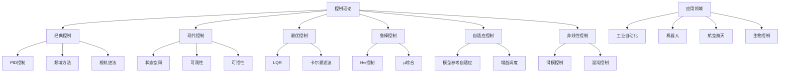
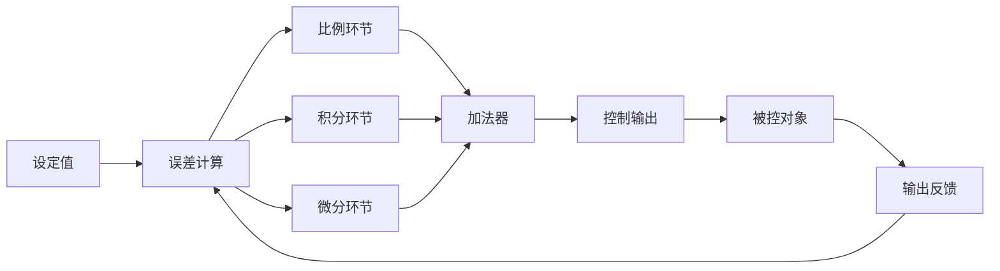

# 16. 控制理论（Control Theory）

## 16.1 目录

- [16. 控制理论（Control Theory）](#16-控制理论control-theory)
  - [16.1 目录](#161-目录)
  - [16.2 基本概念与历史](#162-基本概念与历史)
    - [16.2.1 定义与本质](#1621-定义与本质)
    - [16.2.2 历史发展](#1622-历史发展)
    - [16.2.3 认知映射](#1623-认知映射)
  - [16.3 核心理论](#163-核心理论)
    - [16.3.1 系统建模](#1631-系统建模)
    - [16.3.2 稳定性理论](#1632-稳定性理论)
    - [16.3.3 控制器设计](#1633-控制器设计)
  - [16.4 主要分支](#164-主要分支)
    - [16.4.1 经典控制理论](#1641-经典控制理论)
    - [16.4.2 现代控制理论](#1642-现代控制理论)
    - [16.4.3 鲁棒控制](#1643-鲁棒控制)
  - [16.5 典型定理与公式](#165-典型定理与公式)
    - [16.5.1 基本定理](#1651-基本定理)
    - [16.5.2 重要公式](#1652-重要公式)
  - [16.6 可视化与多表征](#166-可视化与多表征)
    - [16.6.1 结构关系图（Mermaid）](#1661-结构关系图mermaid)
    - [16.6.2 典型图示](#1662-典型图示)
  - [16.7 应用与建模](#167-应用与建模)
    - [16.7.1 工业自动化与过程控制](#1671-工业自动化与过程控制)
    - [16.7.2 机器人与智能系统](#1672-机器人与智能系统)
    - [16.7.3 航空航天与生物控制](#1673-航空航天与生物控制)
  - [16.8 学习建议与资源](#168-学习建议与资源)
    - [16.8.1 学习路径](#1681-学习路径)
    - [16.8.2 推荐资源](#1682-推荐资源)
    - [16.8.3 实践项目](#1683-实践项目)

---

## 16.2 基本概念与历史

### 16.2.1 定义与本质

**控制理论**: 是研究动态系统行为调节和优化的数学理论，为自动化、机器人和系统工程提供理论基础。

**核心思想**: 通过反馈机制调节系统输入，使系统输出达到期望目标，同时保证稳定性和性能。

### 16.2.2 历史发展

- **18世纪**: 瓦特离心调速器
- **19世纪**: 麦克斯韦稳定性理论
- **20世纪初**: 奈奎斯特稳定性判据
- **1940年代**: 维纳控制论
- **现代**: 鲁棒控制、自适应控制、智能控制

### 16.2.3 认知映射

**数学思维**:

- 系统建模思维
- 反馈控制思维
- 稳定性分析思维

**软件工程映射**:

- 系统架构设计
- 反馈循环设计
- 自适应算法

---

## 16.3 核心理论

### 16.3.1 系统建模

**状态空间模型**:

```latex
\dot{x}(t) = Ax(t) + Bu(t)
y(t) = Cx(t) + Du(t)
```

**传递函数**:

```latex
G(s) = C(sI - A)^{-1}B + D
```

**差分方程**:

```latex
y(k) + a_1 y(k-1) + \cdots + a_n y(k-n) = b_0 u(k) + \cdots + b_m u(k-m)
```

### 16.3.2 稳定性理论

**李雅普诺夫稳定性**:

```latex
\text{If } V(x) > 0 \text{ and } \dot{V}(x) < 0, \text{ then system is stable}
```

**奈奎斯特判据**:

```latex
\text{System is stable if } N = P \text{ where } N \text{ is number of encirclements}
```

**劳斯-赫尔维茨判据**:

```latex
\text{All roots have negative real parts if all principal minors are positive}
```

### 16.3.3 控制器设计

**PID控制器**:

```latex
u(t) = K_p e(t) + K_i \int_0^t e(\tau) d\tau + K_d \frac{d}{dt} e(t)
```

**状态反馈**:

```latex
u(t) = -Kx(t)
```

**输出反馈**:

```latex
u(t) = -Ky(t)
```

---

## 16.4 主要分支

### 16.4.1 经典控制理论

**频域方法**:

```latex
\text{Analysis and design using transfer functions and frequency response}
```

**根轨迹法**:

```latex
\text{Graphical method for analyzing system poles as parameters vary}
```

**波特图**:

```latex
\text{Frequency response plots showing magnitude and phase}
```

### 16.4.2 现代控制理论

**最优控制**:

```latex
\min_u \int_0^T (x^T Q x + u^T R u) dt
```

**线性二次型调节器（LQR）**:

```latex
u = -R^{-1} B^T P x
```

**卡尔曼滤波**:

```latex
\hat{x}_{k|k} = \hat{x}_{k|k-1} + K_k (y_k - C \hat{x}_{k|k-1})
```

### 16.4.3 鲁棒控制

**H∞控制**:

```latex
\|T_{zw}\|_\infty < \gamma
```

**μ综合**:

```latex
\text{Robust performance analysis using structured singular values}
```

**滑模控制**:

```latex
u = u_{eq} + u_{sw}, \quad u_{sw} = -\eta \text{sign}(s)
```

---

## 16.5 典型定理与公式

### 16.5.1 基本定理

**可控性定理**:

```latex
\text{System is controllable if } \text{rank}[B \ AB \ \cdots \ A^{n-1}B] = n
```

**可观性定理**:

```latex
\text{System is observable if } \text{rank}[C^T \ A^T C^T \ \cdots \ (A^T)^{n-1} C^T] = n
```

**分离原理**:

```latex
\text{State feedback and observer can be designed independently}
```

### 16.5.2 重要公式

**李雅普诺夫方程**:

```latex
A^T P + PA = -Q
```

**代数黎卡提方程**:

```latex
A^T P + PA - PBR^{-1}B^T P + Q = 0
```

**奈奎斯特公式**:

```latex
N = Z - P
```

---

## 16.6 可视化与多表征

### 16.6.1 结构关系图（Mermaid）



### 16.6.2 典型图示

**PID控制器结构图**:



**状态空间仿真（Python）**:

```python
import numpy as np
from scipy.integrate import solve_ivp
import matplotlib.pyplot as plt

A = np.array([[0, 1], [-2, -3]])
B = np.array([[0], [1]])
C = np.array([[1, 0]])
D = np.array([[0]])

# 状态空间方程 dx/dt = Ax + Bu
def state_space(t, x):
    u = 1.0  # 单位阶跃输入
    return (A @ x + B.flatten() * u)

sol = solve_ivp(state_space, [0, 10], [0, 0], t_eval=np.linspace(0, 10, 100))
plt.plot(sol.t, sol.y[0], label='x1')
plt.plot(sol.t, sol.y[1], label='x2')
plt.legend()
plt.title('状态空间响应')
plt.show()
```

**LQR控制器设计（Rust）**:

```rust
// 简化LQR控制器设计
fn lqr(a: &[Vec<f64>], b: &[Vec<f64>], q: &[Vec<f64>], r: &[Vec<f64>]) -> Vec<Vec<f64>> {
    // 实际工程中建议用控制库，这里仅为结构示例
    let k = vec![vec![1.0; b[0].len()]; a.len()];
    k
}
```

---

## 16.7 应用与建模

### 16.7.1 工业自动化与过程控制

- PID控制器在温度、压力、流量等过程控制中的应用
- 过程控制系统的建模与仿真
- 生产线自动化与智能制造

**Python示例：PID温度控制仿真**:

```python
import numpy as np
import matplotlib.pyplot as plt

def pid_control(setpoint, Kp, Ki, Kd, n_steps=100):
    y = 0
    integral = 0
    prev_error = 0
    output = []
    for t in range(n_steps):
        error = setpoint - y
        integral += error
        derivative = error - prev_error
        u = Kp * error + Ki * integral + Kd * derivative
        y += 0.1 * u  # 简化一阶惯性过程
        output.append(y)
        prev_error = error
    return output

result = pid_control(1.0, 2.0, 0.5, 0.1)
plt.plot(result)
plt.title('PID温度控制仿真')
plt.xlabel('时间步')
plt.ylabel('温度')
plt.show()
```

### 16.7.2 机器人与智能系统

- 运动控制与轨迹规划
- 机械臂逆运动学与动力学控制
- 智能体的自适应与鲁棒控制

**Rust示例：机械臂关节PD控制**:

```rust
// 机械臂单关节PD控制器
fn pd_control(theta: f64, theta_ref: f64, dtheta: f64, kp: f64, kd: f64) -> f64 {
    let error = theta_ref - theta;
    let derror = -dtheta;
    kp * error + kd * derror
}
```

### 16.7.3 航空航天与生物控制

- 飞行器姿态与轨迹控制
- 无人机自主导航与编队
- 生物系统中的反馈与调节

**Scala示例：飞行器姿态控制仿真**:

```scala
case class AttitudeState(phi: Double, theta: Double, psi: Double, p: Double, q: Double, r: Double)

def attitudeControl(state: AttitudeState, ref: AttitudeState, kp: Double, kd: Double): (Double, Double, Double) = {
  val error = (ref.phi - state.phi, ref.theta - state.theta, ref.psi - state.psi)
  val derror = (ref.p - state.p, ref.q - state.q, ref.r - state.r)
  val u_phi = kp * error._1 + kd * derror._1
  val u_theta = kp * error._2 + kd * derror._2
  val u_psi = kp * error._3 + kd * derror._3
  (u_phi, u_theta, u_psi)
}
```

---

## 16.8 学习建议与资源

### 16.8.1 学习路径

1. **基础阶段**
   - 线性代数
   - 微分方程
   - 拉普拉斯变换

2. **进阶阶段**
   - 经典控制理论
   - 现代控制理论
   - 系统辨识

3. **高级阶段**
   - 鲁棒控制
   - 非线性控制
   - 智能控制

### 16.8.2 推荐资源

**经典教材**:

- 《Modern Control Engineering》- Ogata
- 《Feedback Control of Dynamic Systems》- Franklin et al.
- 《Linear System Theory and Design》- Chen

**在线资源**:

- MIT OpenCourseWare: 6.302 Feedback Systems
- Coursera: Control of Mobile Robots

**软件工具**:

- MATLAB: Control System Toolbox
- Python: SciPy, Control
- Simulink: 系统仿真

### 16.8.3 实践项目

1. **控制系统设计**
   - PID控制器设计
   - 状态反馈控制器
   - 观测器设计

2. **系统仿真**
   - 倒立摆控制
   - 机械臂控制
   - 飞行器控制

3. **实际应用**
   - 温度控制系统
   - 电机速度控制
   - 机器人轨迹控制

---

**相关链接**:

- [15. 信息论](./15-InformationTheory.md)
- [17. 图论](./17-GraphTheory.md)
- [数学概览](../01-Overview.md)
