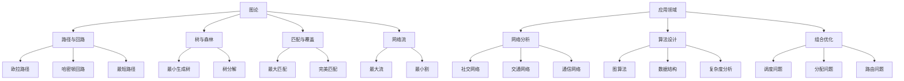
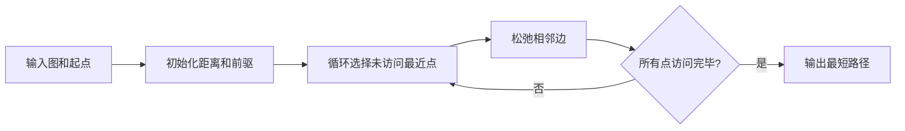

# 17. 图论（Graph Theory）

## 17.1 目录

- [17. 图论（Graph Theory）](#17-图论graph-theory)
  - [17.1 目录](#171-目录)
  - [17.2 基本概念与历史](#172-基本概念与历史)
    - [17.2.1 定义与本质](#1721-定义与本质)
    - [17.2.2 历史发展](#1722-历史发展)
    - [17.2.3 认知映射](#1723-认知映射)
  - [17.3 核心理论](#173-核心理论)
    - [17.3.1 基本定义](#1731-基本定义)
    - [17.3.2 连通性](#1732-连通性)
    - [17.3.3 匹配与覆盖](#1733-匹配与覆盖)
  - [17.4 主要分支](#174-主要分支)
    - [17.4.1 路径与回路](#1741-路径与回路)
    - [17.4.2 树与森林](#1742-树与森林)
    - [17.4.3 网络流](#1743-网络流)
  - [17.5 典型定理与公式](#175-典型定理与公式)
    - [17.5.1 基本定理](#1751-基本定理)
    - [17.5.2 重要公式](#1752-重要公式)
  - [17.6 可视化与多表征](#176-可视化与多表征)
    - [17.6.1 结构关系图（Mermaid）](#1761-结构关系图mermaid)
    - [17.6.2 典型图示](#1762-典型图示)
  - [17.7 应用与建模](#177-应用与建模)
    - [17.7.1 网络分析](#1771-网络分析)
    - [17.7.2 算法设计](#1772-算法设计)
    - [17.7.3 组合优化](#1773-组合优化)
  - [17.8 学习建议与资源](#178-学习建议与资源)
    - [17.8.1 学习路径](#1781-学习路径)
    - [17.8.2 推荐资源](#1782-推荐资源)
    - [17.8.3 实践项目](#1783-实践项目)

---

## 17.2 基本概念与历史

### 17.2.1 定义与本质

**图论**是研究图（由顶点和边组成的数学结构）的性质和应用的数学分支，为网络分析、算法设计和组合优化提供理论基础。

**核心思想**:

- 用抽象的点和线表示对象及其关系，研究图的结构性质、算法和优化问题。

### 17.2.2 历史发展

- **18世纪**：柯尼斯堡七桥问题
- **19世纪**：欧拉图、哈密顿图
- **20世纪初**：四色定理、匹配理论
- **20世纪中期**：网络流、图算法
- **现代**：随机图、网络科学、图神经网络

### 17.2.3 认知映射

**数学思维**:

- 抽象关系思维
- 组合结构思维
- 算法优化思维

**软件工程映射**:

- 数据结构设计
- 网络算法实现
- 图数据库设计

---

## 17.3 核心理论

### 17.3.1 基本定义

**图**:

```latex
G = (V, E) \text{ where } V \text{ is vertex set, } E \text{ is edge set}
```

**度**:

```latex
\deg(v) = |\{e \in E : v \in e\}|
```

**路径**:

```latex
P = (v_0, v_1, \ldots, v_k) \text{ where } \{v_i, v_{i+1}\} \in E
```

### 17.3.2 连通性

**连通图**:

```latex
\text{Graph is connected if } \forall u,v \in V, \exists \text{ path from } u \text{ to } v
```

**连通分量**:

```latex
\text{Maximal connected subgraph}
```

**割点与桥**:

```latex
\text{Cut vertex: removal increases number of components}
```

### 17.3.3 匹配与覆盖

**匹配**:

```latex
M \subseteq E \text{ where no two edges share a vertex}
```

**最大匹配**:

```latex
\text{Matching with maximum number of edges}
```

**完美匹配**:

```latex
\text{Matching covering all vertices}
```

---

## 17.4 主要分支

### 17.4.1 路径与回路

**欧拉路径**:

```latex
\text{Path traversing each edge exactly once}
```

**哈密顿回路**:

```latex
\text{Cycle visiting each vertex exactly once}
```

**最短路径**:

```latex
\text{Path with minimum total weight}
```

### 17.4.2 树与森林

**树**:

```latex
\text{Connected acyclic graph}
```

**生成树**:

```latex
\text{Tree spanning all vertices}
```

**最小生成树**:

```latex
\text{Spanning tree with minimum total weight}
```

### 17.4.3 网络流

**最大流**:

```latex
\max \sum_{v \in V} f(s,v) \text{ subject to capacity constraints}
```

**最小割**:

```latex
\text{Minimum capacity cut separating source and sink}
```

**最大流最小割定理**:

```latex
\text{Maximum flow equals minimum cut capacity}
```

---

## 17.5 典型定理与公式

### 17.5.1 基本定理

**握手引理**:

```latex
\sum_{v \in V} \deg(v) = 2|E|
```

**欧拉公式**:

```latex
|V| - |E| + |F| = 2 \text{ for planar graphs}
```

**柯尼希定理**:

```latex
\text{In bipartite graphs, maximum matching equals minimum vertex cover}
```

### 17.5.2 重要公式

**图的谱**:

```latex
\text{Eigenvalues of adjacency matrix } A
```

**拉普拉斯矩阵**:

```latex
L = D - A \text{ where } D \text{ is degree matrix}
```

**图的着色数**:

```latex
\chi(G) = \min\{k : G \text{ is } k\text{-colorable}\}
```

---

## 17.6 可视化与多表征

### 17.6.1 结构关系图（Mermaid）



### 17.6.2 典型图示

**最短路径算法流程图**:



**图的基本操作（Haskell）**:

```haskell
-- 图的基本定义与度计算
 data Graph a = Graph {
     vertices :: [a],
     edges :: [(a, a)]
 }

degree :: Eq a => Graph a -> a -> Int
degree g v = length [e | e <- edges g, fst e == v || snd e == v]
```

**最大流算法（Rust）**:

```rust
// Edmonds-Karp最大流算法
fn edmonds_karp(capacity: &Vec<Vec<i32>>, source: usize, sink: usize) -> i32 {
    let n = capacity.len();
    let mut flow = vec![vec![0; n]; n];
    let mut max_flow = 0;
    loop {
        let mut parent = vec![-1; n];
        let mut queue = std::collections::VecDeque::new();
        queue.push_back(source);
        while let Some(u) = queue.pop_front() {
            for v in 0..n {
                if parent[v] == -1 && capacity[u][v] - flow[u][v] > 0 {
                    parent[v] = u as i32;
                    if v == sink { break; }
                    queue.push_back(v);
                }
            }
        }
        if parent[sink] == -1 { break; }
        let mut increment = i32::MAX;
        let mut v = sink;
        while v != source {
            let u = parent[v] as usize;
            increment = increment.min(capacity[u][v] - flow[u][v]);
            v = u;
        }
        v = sink;
        while v != source {
            let u = parent[v] as usize;
            flow[u][v] += increment;
            flow[v][u] -= increment;
            v = u;
        }
        max_flow += increment;
    }
    max_flow
}
```

---

## 17.7 应用与建模

### 17.7.1 网络分析

- 社交网络分析（社区发现、中心性、影响力传播）
- 交通网络优化（最短路径、流量分配）
- 通信网络设计（路由、容错）

**Python示例：社交网络社区发现**:

```python
import networkx as nx
from networkx.algorithms import community

G = nx.karate_club_graph()
communities = community.greedy_modularity_communities(G)
for i, c in enumerate(communities):
    print(f"社区 {i}: {sorted(c)}")
```

### 17.7.2 算法设计

- 最短路径算法（Dijkstra、Floyd、Bellman-Ford）
- 最小生成树算法（Kruskal、Prim）
- 网络流算法（Edmonds-Karp、Dinic）

**Scala示例：Kruskal最小生成树**:

```scala
case class Edge(u: Int, v: Int, w: Int)

def kruskal(n: Int, edges: List[Edge]): List[Edge] = {
  val parent = (0 until n).toArray
  def find(x: Int): Int = if (parent(x) != x) { parent(x) = find(parent(x)); parent(x) } else x
  def union(x: Int, y: Int): Boolean = {
    val fx = find(x); val fy = find(y)
    if (fx != fy) { parent(fx) = fy; true } else false
  }
  edges.sortBy(_.w).filter(e => union(e.u, e.v))
}
```

### 17.7.3 组合优化

- 调度问题（关键路径、任务分配）
- 分配问题（二分图匹配、匈牙利算法）
- 路由问题（最优路径、负载均衡）

**Haskell示例：二分图最大匹配**:

```haskell
-- 匈牙利算法（伪代码结构）
findMatching :: [[Bool]] -> [Maybe Int]
findMatching adj = ... -- 省略具体实现，可用递归和回溯
```

---

## 17.8 学习建议与资源

### 17.8.1 学习路径

1. **基础阶段**
   - 离散数学
   - 组合数学
   - 算法基础

2. **进阶阶段**
   - 图论基础
   - 图算法
   - 网络分析

3. **高级阶段**
   - 随机图论
   - 网络科学
   - 图神经网络

### 17.8.2 推荐资源

**经典教材**:

- 《Introduction to Graph Theory》- West
- 《Graph Theory》- Bondy & Murty
- 《Algorithm Design》- Kleinberg & Tardos

**在线资源**:

- MIT OpenCourseWare: 6.006 Introduction to Algorithms
- Coursera: Algorithms on Graphs

**软件工具**:

- Python: NetworkX, igraph
- R: igraph, statnet
- C++: Boost Graph Library

### 17.8.3 实践项目

1. **图算法实现**
   - 最短路径算法
   - 最小生成树算法
   - 网络流算法

2. **网络分析**
   - 社交网络分析
   - 交通网络分析
   - 生物网络分析

3. **应用开发**
   - 图数据库系统
   - 网络可视化工具
   - 路径规划系统

---

**相关链接**:

- [16. 控制理论](./16-ControlTheory.md)
- [18. 组合数学](./18-Combinatorics.md)
- [数学概览](../01-Overview.md)
