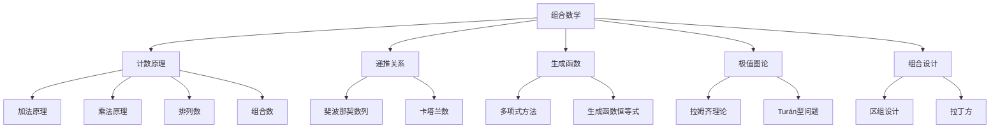
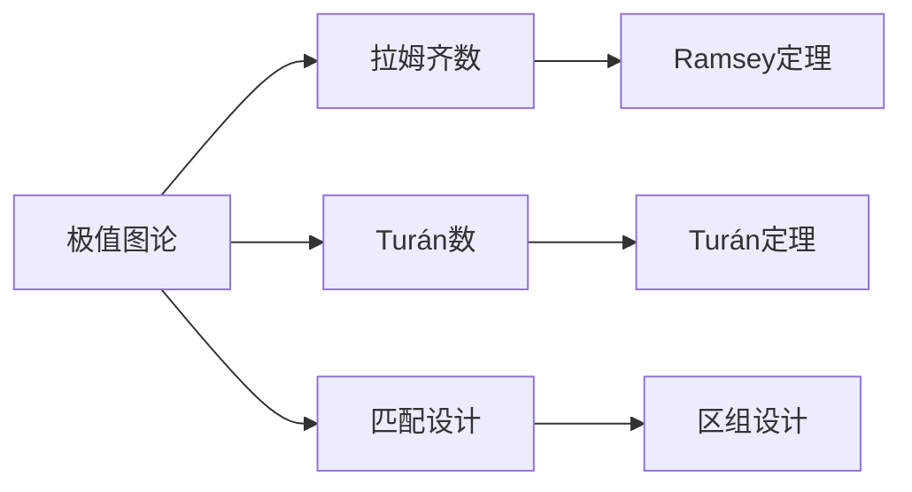

# 18. 组合数学（Combinatorics）

## 18.1 目录

- [18. 组合数学（Combinatorics）](#18-组合数学combinatorics)
  - [18.1 目录](#181-目录)
  - [18.2 基本概念与历史](#182-基本概念与历史)
    - [18.2.1 定义与本质](#1821-定义与本质)
    - [18.2.2 历史发展](#1822-历史发展)
    - [18.2.3 认知映射](#1823-认知映射)
  - [18.3 核心理论](#183-核心理论)
    - [18.3.1 计数原理](#1831-计数原理)
    - [18.3.2 排列与组合](#1832-排列与组合)
    - [18.3.3 容斥原理](#1833-容斥原理)
    - [18.3.4 递推关系](#1834-递推关系)
  - [18.4 主要分支](#184-主要分支)
    - [18.4.1 极值组合](#1841-极值组合)
    - [18.4.2 设计理论](#1842-设计理论)
    - [18.4.3 组合优化](#1843-组合优化)
    - [18.4.4 代数组合](#1844-代数组合)
  - [18.5 典型定理与公式](#185-典型定理与公式)
    - [18.5.1 基本定理](#1851-基本定理)
    - [18.5.2 重要公式](#1852-重要公式)
  - [18.6 可视化与多表征](#186-可视化与多表征)
    - [18.6.1 结构关系图（Mermaid）](#1861-结构关系图mermaid)
    - [18.6.2 典型图示](#1862-典型图示)
  - [18.7 应用与建模](#187-应用与建模)
    - [18.7.1 计算机科学](#1871-计算机科学)
    - [18.7.2 运筹优化](#1872-运筹优化)
    - [18.7.3 生物信息学](#1873-生物信息学)
    - [18.7.1 算法与计算](#1871-算法与计算)
    - [18.7.2 信息与编码](#1872-信息与编码)
    - [18.7.3 科学与工程建模](#1873-科学与工程建模)
  - [18.8 学习建议与资源](#188-学习建议与资源)
    - [18.8.1 学习路径](#1881-学习路径)
    - [18.8.2 推荐资源](#1882-推荐资源)
    - [18.8.3 实践项目](#1883-实践项目)

---

## 18.2 基本概念与历史

### 18.2.1 定义与本质

**组合数学**是研究有限或可数离散结构的计数、构造、分析与优化的数学分支。

**核心思想**:

- 离散结构思维
- 计数与构造思维
- 递推与归纳思维

### 18.2.2 历史发展

- **17世纪**：帕斯卡三角形、二项式定理
- **18世纪**：欧拉、拉格朗日的组合恒等式
- **19世纪**：拉姆齐理论、设计理论
- **20世纪**：极值组合、代数组合
- **现代**：组合优化、计算机组合学

### 18.2.3 认知映射

**数学思维**:

- 离散结构思维
- 计数与构造思维
- 递推与归纳思维

**软件工程映射**:

- 算法复杂度分析
- 离散数据结构
- 组合算法设计

---

## 18.3 核心理论

### 18.3.1 计数原理

**加法原理**:

```latex
|A \cup B| = |A| + |B| \text{ if } A \cap B = \emptyset
```

**乘法原理**:

```latex
|A \times B| = |A| \cdot |B|
```

### 18.3.2 排列与组合

**排列数**:

```latex
P(n, k) = \frac{n!}{(n-k)!}
```

**组合数**:

```latex
C(n, k) = \binom{n}{k} = \frac{n!}{k!(n-k)!}
```

### 18.3.3 容斥原理

**容斥原理**:

```latex
|A \cup B| = |A| + |B| - |A \cap B|
```

**推广**:

```latex
|A_1 \cup \cdots \cup A_n| = \sum_{i} |A_i| - \sum_{i<j} |A_i \cap A_j| + \cdots + (-1)^{n+1} |A_1 \cap \cdots \cap A_n|
```

### 18.3.4 递推关系

**斐波那契数列**:

```latex
F_n = F_{n-1} + F_{n-2}, \quad F_0 = 0, F_1 = 1
```

**卡塔兰数**:

```latex
C_n = \frac{1}{n+1} \binom{2n}{n}
```

---

## 18.4 主要分支

### 18.4.1 极值组合

- 拉姆齐理论
- Turán型问题
- 极值图论

### 18.4.2 设计理论

- 匹配设计
- 区组设计
- 拉丁方

### 18.4.3 组合优化

- 旅行商问题
- 排列优化
- 图着色

### 18.4.4 代数组合

- 生成函数
- 组合恒等式
- 多项式方法

---

## 18.5 典型定理与公式

### 18.5.1 基本定理

**鸽巢原理**:

```latex
n+1 \text{ pigeons in } n \text{ holes } \Rightarrow \text{ at least one hole has } \geq 2 \text{ pigeons}
```

**拉姆齐定理**:

```latex
R(m, n) \text{ is the minimum number of vertices to guarantee a clique of size } m \text{ or an independent set of size } n
```

**Burnside引理**:

```latex
|X/G| = \frac{1}{|G|} \sum_{g \in G} |\text{Fix}(g)|
```

### 18.5.2 重要公式

**二项式定理**:

```latex
(x+y)^n = \sum_{k=0}^n \binom{n}{k} x^k y^{n-k}
```

**斯特林数**:

```latex
S(n, k) = S(n-1, k-1) + k S(n-1, k)
```

**贝尔数**:

```latex
B_n = \sum_{k=0}^n S(n, k)
```

---

## 18.6 可视化与多表征

### 18.6.1 结构关系图（Mermaid）



### 18.6.2 典型图示

**组合数可视化（Haskell）**:

```haskell
-- 组合数的杨辉三角可视化
pascal :: [[Integer]]
pascal = [1] : map next pascal
  where next row = zipWith (+) ([0] ++ row) (row ++ [0])

printPascal :: Int -> IO ()
printPascal n = mapM_ print $ take n pascal
```

**递推关系实现（Python）**:

```python
def fibonacci(n):
    a, b = 0, 1
    for _ in range(n):
        a, b = b, a + b
    return a

def catalan(n):
    if n == 0:
        return 1
    return sum(catalan(i) * catalan(n - 1 - i) for i in range(n))
```

**极值图论结构图**:



---

## 18.7 应用与建模

### 18.7.1 计算机科学

- 算法复杂度分析
- 数据结构设计
- 随机算法

### 18.7.2 运筹优化

- 排班问题
- 资源分配
- 网络流优化

### 18.7.3 生物信息学

- 基因序列比对
- 进化树构建
- 组合药物筛选

### 18.7.1 算法与计算

- 组合数生成与递推关系求解
- 组合优化算法（旅行商、图着色、分配问题）
- 随机化算法与概率方法

**Rust示例：组合数生成**:

```rust
// 生成所有n选k组合
fn combinations(n: usize, k: usize) -> Vec<Vec<usize>> {
    fn backtrack(start: usize, k: usize, path: &mut Vec<usize>, res: &mut Vec<Vec<usize>>, n: usize) {
        if path.len() == k {
            res.push(path.clone());
            return;
        }
        for i in start..=n {
            path.push(i);
            backtrack(i + 1, k, path, res, n);
            path.pop();
        }
    }
    let mut res = Vec::new();
    let mut path = Vec::new();
    backtrack(1, k, &mut path, &mut res, n);
    res
}
```

### 18.7.2 信息与编码

- 组合设计在编码理论中的应用（区组设计、拉丁方）
- 错误检测与纠错码（汉明码、BCH码）
- 随机编码与概率方法

**Python示例：拉丁方生成**:

```python
def latin_square(n):
    square = [[(i + j) % n + 1 for j in range(n)] for i in range(n)]
    return square

for row in latin_square(5):
    print(row)
```

### 18.7.3 科学与工程建模

- 网络结构优化（图着色、匹配、流）
- 生物信息学中的组合问题（基因排列、序列比对）
- 物理与化学中的组合模型（分子构型、统计力学）

**Scala示例：图着色回溯算法**:

```scala
def graphColoring(graph: Map[Int, List[Int]], m: Int): Option[Map[Int, Int]] = {
  def assignColor(v: Int, coloring: Map[Int, Int]): Option[Map[Int, Int]] = {
    if (v == graph.size) Some(coloring)
    else {
      (1 to m).toStream.flatMap { color =>
        if (graph(v).forall(n => coloring.get(n) != Some(color)))
          assignColor(v + 1, coloring + (v -> color))
        else None
      }.headOption
    }
  }
  assignColor(0, Map())
}
```

---

## 18.8 学习建议与资源

### 18.8.1 学习路径

1. **基础阶段**
   - 离散数学基础
   - 计数原理
   - 排列组合

2. **进阶阶段**
   - 容斥原理
   - 递推关系
   - 极值组合

3. **高级阶段**
   - 设计理论
   - 组合优化
   - 代数组合

### 18.8.2 推荐资源

**经典教材**:

- 《Introductory Combinatorics》- Brualdi
- 《A Walk Through Combinatorics》- Miklós Bóna
- 《Enumerative Combinatorics》- Stanley

**在线资源**:

- MIT OpenCourseWare: 6.042J Mathematics for Computer Science
- Coursera: Combinatorics and Probability

**软件工具**:

- Python: SymPy, itertools
- SageMath: 组合数学库
- Mathematica: Combinatorica

### 18.8.3 实践项目

1. **算法实现**:
   - 组合数生成器
   - 递推关系求解器
   - 组合优化算法

2. **应用开发**:
   - 排班系统
   - 基因序列分析
   - 网络流优化工具

3. **竞赛训练**:
   - ACM/ICPC组合题
   - 数学建模竞赛
   - 算法竞赛

---

**相关链接**:

- [17. 图论](./17-GraphTheory.md)
- [数学概览](../01-Overview.md)
