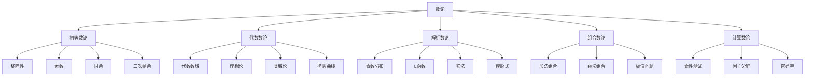
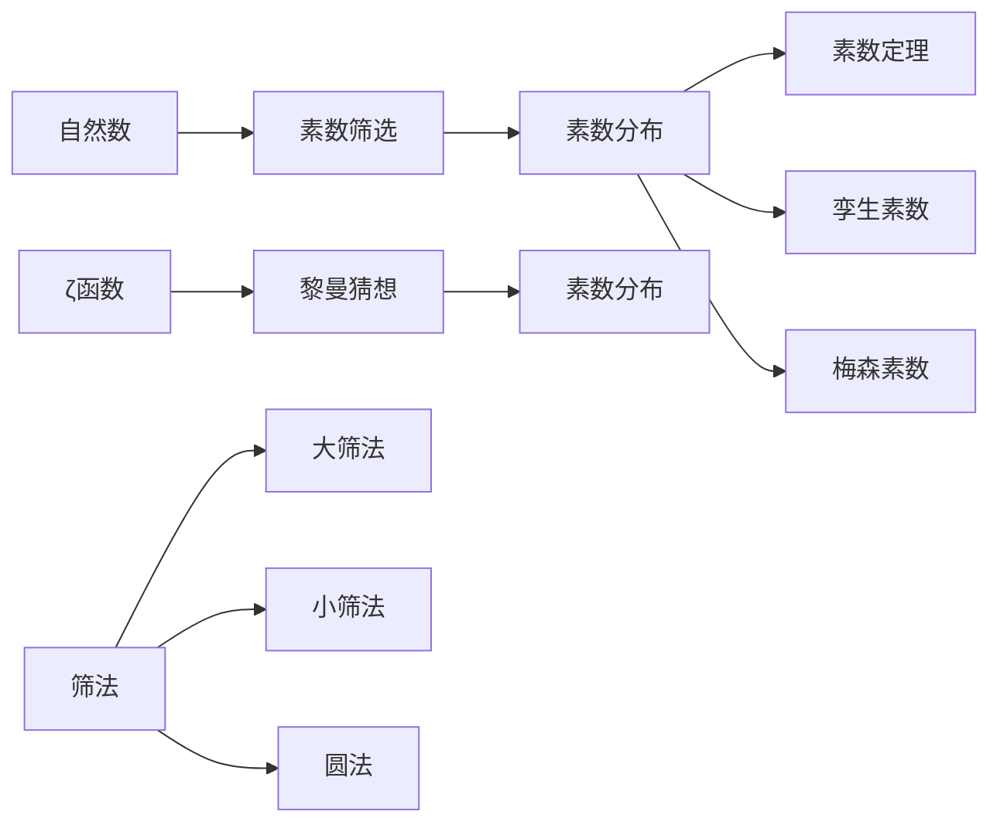

# 19. 数论（Number Theory）

## 概述

数论是研究整数性质的数学分支，被誉为"数学的皇后"。它研究整数的结构、性质和关系，从最基础的整除性到深奥的代数数论和解析数论。

## 历史背景

### 古代数论

- **古希腊**: 欧几里得、毕达哥拉斯学派
- **中国**: 孙子定理、秦九韶算法
- **印度**: 婆罗摩笈多、阿耶波多

### 近代发展

- **费马**: 费马大定理、费马小定理
- **欧拉**: 欧拉函数、欧拉定理
- **高斯**: 二次互反律、高斯整数

### 现代数论

- **黎曼**: 黎曼猜想、ζ函数
- **希尔伯特**: 希尔伯特问题
- **朗兰兹纲领**: 统一数论与几何

## 核心理论

### 1. 初等数论

#### 整除性理论

```latex
\text{定义：} a \mid b \Leftrightarrow \exists k \in \mathbb{Z}, b = ak
```

**基本性质**:

- 传递性：$a \mid b, b \mid c \Rightarrow a \mid c$
- 线性组合：$a \mid b, a \mid c \Rightarrow a \mid (mb + nc)$

#### 素数理论

```latex
\text{素数分布：} \pi(x) \sim \frac{x}{\ln x}
```

**重要定理**:

- 算术基本定理
- 素数定理
- 孪生素数猜想

#### 同余理论

```latex
a \equiv b \pmod{m} \Leftrightarrow m \mid (a - b)
```

**中国剩余定理**:

```latex
\begin{cases}
x \equiv a_1 \pmod{m_1} \\
x \equiv a_2 \pmod{m_2} \\
\vdots \\
x \equiv a_n \pmod{m_n}
\end{cases}
```

### 2. 代数数论

#### 代数数域

```latex
K = \mathbb{Q}(\alpha) = \{a_0 + a_1\alpha + \cdots + a_{n-1}\alpha^{n-1} : a_i \in \mathbb{Q}\}
```

#### 理想论

```latex
\text{主理想：} (a) = \{ra : r \in R\}
```

**理想分解**:

```latex
(a) = \prod_{i=1}^{n} \mathfrak{p}_i^{e_i}
```

#### 类域论

- 阿贝尔扩张的分类
- 局部-整体原理
- 朗兰兹纲领

### 3. 解析数论

#### 狄利克雷级数

```latex
L(s, \chi) = \sum_{n=1}^{\infty} \frac{\chi(n)}{n^s}
```

#### 黎曼ζ函数

```latex
\zeta(s) = \sum_{n=1}^{\infty} \frac{1}{n^s} = \prod_{p} \frac{1}{1 - p^{-s}}
```

**函数方程**:

```latex
\zeta(s) = 2^s \pi^{s-1} \sin\left(\frac{\pi s}{2}\right) \Gamma(1-s) \zeta(1-s)
```

## 主要分支

### 1. 初等数论1

- 整除性
- 素数分布
- 同余理论
- 二次剩余

### 2. 代数数论1

- 代数数域
- 理想论
- 类域论
- 椭圆曲线

### 3. 解析数论1

- 素数分布
- L函数
- 筛法
- 模形式

### 4. 组合数论

- 加法组合
- 乘法组合
- 极值问题
- 拉姆齐理论

### 5. 计算数论

- 素性测试
- 因子分解
- 离散对数
- 椭圆曲线密码

## 典型定理与公式

### 费马小定理

```latex
a^p \equiv a \pmod{p} \quad \text{对于素数} p
```

### 欧拉定理

```latex
a^{\phi(n)} \equiv 1 \pmod{n} \quad \text{当} \gcd(a,n) = 1
```

### 二次互反律

```latex
\left(\frac{p}{q}\right)\left(\frac{q}{p}\right) = (-1)^{\frac{p-1}{2} \cdot \frac{q-1}{2}}
```

### 素数定理

```latex
\pi(x) \sim \text{Li}(x) = \int_2^x \frac{dt}{\ln t}
```

### 算术基本定理

```latex
n = \prod_{i=1}^{k} p_i^{e_i} \quad \text{唯一分解}
```

## 可视化表示

### 数论概念关系图



### 素数分布图



## 代码实现

### Haskell实现

```haskell
-- 素数测试
isPrime :: Integer -> Bool
isPrime n
  | n < 2 = False
  | n == 2 = True
  | even n = False
  | otherwise = all (\d -> n `mod` d /= 0) [3,5..floor (sqrt (fromIntegral n))]

-- 欧拉函数
eulerPhi :: Integer -> Integer
eulerPhi n = product [p^(e-1) * (p-1) | (p,e) <- primeFactors n]

-- 中国剩余定理
chineseRemainder :: [(Integer, Integer)] -> Maybe Integer
chineseRemainder [] = Nothing
chineseRemainder [(a,m)] = Just a
chineseRemainder ((a1,m1):(a2,m2):rest) = do
  let (x, y) = extendedGCD m1 m2
  let m = m1 * m2
  let a = (a1 * m2 * y + a2 * m1 * x) `mod` m
  chineseRemainder ((a,m):rest)

-- 二次剩余
quadraticResidue :: Integer -> Integer -> Bool
quadraticResidue a p = a `mod` p /= 0 && legendreSymbol a p == 1

-- 勒让德符号
legendreSymbol :: Integer -> Integer -> Integer
legendreSymbol a p
  | a `mod` p == 0 = 0
  | a `mod` p == 1 = 1
  | even a = legendreSymbol (a `div` 2) p * if p `mod` 8 `elem` [1,7] then 1 else -1
  | otherwise = legendreSymbol (p `mod` a) a * if (a-1)*(p-1) `div` 4 `mod` 2 == 0 then 1 else -1
```

### Rust实现

```rust
use std::collections::HashMap;

// 素数测试
fn is_prime(n: u64) -> bool {
    if n < 2 { return false; }
    if n == 2 { return true; }
    if n % 2 == 0 { return false; }
    
    let sqrt_n = (n as f64).sqrt() as u64;
    for d in (3..=sqrt_n).step_by(2) {
        if n % d == 0 { return false; }
    }
    true
}

// 欧拉函数
fn euler_phi(n: u64) -> u64 {
    let mut result = n;
    let mut n_mut = n;
    
    for i in 2..=((n as f64).sqrt() as u64) {
        if n_mut % i == 0 {
            while n_mut % i == 0 {
                n_mut /= i;
            }
            result = result / i * (i - 1);
        }
    }
    
    if n_mut > 1 {
        result = result / n_mut * (n_mut - 1);
    }
    result
}

// 扩展欧几里得算法
fn extended_gcd(a: i64, b: i64) -> (i64, i64, i64) {
    if b == 0 {
        (a, 1, 0)
    } else {
        let (gcd, x, y) = extended_gcd(b, a % b);
        (gcd, y, x - (a / b) * y)
    }
}

// 中国剩余定理
fn chinese_remainder(remainders: &[(i64, i64)]) -> Option<i64> {
    let mut result = 0;
    let mut product = 1;
    
    for &(_, modulus) in remainders {
        product *= modulus;
    }
    
    for &(remainder, modulus) in remainders {
        let p = product / modulus;
        let (_, inv, _) = extended_gcd(p, modulus);
        result = (result + remainder * p * inv) % product;
    }
    
    Some((result + product) % product)
}

// 二次剩余
fn quadratic_residue(a: u64, p: u64) -> bool {
    if a % p == 0 { return false; }
    legendre_symbol(a, p) == 1
}

// 勒让德符号
fn legendre_symbol(a: u64, p: u64) -> i32 {
    if a % p == 0 { return 0; }
    if a % p == 1 { return 1; }
    
    if a % 2 == 0 {
        let mut result = legendre_symbol(a / 2, p);
        if p % 8 == 3 || p % 8 == 5 { result = -result; }
        result
    } else {
        let mut result = legendre_symbol(p % a, a);
        if ((a-1)*(p-1) `div` 4) % 2 == 1 { result = -result; }
        result
    }
}
```

### Scala实现

```scala
object NumberTheory {
  // 素数测试
  def isPrime(n: Long): Boolean = {
    if (n < 2) false
    else if (n == 2) true
    else if (n % 2 == 0) false
    else {
      val sqrtN = math.sqrt(n).toLong
      (3L to sqrtN by 2).forall(d => n % d != 0)
    }
  }
  
  // 欧拉函数
  def eulerPhi(n: Long): Long = {
    var result = n
    var nMut = n
    
    for (i <- 2L to math.sqrt(n).toLong) {
      if (nMut % i == 0) {
        while (nMut % i == 0) nMut /= i
        result = result / i * (i - 1)
      }
    }
    
    if (nMut > 1) result = result / nMut * (nMut - 1)
    result
  }
  
  // 扩展欧几里得算法
  def extendedGcd(a: Long, b: Long): (Long, Long, Long) = {
    if (b == 0) (a, 1, 0)
    else {
      val (gcd, x, y) = extendedGcd(b, a % b)
      (gcd, y, x - (a / b) * y)
    }
  }
  
  // 中国剩余定理
  def chineseRemainder(remainders: List[(Long, Long)]): Option[Long] = {
    val product = remainders.map(_._2).product
    
    val result = remainders.foldLeft(0L) { case (acc, (remainder, modulus)) =>
      val p = product / modulus
      val (_, inv, _) = extendedGcd(p, modulus)
      (acc + remainder * p * inv) % product
    }
    
    Some((result + product) % product)
  }
  
  // 二次剩余
  def quadraticResidue(a: Long, p: Long): Boolean = {
    if (a % p == 0) false
    else legendreSymbol(a, p) == 1
  }
  
  // 勒让德符号
  def legendreSymbol(a: Long, p: Long): Int = {
    if (a % p == 0) 0
    else if (a % p == 1) 1
    else if (a % 2 == 0) {
      val result = legendreSymbol(a / 2, p)
      if (p % 8 == 3 || p % 8 == 5) -result else result
    } else {
      val result = legendreSymbol(p % a, a)
      if (((a - 1) * (p - 1) / 4) % 2 == 1) -result else result
    }
  }
}
```

### Python实现

```python
import math
from typing import List, Tuple, Optional

class NumberTheory:
    @staticmethod
    def is_prime(n: int) -> bool:
        """素数测试"""
        if n < 2:
            return False
        if n == 2:
            return True
        if n % 2 == 0:
            return False
        
        for d in range(3, int(math.sqrt(n)) + 1, 2):
            if n % d == 0:
                return False
        return True
    
    @staticmethod
    def euler_phi(n: int) -> int:
        """欧拉函数"""
        result = n
        n_mut = n
        
        for i in range(2, int(math.sqrt(n)) + 1):
            if n_mut % i == 0:
                while n_mut % i == 0:
                    n_mut //= i
                result = result // i * (i - 1)
        
        if n_mut > 1:
            result = result // n_mut * (n_mut - 1)
        return result
    
    @staticmethod
    def extended_gcd(a: int, b: int) -> Tuple[int, int, int]:
        """扩展欧几里得算法"""
        if b == 0:
            return a, 1, 0
        else:
            gcd, x, y = NumberTheory.extended_gcd(b, a % b)
            return gcd, y, x - (a // b) * y
    
    @staticmethod
    def chinese_remainder(remainders: List[Tuple[int, int]]) -> Optional[int]:
        """中国剩余定理"""
        if not remainders:
            return None
        
        product = 1
        for _, modulus in remainders:
            product *= modulus
        
        result = 0
        for remainder, modulus in remainders:
            p = product // modulus
            _, inv, _ = NumberTheory.extended_gcd(p, modulus)
            result = (result + remainder * p * inv) % product
        
        return (result + product) % product
    
    @staticmethod
    def quadratic_residue(a: int, p: int) -> bool:
        """二次剩余"""
        if a % p == 0:
            return False
        return NumberTheory.legendre_symbol(a, p) == 1
    
    @staticmethod
    def legendre_symbol(a: int, p: int) -> int:
        """勒让德符号"""
        if a % p == 0:
            return 0
        if a % p == 1:
            return 1
        
        if a % 2 == 0:
            result = NumberTheory.legendre_symbol(a // 2, p)
            if p % 8 in [3, 5]:
                result = -result
            return result
        else:
            result = NumberTheory.legendre_symbol(p % a, a)
            if ((a - 1) * (p - 1) // 4) % 2 == 1:
                result = -result
            return result
    
    @staticmethod
    def prime_factors(n: int) -> List[Tuple[int, int]]:
        """质因数分解"""
        factors = []
        n_mut = n
        
        for i in range(2, int(math.sqrt(n)) + 1):
            if n_mut % i == 0:
                count = 0
                while n_mut % i == 0:
                    n_mut //= i
                    count += 1
                factors.append((i, count))
        
        if n_mut > 1:
            factors.append((n_mut, 1))
        
        return factors
    
    @staticmethod
    def gcd(a: int, b: int) -> int:
        """最大公约数"""
        while b:
            a, b = b, a % b
        return a
    
    @staticmethod
    def lcm(a: int, b: int) -> int:
        """最小公倍数"""
        return a * b // NumberTheory.gcd(a, b)
```

## 实际应用

### 1. 密码学

- **RSA算法**: 基于大数分解困难性
- **椭圆曲线密码**: 基于椭圆曲线离散对数
- **数字签名**: 基于数论难题

### 2. 计算机科学

- **哈希函数**: 素数模运算
- **随机数生成**: 线性同余法
- **算法优化**: 数论变换

### 3. 物理学

- **量子力学**: 希尔伯特空间
- **统计物理**: 配分函数
- **弦论**: 模形式

### 4. 经济学

- **博弈论**: 纳什均衡
- **金融数学**: 期权定价
- **计量经济学**: 回归分析

## 学习资源

### 经典教材

1. **《初等数论》** - 哈代
2. **《代数数论》** - 内文
3. **《解析数论》** - 达文波特
4. **《数论导引》** - 华罗庚

### 在线资源

- **OEIS**: 整数序列在线百科全书
- **LMFDB**: L函数和模形式数据库
- **Numberphile**: 数论视频频道

### 研究前沿

- **朗兰兹纲领**: 统一数论与几何
- **ABC猜想**: 数论中的重大猜想
- **孪生素数猜想**: 素数分布问题

---

**数论**作为数学的基础分支，不仅具有深厚的理论价值，在现代密码学、计算机科学等领域也有重要应用。从初等数论到高级的代数数论和解析数论，数论展现了数学的优雅和深刻。
