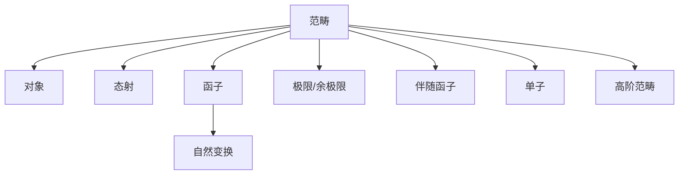
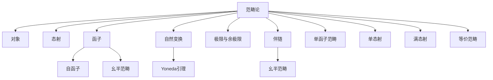

# 21. 范畴论（Category Theory）

## 概述

范畴论是研究数学结构及其之间映射的理论，被誉为"数学的数学"。它以对象（Object）和态射（Morphism）为基本元素，强调结构之间的关系和统一性，是现代数学和理论计算机科学的重要基础。

## 历史背景

- **1940s**：埃伦伯格（Eilenberg）与麦克莱恩（Mac Lane）提出范畴论，用于代数拓扑中的同调理论。
- **1950s-1970s**：函子、自然变换、极限、伴随函子等核心概念发展。
- **1980s-至今**：范畴论广泛应用于代数几何、逻辑、计算机科学、物理学等领域。

## 核心理论

### 1. 基本概念

#### 范畴

```latex
\text{范畴}~\mathcal{C} = (\mathrm{Ob}(\mathcal{C}), \mathrm{Hom}(\mathcal{C}), \circ, \mathrm{id})
```

- 对象集合 $\mathrm{Ob}(\mathcal{C})$
- 态射集合 $\mathrm{Hom}(\mathcal{C})$
- 复合运算 $\circ$
- 单位元 $\mathrm{id}_A$

#### 态射

- $f: A \to B$
- 满足结合律与单位元律

#### 函子

```latex
F: \mathcal{C} \to \mathcal{D}
```

- 对象映射 $F(A)$
- 态射映射 $F(f): F(A) \to F(B)$
- 保持结构：$F(\mathrm{id}_A) = \mathrm{id}_{F(A)}$, $F(g \circ f) = F(g) \circ F(f)$

#### 自然变换

```latex
\eta: F \Rightarrow G,\ \eta_A: F(A) \to G(A)
```

- 交换图：$G(f) \circ \eta_A = \eta_B \circ F(f)$

### 2. 重要结构

#### 极限与余极限

- 极限：锥、终锥
- 余极限：余锥、始锥

#### 伴随函子

- $F \dashv G$
- 单位与余单位

#### 闭范畴与单子

- 闭结构、幺半范畴
- 单子（Monad）、伴随对

#### 高阶范畴

- 2-范畴、n-范畴
- 高阶自然变换

## 主要分支

- 小范畴与大范畴
- 2-范畴与高阶范畴
- 单子理论
- 拓扑范畴
- 预层与层
- 场论与纤维化
- 量子范畴论

## 典型定理与公式

### Yoneda引理

```latex
\mathrm{Nat}(\mathrm{Hom}_\mathcal{C}(-, A), F) \cong F(A)
```

### 伴随函子判别定理

- $F \dashv G$ 当且仅当存在自然同构：

```latex
\mathrm{Hom}_\mathcal{D}(F(A), B) \cong \mathrm{Hom}_\mathcal{C}(A, G(B))
```

### 极限的普遍性质

- 极限对象的唯一性（同构意义下）

## 可视化表示

### 范畴论结构图



### Yoneda引理示意图

```mermaid
graph LR
    X -.->|Hom(-,A)| A
    X -.->|F| F(X)
    A -->|F| F(A)
    F(X) -->|Nat| F(A)
```

## 代码实现

### Haskell实现

```haskell
-- 范畴类型类
class Category cat where
    idC :: cat a a
    (.) :: cat b c -> cat a b -> cat a c

-- Hask范畴实例
instance Category (->) where
    idC = id
    (.) = (Prelude..)

-- 函子类型类
class Functor f where
    fmap :: (a -> b) -> f a -> f b

-- 自然变换
newtype Nat f g = Nat { runNat :: forall a. f a -> g a }
```

### Rust实现（伪代码）

```rust
// 范畴trait
trait Category<A, B, C> {
    fn id() -> fn(A) -> A;
    fn compose(f: fn(B) -> C, g: fn(A) -> B) -> fn(A) -> C;
}

// 函子trait
trait Functor<F, G> {
    fn fmap<A, B>(f: fn(A) -> B, fa: F<A>) -> F<B>;
}

// 自然变换trait
trait NaturalTransformation<F, G> {
    fn transform<A>(fa: F<A>) -> G<A>;
}
```

### Scala实现

```scala
trait Category[~>[_, _]] {
  def id[A]: A ~> A
  def compose[A, B, C](f: B ~> C, g: A ~> B): A ~> C
}

trait Functor[F[_]] {
  def fmap[A, B](f: A => B): F[A] => F[B]
}

trait Nat[F[_], G[_]] {
  def apply[A](fa: F[A]): G[A]
}
```

### Python实现（伪代码）

```python
from typing import Callable, TypeVar, Generic
A = TypeVar('A')
B = TypeVar('B')
C = TypeVar('C')

class Category(Generic[A, B, C]):
    def id(self) -> Callable[[A], A]:
        return lambda x: x
    def compose(self, f: Callable[[B], C], g: Callable[[A], B]) -> Callable[[A], C]:
        return lambda x: f(g(x))

class Functor(Generic[A, B]):
    def fmap(self, f: Callable[[A], B], fa):
        raise NotImplementedError

class NaturalTransformation(Generic[A, B]):
    def transform(self, fa):
        raise NotImplementedError
```

## 实际应用

### 1. 代数与几何

- 同调代数、层论、代数几何中的统一语言

### 2. 逻辑与计算机科学

- 类型论、λ演算、编程语言语义
- 函子式编程、单子、抽象语法树

### 3. 物理学

- 量子场论、拓扑量子场论、量子信息范畴

### 4. 人工智能

- 知识表示、范畴化推理、结构化学习

## 学习资源

### 经典教材

1. **《范畴论基础》** - Mac Lane
2. **《Sheaves in Geometry and Logic》** - Mac Lane & Moerdijk
3. **《Category Theory for Programmers》** - Bartosz Milewski

### 在线资源

- **nLab**：范畴论百科
- **Catsters**：范畴论视频
- **arXiv**：范畴论论文

### 研究前沿

- **高阶范畴理论**
- **同调范畴与导出范畴**
- **范畴化人工智能**

---

**范畴论**以其高度抽象和统一性，成为现代数学、计算机科学和物理学的核心工具。

## 21.6 可视化与多表征

### 21.6.1 结构关系图（Mermaid）



### 21.6.2 典型图示

**范畴与函子结构图**:

```mermaid
graph LR
    A[范畴C] -->|F| B[范畴D]
    A1[对象A] -->|f| A2[对象B]
    B1[对象F(A)] -->|F(f)| B2[对象F(B)]
```

**自然变换与交换图**:

```mermaid
graph LR
    X1[对象A] --f--> X2[对象B]
    X1 --F--> Y1[对象F(A)]
    X2 --F--> Y2[对象F(B)]
    Y1 --ηA--> Z1[对象G(A)]
    Y2 --ηB--> Z2[对象G(B)]
    Z1 --G(f)--> Z2
```

**Yoneda引理可视化（Haskell）**:

```haskell
-- Yoneda引理的类型同构
newtype Yoneda f a = Yoneda { runYoneda :: forall b. (a -> b) -> f b }

-- 证明：Nat(Hom(A,-), F) ≅ F(A)
-- 其中Hom(A,-)是代表函子
```

---

## 21.7 应用与建模

### 21.7.1 计算机科学与编程范式

- 函子、单子在函数式编程（Haskell、Scala）中的应用
- 类型系统与范畴论的关系
- 组合子与高阶抽象

**Haskell示例：Monad定义与使用**:

```haskell
-- Monad类型类定义
class Monad m where
    return :: a -> m a
    (>>=) :: m a -> (a -> m b) -> m b

-- Maybe Monad示例
instance Monad Maybe where
    return = Just
    Nothing >>= _ = Nothing
    Just x >>= f = f x
```

### 21.7.2 数学与物理建模

- 拓扑、代数、几何中的范畴化思想
- 量子物理中的范畴论（张量范畴、量子通道）
- 代数几何中的函子与自然变换

**Scala示例：函子与自然变换**:

```scala
trait Functor[F[_]] {
  def map[A, B](fa: F[A])(f: A => B): F[B]
}

// 自然变换
trait Nat[F[_], G[_]] {
  def apply[A](fa: F[A]): G[A]
}
```

### 21.7.3 信息科学与AI

- 数据流与范畴结构（数据管道、ETL）
- 机器学习中的范畴抽象（组合模型、特征变换）
- 知识表示与本体范畴化

**Rust示例：范畴结构的数据流建模**:

```rust
// 简化的数据流范畴结构
struct Object<T> { value: T }
struct Morphism<T, U> { f: fn(T) -> U }

fn compose<T, U, V>(f: Morphism<T, U>, g: Morphism<U, V>) -> Morphism<T, V> {
    Morphism { f: |x| (g.f)(f.f(x)) }
}
```

---

## 21.8 学习建议与资源

### 经典教材1

1. **《范畴论基础》** - Mac Lane
2. **《Sheaves in Geometry and Logic》** - Mac Lane & Moerdijk
3. **《Category Theory for Programmers》** - Bartosz Milewski

### 在线资源1

- **nLab**：范畴论百科
- **Catsters**：范畴论视频
- **arXiv**：范畴论论文

### 研究前沿1

- **高阶范畴理论**
- **同调范畴与导出范畴**
- **范畴化人工智能**

---

**范畴论**以其高度抽象和统一性，成为现代数学、计算机科学和物理学的核心工具。
