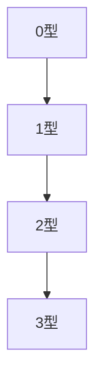
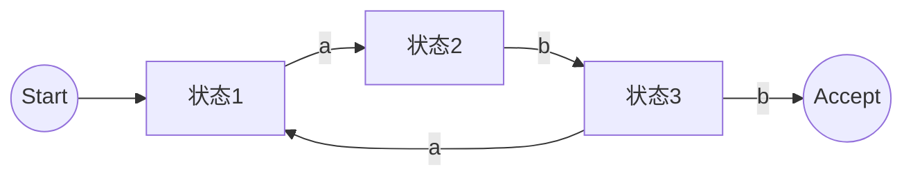
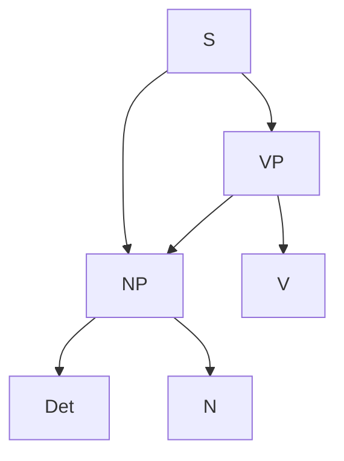
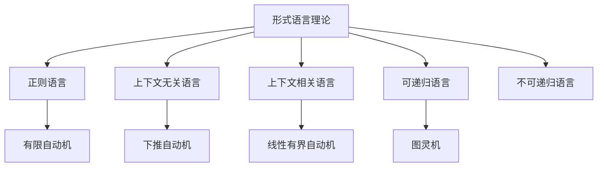
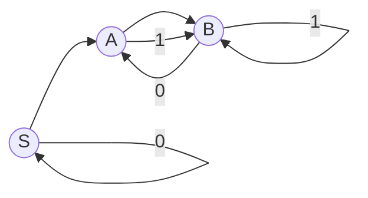
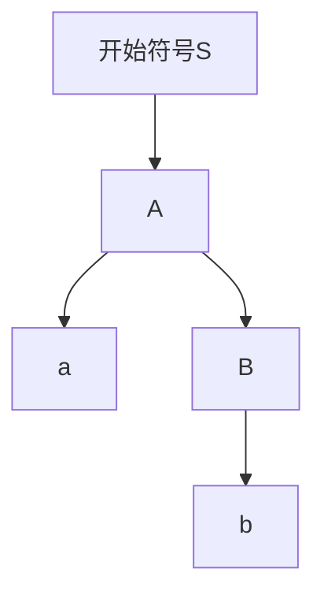

# 22. 形式语言理论（Formal Language Theory）

## 概述

形式语言理论是研究符号串及其结构、生成与识别规则的理论，是计算机科学、逻辑学和语言学的基础。它为自动机理论、编译原理、程序设计语言、人工智能等领域提供了理论支撑。

## 历史背景

- **20世纪初**：希尔伯特、哥德尔等人提出形式系统思想。
- **1950s**：乔姆斯基（Chomsky）提出文法分级体系，奠定现代形式语言理论基础。
- **1960s-1980s**：自动机理论、复杂性理论、语法分析等快速发展。
- **现代**：与类型论、范畴论、认知科学等交叉融合。

## 核心理论

### 1. 形式语言与文法

#### 字母表与字符串

- 字母表 $\Sigma$：有限符号集合
- 字符串 $w \in \Sigma^*$

#### 语言

- 语言 $L \subseteq \Sigma^*$

#### 文法

- $G = (N, \Sigma, P, S)$
  - $N$：非终结符集合
  - $\Sigma$：终结符集合
  - $P$：产生式集合
  - $S$：开始符号

#### 乔姆斯基文法类型

- 0型：无限制文法
- 1型：上下文相关文法
- 2型：上下文无关文法
- 3型：正则文法

### 2. 自动机理论

#### 有限自动机（FA）

- 确定型（DFA）与非确定型（NFA）
- 状态转移图、接受状态

#### 推理自动机

- 下推自动机（PDA）：识别上下文无关语言
- 图灵机（TM）：可计算性理论基础

#### 正则表达式

- $a^*b(a|b)^*$
- 与有限自动机等价

### 3. 语言的性质与运算

- 闭包性质：并、交、补、连接、Kleene星
- 判定性与不可判定性
- 语言等价与同构

### 4. 语法分析与语义

- 语法树、抽象语法树（AST）
- 语义分析、类型系统
- 形式语义学（操作语义、公理语义、演绎语义）

### 5. 认知与隐喻视角

- 具身认知与语言
- 形式系统与自然语言的关系
- 隐喻系统与认知语言学

## 主要分支

- 正则语言与自动机
- 上下文无关语言与PDA
- 上下文相关语言与线性有界自动机
- 图灵可识别语言
- 形式语义学
- 类型理论与范畴语法
- 认知语言学与隐喻系统

## 典型定理与公式

### Kleene定理

```latex
\text{正则表达式} \Leftrightarrow \text{有限自动机}
```

### Pumping Lemma（抽水引理）

- 正则语言与上下文无关语言的判别工具

### 图灵可判定性

- 存在不可判定语言

### 乔姆斯基层级



## 可视化表示

### 自动机结构图



### 语法树示例



## 代码实现

### Haskell实现

```haskell
-- DFA定义
import qualified Data.Set as Set

data DFA state symbol = DFA
  { states :: Set.Set state
  , alphabet :: Set.Set symbol
  , transition :: state -> symbol -> state
  , start :: state
  , accept :: Set.Set state
  }

-- DFA运行
runDFA :: (Ord state) => DFA state symbol -> [symbol] -> Bool
runDFA dfa input = go (start dfa) input
  where
    go s [] = s `Set.member` accept dfa
    go s (x:xs) = go (transition dfa s x) xs
```

### Rust实现

```rust
use std::collections::HashSet;

struct DFA<State, Symbol> {
    states: HashSet<State>,
    alphabet: HashSet<Symbol>,
    transition: fn(State, Symbol) -> State,
    start: State,
    accept: HashSet<State>,
}

impl<State: Eq + std::hash::Hash + Copy, Symbol: Eq + std::hash::Hash + Copy> DFA<State, Symbol> {
    fn run(&self, input: &[Symbol]) -> bool {
        let mut state = self.start;
        for &sym in input {
            state = (self.transition)(state, sym);
        }
        self.accept.contains(&state)
    }
}
```

### Scala实现

```scala
case class DFA[S, A](states: Set[S], alphabet: Set[A], transition: (S, A) => S, start: S, accept: Set[S]) {
  def run(input: List[A]): Boolean =
    input.foldLeft(start)((s, a) => transition(s, a)) |> (accept contains _)
}
```

### Python实现

```python
class DFA:
    def __init__(self, states, alphabet, transition, start, accept):
        self.states = states
        self.alphabet = alphabet
        self.transition = transition  # dict: (state, symbol) -> state
        self.start = start
        self.accept = accept

    def run(self, input_str):
        state = self.start
        for symbol in input_str:
            state = self.transition[(state, symbol)]
        return state in self.accept
```

## 实际应用

### 1. 编译原理

- 词法分析、语法分析、语义分析
- 正则表达式与自动机

### 2. 人工智能与自然语言处理

- 语法解析、句法分析
- 形式语义与知识表示

### 3. 计算机安全

- 协议验证、输入验证
- 模型检测

### 4. 认知科学与语言学

- 语言习得模型
- 认知隐喻与形式系统

## 学习资源

### 经典教材

1. **《Introduction to Automata Theory, Languages, and Computation》** - Hopcroft, Motwani, Ullman
2. **《Formal Languages and Their Relation to Automata》** - Hopcroft & Ullman
3. **《The Formal Semantics of Programming Languages》** - Winskel

### 在线资源

- **Automata Tutor**：自动机与文法在线练习
- **nLab**：形式语言与自动机百科
- **arXiv**：相关论文

### 研究前沿

- **类型理论与范畴语法**
- **形式化自然语言理解**
- **自动机与AI的结合**

---

**形式语言理论**作为计算机科学和逻辑学的基石，连接了自动机、语法、语义、认知等多领域，是理解智能与计算本质的重要工具。

## 22.6 可视化与多表征

### 22.6.1 结构关系图（Mermaid）



### 22.6.2 典型自动机结构图

**有限自动机示意图**:



**上下文无关文法推导树**:



---

## 22.7 应用与建模

### 22.7.1 编译原理与程序分析

- 词法分析、语法分析的自动机与文法建模
- 正则表达式与有限自动机的工程实现
- 语法树与抽象语法树（AST）

**Python示例：正则表达式与有限自动机**:

```python
import re
pattern = r"a(b|c)*d"
text = "abcbcd"
match = re.match(pattern, text)
print(bool(match))  # True
```

### 22.7.2 自然语言处理与AI

- 句法分析、分词、语义建模
- 形式语言在对话系统、机器翻译中的应用

**Scala示例：简单文法解析器**:

```scala
sealed trait Expr
case class Num(value: Int) extends Expr
case class Add(left: Expr, right: Expr) extends Expr

def parseExpr(tokens: List[String]): Expr = tokens match {
  case n :: Nil => Num(n.toInt)
  case l :: "+" :: r :: Nil => Add(Num(l.toInt), Num(r.toInt))
}
```

### 22.7.3 软件工程与协议建模

- 通信协议、数据格式的形式化描述
- DSL（领域特定语言）设计

**Rust示例：有限状态机建模**:

```rust
enum State { Start, Middle, End }
struct FSM { state: State }

impl FSM {
    fn next(&mut self, input: char) {
        self.state = match (self.state, input) {
            (State::Start, 'a') => State::Middle,
            (State::Middle, 'b') => State::End,
            _ => self.state,
        }
    }
}
```

---

## 22.8 学习建议与资源

### 经典教材1

1. **《Introduction to Automata Theory, Languages, and Computation》** - Hopcroft, Motwani, Ullman
2. **《Formal Languages and Their Relation to Automata》** - Hopcroft, Ullman
3. **《Elements of the Theory of Computation》** - Lewis, Papadimitriou

### 在线资源1

- **Automata Tutor**：自动机与形式语言在线练习
- **nLab**：形式语言理论百科
- **arXiv**：相关论文

### 研究前沿1

- **形式语言与深度学习结合**
- **复杂系统中的语言建模**
- **形式化验证与模型检测**
