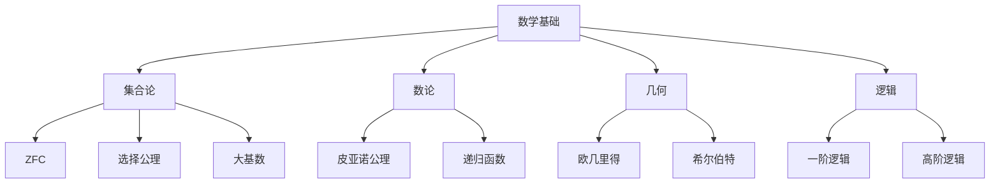
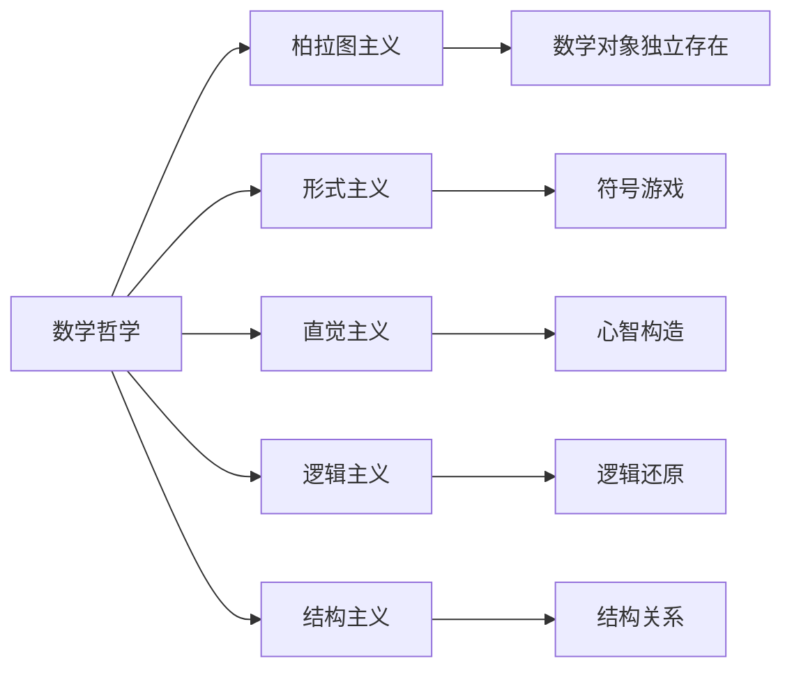
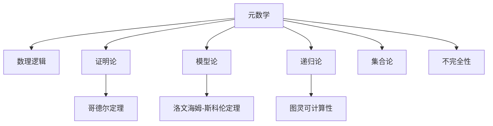
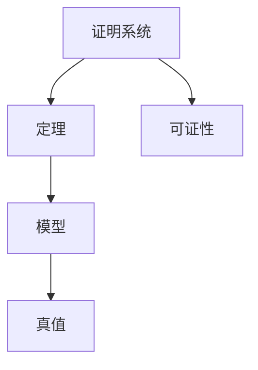

# 23. 元数学与数学哲学（Metamathematics and Philosophy of Mathematics）

## 概述

元数学是研究数学本身的理论，包括数学基础、公理系统、证明理论、模型论等。数学哲学则探讨数学的本质、数学知识的性质、数学真理的涵义等哲学问题。两者共同构成了对数学的反思性研究。

## 历史背景

### 早期发展

- **古希腊**：柏拉图主义、亚里士多德逻辑
- **17-18世纪**：莱布尼茨的普遍语言思想
- **19世纪**：非欧几何、集合论的发展

### 现代发展

- **1900s**：希尔伯特纲领、罗素悖论
- **1930s**：哥德尔不完备定理
- **1950s-至今**：模型论、证明论、计算理论

## 核心理论

### 1. 数学基础

#### 集合论基础

- **ZFC公理系统**：策梅洛-弗兰克尔集合论
- **选择公理**：AC、GCH、V=L等
- **大基数理论**：不可达基数、马洛基数等

#### 数论基础

- **皮亚诺公理**：自然数的公理化
- **递归函数论**：可计算性理论

#### 几何基础

- **欧几里得公理**：传统几何基础
- **希尔伯特公理**：现代几何公理化

### 2. 证明理论

#### 形式系统

```latex
\text{形式语言} + \text{公理} + \text{推理规则} = \text{形式系统}
```

#### 证明论

- **自然演绎**：直觉主义逻辑
- **希尔伯特系统**：经典逻辑
- **Gentzen系统**：序列演算

#### 一致性证明

- **相对一致性**：模型论方法
- **绝对一致性**：证明论方法

### 3. 模型论

#### 模型

- **结构**：$\mathcal{M} = (M, R_1, R_2, \ldots, f_1, f_2, \ldots, c_1, c_2, \ldots)$
- **满足关系**：$\mathcal{M} \models \phi$

#### 紧致性定理

```latex
\text{如果} \Sigma \text{的每个有限子集都有模型，那么} \Sigma \text{有模型}
```

#### Löwenheim-Skolem定理

- 可数模型的存在性

### 4. 递归论

#### 可计算性

- **图灵机**：可计算函数的标准模型
- **递归函数**：原始递归、一般递归
- **Church-Turing论题**：可计算性的哲学假设

#### 不可解问题

- **停机问题**：图灵不可判定
- **波斯特问题**：度理论

### 5. 数学哲学

#### 本体论问题

- **柏拉图主义**：数学对象独立存在
- **形式主义**：数学是符号游戏
- **直觉主义**：数学是心智构造
- **逻辑主义**：数学可还原为逻辑

#### 认识论问题

- **数学知识**：先验还是经验？
- **数学真理**：必然性还是偶然性？
- **数学发现**：发明还是发现？

## 主要分支

### 1. 数学基础1

- 集合论、数论、几何基础
- 公理化方法、形式化

### 2. 证明论

- 形式证明、一致性
- 证明复杂性、证明搜索

### 3. 模型论1

- 模型构造、模型分类
- 稳定性理论、o-极小理论

### 4. 递归论1

- 可计算性理论、复杂度理论
- 度理论、随机性

### 5. 数学哲学1

- 本体论、认识论、方法论
- 数学史、数学社会学

## 典型定理与公式

### 哥德尔不完备定理

```latex
\text{任何一致的形式系统都包含不可证明的真命题}
```

### 塔斯基真理论

```latex
\text{在足够强的形式系统中，无法定义自己的真谓词}
```

### 康托尔对角线法

```latex
\text{实数集不可数：} |\mathbb{R}| > |\mathbb{N}|
```

### 罗素悖论

```latex
R = \{x : x \notin x\} \Rightarrow R \in R \Leftrightarrow R \notin R
```

## 可视化表示

### 数学基础关系图



### 数学哲学流派图



## 代码实现

### Haskell实现

```haskell
-- 形式系统
data Formula = Atom String
             | Not Formula
             | And Formula Formula
             | Or Formula Formula
             | Implies Formula Formula
             | ForAll String Formula
             | Exists String Formula

-- 证明系统
data Proof = Axiom String
           | ModusPonens Proof Proof
           | UniversalGen Proof String
           | ExistentialGen Proof String

-- 模型
data Model a = Model
  { domain :: [a]
  , relations :: [(String, [[a]])]
  , functions :: [(String, [a] -> a)]
  , constants :: [(String, a)]
  }

-- 满足关系
satisfies :: (Eq a) => Model a -> Formula -> Bool
satisfies model (Atom p) = -- 实现原子公式的满足
satisfies model (Not phi) = not (satisfies model phi)
satisfies model (And phi psi) = satisfies model phi && satisfies model psi
-- 其他情况...
```

### Rust实现

```rust
#[derive(Debug, Clone)]
enum Formula {
    Atom(String),
    Not(Box<Formula>),
    And(Box<Formula>, Box<Formula>),
    Or(Box<Formula>, Box<Formula>),
    Implies(Box<Formula>, Box<Formula>),
    ForAll(String, Box<Formula>),
    Exists(String, Box<Formula>),
}

#[derive(Debug)]
enum Proof {
    Axiom(String),
    ModusPonens(Box<Proof>, Box<Proof>),
    UniversalGen(Box<Proof>, String),
    ExistentialGen(Box<Proof>, String),
}

struct Model<T> {
    domain: Vec<T>,
    relations: Vec<(String, Vec<Vec<T>>)>,
    functions: Vec<(String, Box<dyn Fn(&[T]) -> T>)>,
    constants: Vec<(String, T)>,
}

impl<T: Eq + Clone> Model<T> {
    fn satisfies(&self, formula: &Formula) -> bool {
        match formula {
            Formula::Atom(_) => true, // 简化实现
            Formula::Not(phi) => !self.satisfies(phi),
            Formula::And(phi, psi) => self.satisfies(phi) && self.satisfies(psi),
            _ => false, // 其他情况
        }
    }
}
```

### Scala实现

```scala
sealed trait Formula
case class Atom(name: String) extends Formula
case class Not(phi: Formula) extends Formula
case class And(phi: Formula, psi: Formula) extends Formula
case class Or(phi: Formula, psi: Formula) extends Formula
case class Implies(phi: Formula, psi: Formula) extends Formula
case class ForAll(var: String, phi: Formula) extends Formula
case class Exists(var: String, phi: Formula) extends Formula

sealed trait Proof
case class Axiom(name: String) extends Proof
case class ModusPonens(phi: Proof, psi: Proof) extends Proof
case class UniversalGen(proof: Proof, var: String) extends Proof
case class ExistentialGen(proof: Proof, var: String) extends Proof

case class Model[T](domain: List[T], relations: List[(String, List[List[T]])], functions: List[(String, List[T] => T)], constants: List[(String, T)]) {
  def satisfies(formula: Formula): Boolean = formula match {
    case Atom(_) => true
    case Not(phi) => !satisfies(phi)
    case And(phi, psi) => satisfies(phi) && satisfies(psi)
    case _ => false
  }
}
```

### Python实现

```python
from typing import List, Dict, Callable, Union
from dataclasses import dataclass
from enum import Enum

class Formula:
    pass

@dataclass
class Atom(Formula):
    name: str

@dataclass
class Not(Formula):
    phi: Formula

@dataclass
class And(Formula):
    phi: Formula
    psi: Formula

@dataclass
class Or(Formula):
    phi: Formula
    psi: Formula

@dataclass
class Implies(Formula):
    phi: Formula
    psi: Formula

@dataclass
class ForAll(Formula):
    var: str
    phi: Formula

@dataclass
class Exists(Formula):
    var: str
    phi: Formula

class Proof:
    pass

@dataclass
class Axiom(Proof):
    name: str

@dataclass
class ModusPonens(Proof):
    phi: Proof
    psi: Proof

@dataclass
class UniversalGen(Proof):
    proof: Proof
    var: str

@dataclass
class ExistentialGen(Proof):
    proof: Proof
    var: str

class Model:
    def __init__(self, domain: List, relations: Dict, functions: Dict, constants: Dict):
        self.domain = domain
        self.relations = relations
        self.functions = functions
        self.constants = constants
    
    def satisfies(self, formula: Formula) -> bool:
        if isinstance(formula, Atom):
            return True  # 简化实现
        elif isinstance(formula, Not):
            return not self.satisfies(formula.phi)
        elif isinstance(formula, And):
            return self.satisfies(formula.phi) and self.satisfies(formula.psi)
        elif isinstance(formula, Or):
            return self.satisfies(formula.phi) or self.satisfies(formula.psi)
        elif isinstance(formula, Implies):
            return not self.satisfies(formula.phi) or self.satisfies(formula.psi)
        else:
            return False  # 简化实现

# 哥德尔编码示例
def godel_encode(formula: Formula) -> int:
    """简单的哥德尔编码实现"""
    if isinstance(formula, Atom):
        return hash(formula.name) % 1000
    elif isinstance(formula, Not):
        return 2 * godel_encode(formula.phi) + 1
    elif isinstance(formula, And):
        return 3 * godel_encode(formula.phi) + 5 * godel_encode(formula.psi)
    else:
        return 0

# 对角线引理示例
def diagonal_lemma(phi: Formula, var: str) -> Formula:
    """对角线引理：构造自指公式"""
    # 简化实现
    return Exists(var, And(phi, Atom(f"self_reference_{var}")))
```

## 实际应用

### 1. 计算机科学

- **程序验证**：形式化方法、模型检测
- **类型系统**：依赖类型、同伦类型论
- **人工智能**：逻辑编程、知识表示

### 2. 数学教育

- **数学思维**: 证明方法、逻辑推理
- **数学史**：概念发展、思想演变

### 3. 哲学研究

- **认识论**：数学知识的性质
- **本体论**：数学对象的存在
- **方法论**：数学研究的方法

### 4. 认知科学

- **数学认知**：数感、空间思维
- **学习理论**：概念形成、技能发展

## 学习资源

### 经典教材

1. **《Mathematical Logic》** - Ebbinghaus, Flum, Thomas
2. **《Model Theory》** - Chang & Keisler
3. **《Recursion Theory》** - Rogers
4. **《Philosophy of Mathematics》** - Shapiro

### 在线资源

- **Stanford Encyclopedia of Philosophy**：数学哲学条目
- **nLab**：范畴论与数学基础
- **MathOverflow**：数学基础讨论

### 研究前沿

- **同伦类型论**：新的数学基础
- **范畴论基础**：结构主义数学
- **计算复杂性**：P vs NP问题

---

**元数学与数学哲学**作为对数学本身的反思性研究，不仅深化了我们对数学本质的理解，也为计算机科学、人工智能等领域提供了重要的理论基础。

## 23.6 可视化与多表征

### 23.6.1 结构关系图（Mermaid）



### 23.6.2 典型结构与定理可视化

**哥德尔不完全性定理结构图**:


**证明系统与模型论关系**:



---

## 23.7 应用与建模

### 23.7.1 数学基础与逻辑系统

- 公理化系统的构建与一致性分析
- 形式化证明与自动定理证明（ATP）
- 逻辑系统的可判定性与可计算性

**Python示例：一阶逻辑定理证明（简化）**:

```python
from sympy import symbols, Implies, satisfiable
A, B = symbols('A B')
expr = Implies(A, B)
print(satisfiable(expr))
```

### 23.7.2 计算机科学与AI

- 形式化验证、模型检测
- 计算复杂性与可计算性理论
- 证明助理（如Coq、Lean、Isabelle）

**Haskell示例：皮亚诺算术的递归定义**:

```haskell
data Nat = Zero | Succ Nat

add :: Nat -> Nat -> Nat
add Zero n = n
add (Succ m) n = Succ (add m n)
```

### 23.7.3 哲学与科学方法论

- 数学真理、可知性与不可知性
- 形式系统的极限与元理论反思
- 哥德尔、图灵、丘奇等思想的跨学科影响

**Rust示例：哥德尔编码（简化）**:

```rust
fn godel_encode(nums: &[u32]) -> u64 {
    nums.iter().enumerate().fold(1u64, |acc, (i, &n)| acc * prime(i).pow(n))
}

fn prime(n: usize) -> u64 {
    // 返回第n个素数（略）
    [2,3,5,7,11,13,17,19,23,29][n]
}
```

---

## 23.8 学习建议与资源

### 经典教材1

1. **《Introduction to Metamathematics》** - Stephen Kleene
2. **《Gödel, Escher, Bach》** - Douglas Hofstadter
3. **《Proofs from THE BOOK》** - Aigner & Ziegler

### 在线资源1

- **Metamath**：元数学证明数据库
- **nLab**：元数学百科
- **arXiv**：相关论文

### 研究前沿1

- **自动化证明与AI结合**
- **不可判定性与复杂性边界**
- **元理论与数学哲学**
