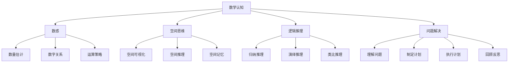
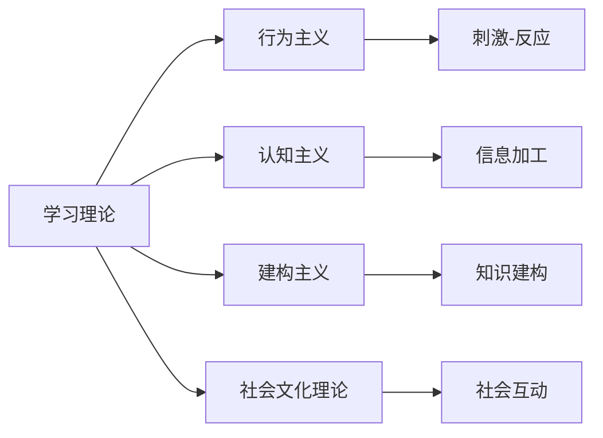
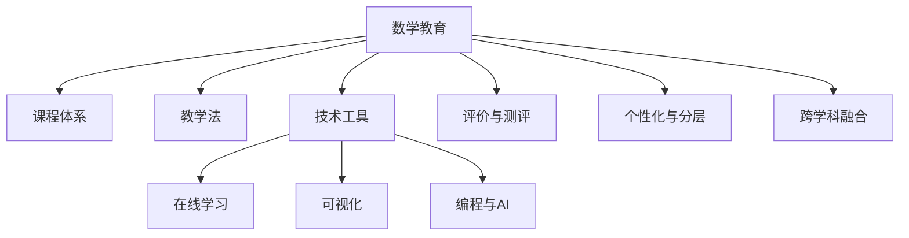
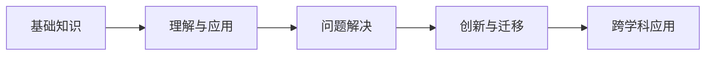
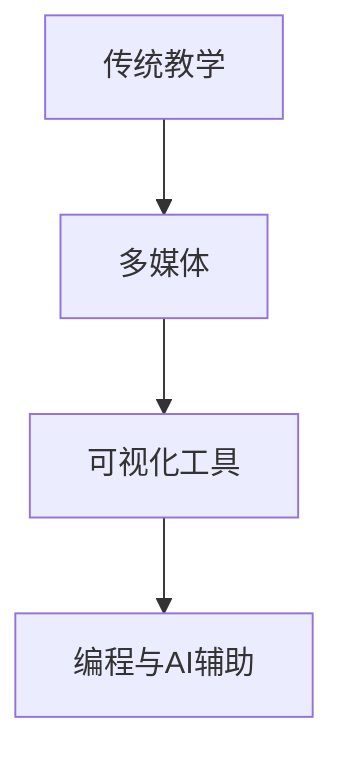

# 24. 数学教育（Mathematical Education）

## 概述

数学教育是研究数学学习、教学和认知过程的跨学科领域，结合了数学、心理学、教育学、认知科学等学科的理论和方法。它旨在理解数学思维的本质，优化数学教学策略，促进数学素养的发展。

## 历史背景

### 早期发展

- **古希腊**：欧几里得《几何原本》的系统化教学
- **中世纪**：算术、几何、天文学、音乐四艺
- **文艺复兴**：实用数学教育的兴起

### 现代发展

- **19世纪**：皮亚杰认知发展理论
- **20世纪**：建构主义、发现学习
- **当代**：数字化教育、个性化学习

## 核心理论

### 1. 认知发展理论

#### 皮亚杰理论

- **感知运动期**（0-2岁）：动作思维
- **前运算期**（2-7岁）：符号思维
- **具体运算期**（7-11岁）：逻辑思维
- **形式运算期**（11岁以上）：抽象思维

#### 维果茨基理论

- **最近发展区**：潜在发展水平与现有水平之间的差距
- **社会文化理论**：学习是社会文化过程

### 2. 数学思维理论

#### 数感（Number Sense）

```latex
\text{数感} = \text{数量估计} + \text{数字关系} + \text{运算策略}
```

#### 空间思维

- **空间可视化**：三维物体的心理旋转
- **空间推理**：几何关系的逻辑推理
- **空间记忆**：空间信息的编码和提取

#### 逻辑推理

- **归纳推理**：从特殊到一般
- **演绎推理**：从一般到特殊
- **类比推理**：相似性的识别和应用

### 3. 学习理论

#### 建构主义

- **个人建构**：皮亚杰的个体认知建构
- **社会建构**：维果茨基的社会互动建构
- **激进建构**：冯·格拉斯费尔德的极端建构主义

#### 发现学习

- **布鲁纳**：通过发现获得知识
- **探究式学习**：问题驱动的学习过程
- **项目式学习**：真实情境中的学习

### 4. 教学策略

#### 概念教学

- **概念图**：概念关系的可视化
- **类比教学**：利用相似性促进理解
- **反例教学**：通过反例澄清概念边界

#### 问题解决教学

- **波利亚四步法**：
  1. 理解问题
  2. 制定计划
  3. 执行计划
  4. 回顾反思

#### 技术整合教学

- **动态几何软件**：GeoGebra、Cabri
- **计算机代数系统**：Mathematica、Maple
- **在线学习平台**：Khan Academy、Coursera

## 主要分支

### 1. 数学认知

- 数感发展、空间思维、逻辑推理
- 数学焦虑、数学天赋

### 2. 数学教学

- 教学设计、教学策略、教学评价
- 教师专业发展

### 3. 数学课程

- 课程设计、课程标准、课程评价
- 跨学科整合

### 4. 数学技术

- 教育软件、在线平台、虚拟现实
- 人工智能辅助教学

### 5. 数学文化

- 数学史、数学哲学、数学美学
- 多元文化数学教育

## 典型定理与公式

### 学习迁移理论

```latex
\text{迁移效果} = f(\text{相似性}, \text{练习}, \text{理解深度})
```

### 遗忘曲线

```latex
R = e^{-t/S}
```

其中 $R$ 是记忆保持率，$t$ 是时间，$S$ 是记忆强度

### 学习效率公式

```latex
\text{学习效率} = \frac{\text{学习成果}}{\text{学习时间} \times \text{认知负荷}}
```

## 可视化表示

### 数学认知发展图



### 学习理论关系图



## 代码实现

### Python实现（教育数据分析）

```python
import numpy as np
import pandas as pd
import matplotlib.pyplot as plt
from sklearn.cluster import KMeans
from sklearn.decomposition import PCA

class MathEducationAnalytics:
    def __init__(self):
        self.student_data = {}
        self.learning_patterns = {}
    
    def analyze_learning_progress(self, student_scores):
        """分析学习进度"""
        progress = {
            'improvement_rate': np.diff(student_scores).mean(),
            'consistency': np.std(student_scores),
            'trend': 'increasing' if np.diff(student_scores).mean() > 0 else 'decreasing'
        }
        return progress
    
    def identify_learning_patterns(self, student_data):
        """识别学习模式"""
        # 使用聚类分析识别学习模式
        kmeans = KMeans(n_clusters=3)
        clusters = kmeans.fit_predict(student_data)
        return clusters
    
    def calculate_cognitive_load(self, task_complexity, prior_knowledge, time_pressure):
        """计算认知负荷"""
        cognitive_load = (task_complexity * time_pressure) / prior_knowledge
        return cognitive_load
    
    def predict_learning_outcome(self, study_time, practice_problems, concept_understanding):
        """预测学习成果"""
        # 简化的预测模型
        outcome = 0.3 * study_time + 0.4 * practice_problems + 0.3 * concept_understanding
        return min(100, max(0, outcome))
    
    def generate_adaptive_questions(self, student_level, topic):
        """生成自适应题目"""
        difficulty_levels = {
            'beginner': {'complexity': 1, 'steps': 2},
            'intermediate': {'complexity': 2, 'steps': 3},
            'advanced': {'complexity': 3, 'steps': 4}
        }
        return difficulty_levels.get(student_level, difficulty_levels['beginner'])

# 使用示例
analytics = MathEducationAnalytics()
progress = analytics.analyze_learning_progress([70, 75, 80, 85, 90])
print(f"学习进度: {progress}")
```

### Haskell实现（概念图生成）

```haskell
-- 概念图数据结构
data Concept = Concept
  { conceptName :: String
  , conceptLevel :: Int
  , prerequisites :: [String]
  , relatedConcepts :: [String]
  } deriving (Show, Eq)

-- 概念图
data ConceptMap = ConceptMap
  { concepts :: [Concept]
  , relationships :: [(String, String, String)] -- (from, to, relationship)
  } deriving Show

-- 生成学习路径
generateLearningPath :: ConceptMap -> String -> [String]
generateLearningPath cm targetConcept = 
  let target = findConcept cm targetConcept
      prereqs = prerequisites target
  in prereqs ++ [targetConcept]

-- 查找概念
findConcept :: ConceptMap -> String -> Concept
findConcept cm name = 
  head $ filter (\c -> conceptName c == name) (concepts cm)

-- 计算概念难度
conceptDifficulty :: Concept -> Int
conceptDifficulty = conceptLevel

-- 生成练习题目
generateExercise :: Concept -> String
generateExercise concept = 
  case conceptLevel concept of
    1 -> "基础练习: " ++ conceptName concept
    2 -> "中等练习: " ++ conceptName concept
    3 -> "高级练习: " ++ conceptName concept
    _ -> "专家练习: " ++ conceptName concept
```

### Rust实现（学习评估系统）

```rust
use std::collections::HashMap;

#[derive(Debug, Clone)]
struct Student {
    id: String,
    name: String,
    learning_history: Vec<LearningRecord>,
    current_level: f64,
}

#[derive(Debug, Clone)]
struct LearningRecord {
    topic: String,
    score: f64,
    time_spent: f64,
    difficulty: f64,
    timestamp: chrono::DateTime<chrono::Utc>,
}

#[derive(Debug)]
struct LearningAssessment {
    students: HashMap<String, Student>,
}

impl LearningAssessment {
    fn new() -> Self {
        LearningAssessment {
            students: HashMap::new(),
        }
    }
    
    fn add_student(&mut self, student: Student) {
        self.students.insert(student.id.clone(), student);
    }
    
    fn calculate_progress(&self, student_id: &str) -> Option<f64> {
        if let Some(student) = self.students.get(student_id) {
            if student.learning_history.len() < 2 {
                return None;
            }
            
            let recent_scores: Vec<f64> = student.learning_history
                .iter()
                .map(|record| record.score)
                .collect();
            
            let progress = recent_scores.windows(2)
                .map(|window| window[1] - window[0])
                .sum::<f64>() / (recent_scores.len() - 1) as f64;
            
            Some(progress)
        } else {
            None
        }
    }
    
    fn identify_learning_pattern(&self, student_id: &str) -> Option<String> {
        if let Some(student) = self.students.get(student_id) {
            let avg_time = student.learning_history
                .iter()
                .map(|record| record.time_spent)
                .sum::<f64>() / student.learning_history.len() as f64;
            
            let avg_score = student.learning_history
                .iter()
                .map(|record| record.score)
                .sum::<f64>() / student.learning_history.len() as f64;
            
            let pattern = if avg_time > 60.0 && avg_score > 80.0 {
                "深思熟虑型"
            } else if avg_time < 30.0 && avg_score > 70.0 {
                "快速理解型"
            } else if avg_time > 45.0 && avg_score < 60.0 {
                "需要帮助型"
            } else {
                "一般型"
            };
            
            Some(pattern.to_string())
        } else {
            None
        }
    }
    
    fn recommend_next_topic(&self, student_id: &str) -> Option<String> {
        if let Some(student) = self.students.get(student_id) {
            let current_level = student.current_level;
            
            let recommendation = if current_level < 30.0 {
                "基础概念复习"
            } else if current_level < 60.0 {
                "中等难度练习"
            } else if current_level < 85.0 {
                "高级应用问题"
            } else {
                "挑战性问题"
            };
            
            Some(recommendation.to_string())
        } else {
            None
        }
    }
}
```

### Scala实现（教学策略推荐）

```scala
case class Student(id: String, name: String, learningStyle: String, currentLevel: Double)
case class LearningRecord(topic: String, score: Double, timeSpent: Double, difficulty: Double)
case class TeachingStrategy(name: String, description: String, effectiveness: Double)

class MathEducationSystem {
  private var students = Map[String, Student]()
  private var learningRecords = Map[String, List[LearningRecord]]()
  
  def addStudent(student: Student): Unit = {
    students += (student.id -> student)
    learningRecords += (student.id -> List())
  }
  
  def addLearningRecord(studentId: String, record: LearningRecord): Unit = {
    val currentRecords = learningRecords.getOrElse(studentId, List())
    learningRecords += (studentId -> (record :: currentRecords))
  }
  
  def analyzeLearningProgress(studentId: String): Option[Double] = {
    val records = learningRecords.getOrElse(studentId, List())
    if (records.length < 2) None
    else {
      val scores = records.map(_.score)
      val progress = scores.sliding(2).map { case List(a, b) => b - a }.sum / (scores.length - 1)
      Some(progress)
    }
  }
  
  def recommendTeachingStrategy(studentId: String): Option[TeachingStrategy] = {
    val student = students.get(studentId)
    val progress = analyzeLearningProgress(studentId)
    
    (student, progress) match {
      case (Some(s), Some(p)) =>
        val strategy = if (s.learningStyle == "visual" && p > 0) {
          TeachingStrategy("可视化教学", "使用图表和动画", 0.9)
        } else if (s.learningStyle == "kinesthetic" && p < 0) {
          TeachingStrategy("动手实践", "通过操作学习", 0.85)
        } else if (s.currentLevel < 50) {
          TeachingStrategy("基础巩固", "强化基本概念", 0.8)
        } else {
          TeachingStrategy("问题解决", "应用导向学习", 0.75)
        }
        Some(strategy)
      case _ => None
    }
  }
  
  def generateAdaptiveContent(studentId: String, topic: String): String = {
    val student = students.get(studentId)
    val level = student.map(_.currentLevel).getOrElse(50.0)
    
    level match {
      case l if l < 30 => s"基础${topic}概念"
      case l if l < 60 => s"中等${topic}应用"
      case l if l < 85 => s"高级${topic}问题"
      case _ => s"挑战性${topic}探索"
    }
  }
}
```

## 实际应用

### 1. 个性化学习

- **自适应学习系统**：根据学生表现调整难度
- **学习路径规划**：个性化学习序列
- **智能辅导系统**：实时反馈和指导

### 2. 教学评估

- **形成性评估**：学习过程中的持续评估
- **总结性评估**：学习成果的最终评估
- **诊断性评估**：学习困难的识别

### 3. 教师专业发展

- **教学反思**：基于数据的教学改进
- **专业培训**：数学教育理论和实践
- **教学研究**：教育行动研究

### 4. 教育政策

- **课程标准**：数学教育标准的制定
- **教育公平**：数学教育机会的平等
- **国际比较**：PISA、TIMSS等国际评估

## 学习资源

### 经典教材

1. **《数学教育心理学》** - 皮亚杰、维果茨基
2. **《数学思维》** - 波利亚
3. **《数学教育研究手册》** - 国际数学教育委员会

### 在线资源

- **NCTM**：美国数学教师协会
- **ICME**：国际数学教育大会
- **数学教育研究期刊**：JRME、ESM等

### 研究前沿

- **人工智能辅助教学**
- **脑科学与数学学习**
- **跨文化数学教育**

## 24.6 可视化与多表征

### 24.6.1 数学教育内容结构图（Mermaid）



### 24.6.2 教学流程与知识迁移

**数学学习路径与能力提升**:



**数学教育中的技术融合**:



---

## 24.7 应用与建模

### 24.7.1 智能教育与个性化学习

- AI自适应学习系统、智能题库
- 学习路径推荐与知识图谱
- 数据驱动的学习分析与反馈

**Python示例：简单知识图谱节点关系**

```python
import networkx as nx
G = nx.DiGraph()
G.add_edge('函数', '极限')
G.add_edge('极限', '导数')
G.add_edge('导数', '微分方程')
print(list(G.edges))
```

### 24.7.2 可视化与交互式教学

- GeoGebra、Desmos等动态几何工具
- 数学可视化与仿真平台
- 交互式编程与STEAM融合

**JavaScript示例：Desmos API调用（伪代码）**

```javascript
// 创建Desmos图形计算器实例
const elt = document.getElementById('calculator');
const calculator = Desmos.GraphingCalculator(elt);
calculator.setExpression({ id: 'graph1', latex: 'y=x^2' });
```

### 24.7.3 跨学科与工程实践

- 数学建模竞赛、工程案例驱动教学
- 数学与物理、计算机、经济等学科融合
- 项目式学习与真实问题解决

**Rust示例：简单统计分析**

```rust
fn mean(data: &[f64]) -> f64 {
    data.iter().sum::<f64>() / data.len() as f64
}

fn main() {
    let scores = [90.0, 85.0, 78.0, 92.0];
    println!("平均分: {}", mean(&scores));
}
```

---

## 24.8 学习建议与资源

### 经典教材与课程

1. **《How to Solve It》** - G. Polya
2. **《The Art of Problem Solving》** - R. Rusczyk
3. **《Principles and Standards for School Mathematics》** - NCTM

### 在线资源

- **Khan Academy**：全球最大数学教育平台
- **GeoGebra**：动态数学可视化工具
- **Coursera/edX**：数学教育与教学法课程

### 研究前沿

- **AI驱动的自适应教育**
- **数学教育中的可视化与STEAM融合**
- **数据分析与学习科学**

---

**数学教育**作为连接数学理论与教学实践的桥梁，不仅促进了个体数学能力的发展，也为社会培养具有数学素养的公民做出了重要贡献。
