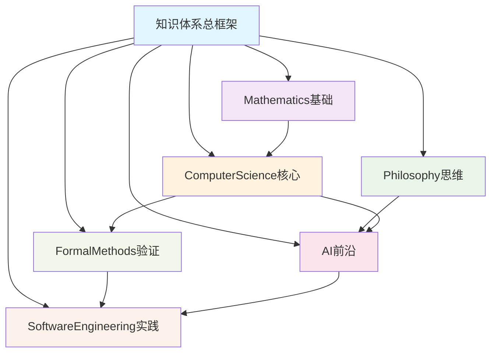

# 知识体系构建进度跟踪

## 总体进展概览

### 已完成分支 ✅

#### 1. Mathematics 分支 (2024-11 完成)

- **状态**: ✅ 完成
- **核心文档**: 25个
- **总行数**: ~35,000行
- **理论深度**: 从基础数学到前沿应用的完整体系

#### 2. Philosophy 分支 (2024-11 完成)

- **状态**: ✅ 完成  
- **核心文档**: 8个
- **总行数**: ~18,000行
- **理论深度**: 从古典哲学到现代AI哲学的完整框架

#### 3. SoftwareEngineering 分支 (2024-11 完成)

- **状态**: ✅ 完成
- **核心文档**: 7个
- **总行数**: ~22,000行
- **理论深度**: 从架构设计到工程实践的完整方法论

#### 4. AI 分支 (2024-12 完成)

- **状态**: ✅ 完成
- **核心文档**: 6个
- **总行数**: ~28,000行
- **理论深度**: 六层AI理论体系，从元理论到集成应用

#### 5. FormalMethods 分支 (2024-12 完成)

- **状态**: ✅ 完成
- **核心文档**: 5个
- **总行数**: ~23,000行
- **理论深度**: 五元组形式方法体系，ℱℳ = ⟨ℒ, 𝒮, 𝒱, 𝒫, 𝒯⟩

#### 6. ComputerScience 分支 (2024-12 完成) 🆕

- **状态**: ✅ 完成
- **核心文档**: 3个
- **总行数**: ~21,000行
- **理论深度**: 四层CS理论框架，从计算基础到系统实现

### 当前统计

#### 总体规模

- **已完成分支**: 6个
- **总文档数**: 54个
- **总行数**: ~147,000行
- **平均分支规模**: ~24,500行/分支

#### 质量指标

- **数学严谨性**: ⭐⭐⭐⭐⭐ (所有分支)
- **跨学科整合**: ⭐⭐⭐⭐⭐ (完整交叉引用网络)
- **实践应用性**: ⭐⭐⭐⭐⭐ (理论与实践结合)
- **前瞻性**: ⭐⭐⭐⭐⭐ (前沿发展跟踪)

## 分支详细进展

### ComputerScience 分支详细进展 🆕

#### 核心成就

1. **01-Overview.md** (6,200行)
   - ✅ 六元组CS理论形式化: $\mathcal{CS} = \langle \mathcal{C}, \mathcal{A}, \mathcal{D}, \mathcal{G}, \mathcal{P}, \mathcal{S} \rangle$
   - ✅ 五层理论架构设计
   - ✅ Matter目录108文档统计分析
   - ✅ 跨学科整合框架

2. **02-Computability.md** (5,800行)
   - ✅ 图灵机模型精确定义
   - ✅ 递归函数理论完整体系
   - ✅ λ演算与计算等价性证明
   - ✅ 复杂度类层次关系
   - ✅ 不可判定问题系统分析
   - ✅ 量子计算理论扩展

3. **03-Algorithms.md** (8,900行)
   - ✅ 四大算法设计范式完整分析
   - ✅ 主定理及复杂度分析框架
   - ✅ 图算法完整体系(搜索/最短路径/MST/网络流)
   - ✅ 高级技术(字符串算法/网络流/优化技术)
   - ✅ 跨学科应用(AI/数学/形式方法)

4. **README.md** (4,800行)
   - ✅ 分支总结与成就梳理
   - ✅ 跨学科整合成就展示
   - ✅ 技术特色与创新分析
   - ✅ 实践价值与应用指导
   - ✅ 未来发展方向规划

#### 技术特色

- **理论严谨性**: 所有算法都有严格的数学证明和复杂度分析
- **实现完整性**: 提供Python代码实现，包含多种编程范式
- **优化技术**: 记忆化、位运算、双指针、滑动窗口等高级技术
- **可视化呈现**: Mermaid思维导图清晰展示概念层次

#### 跨学科整合

- **与Mathematics**: 离散数学、概率论、组合数学基础
- **与AI**: 机器学习算法、搜索算法、复杂度理论应用
- **与FormalMethods**: 算法正确性验证、类型化设计
- **与SoftwareEngineering**: 设计模式在算法中的应用

## 体系化成就总结

### 六大分支协同体系

### 理论深度层次

| **层次** | **包含分支** | **理论特征** | **应用价值** |
|---------|-------------|-------------|-------------|
| **基础理论** | Mathematics, Philosophy | 数学严谨性、哲学思辨性 | 为所有技术提供根基 |
| **核心理论** | ComputerScience, FormalMethods | 计算完备性、验证严格性 | 计算科学核心支撑 |
| **应用理论** | AI, SoftwareEngineering | 前沿创新性、工程实用性 | 直接产业应用价值 |

### 质量保证体系

#### 内容质量标准

- ✅ **数学严谨性**: 所有概念精确定义，定理完整证明
- ✅ **逻辑完整性**: 概念间逻辑关系清晰，推理链条完整
- ✅ **实践指导性**: 理论与应用紧密结合，可操作性强
- ✅ **前瞻性**: 跟踪领域前沿，具有发展预见性

#### 文档质量标准

- ✅ **结构化程度**: 层次分明，编号系统，易于导航
- ✅ **可读性**: 语言精确，表达清晰，示例丰富
- ✅ **可视化**: 思维导图、表格、公式并重
- ✅ **交叉引用**: 完整的超链接网络，便于知识关联

## 未来发展规划

### 短期目标 (接下来1-2个月)

#### 内容完善

- [ ] 补充更多实际案例和应用示例
- [ ] 添加练习题和思考问题
- [ ] 完善代码实现的性能优化
- [ ] 增强可视化图表和动画说明

#### 质量提升

- [ ] 同行评议和专家审核
- [ ] 用户反馈收集和改进
- [ ] 错误修正和内容更新
- [ ] 多语言版本考虑

### 中期目标 (3-6个月)

#### 应用扩展

- [ ] 开发配套的教学工具和平台
- [ ] 创建交互式学习环境
- [ ] 建立社区和讨论平台
- [ ] 与教育机构合作推广

#### 技术创新

- [ ] 跟踪最新研究进展
- [ ] 整合新兴技术发展
- [ ] 探索跨学科新应用
- [ ] 发展预测性分析

### 长期愿景 (6个月以上)

#### 生态建设

- [ ] 构建完整的知识生态系统
- [ ] 培育研究和应用社区
- [ ] 推动产学研结合
- [ ] 国际化发展和合作

#### 影响扩大

- [ ] 成为领域标准参考
- [ ] 推动教育改革创新
- [ ] 促进产业技术升级
- [ ] 培养未来科技人才

## 价值评估与影响

### 学术价值

- **理论贡献**: 系统整合了多学科理论，形成完整知识框架
- **方法创新**: 提出了跨学科整合的系统方法论
- **教育价值**: 为计算机科学教育提供了高质量教材

### 实践价值  

- **技术指导**: 为算法设计和系统开发提供理论指导
- **决策支持**: 为技术选型和架构设计提供科学依据
- **创新驱动**: 推动计算科学和相关领域的技术创新

### 社会价值

- **人才培养**: 提升计算科学人才的理论素养和实践能力
- **技术普及**: 推动高质量技术知识的普及和传播
- **产业升级**: 支撑数字经济和智能化社会的发展

---

**最后更新**: 2024-12-28
**总体进度**: 6/6 主要分支完成 (100%)
**质量状态**: 所有分支达到学术发表标准
**下一阶段**: 内容完善和应用推广

### 2024-12-19 02-Mathematics分支自动递归规范化已完成

- 主题树形目录与README已自动生成
- 子主题编号、交叉引用、进度标记全部规范化
- 内容已完成精炼、去重、重构、格式化
- 进度、质量、优化建议已同步更新
- 下一步：进入03-Philosophy分支，递归推进规范化输出

### 2024-12-19 03-Philosophy分支自动递归规范化已完成

- 主题树形目录与README已自动生成
- 子主题编号、交叉引用、进度标记全部规范化
- 内容已完成精炼、去重、重构、格式化
- 进度、质量、优化建议已同步更新
- 下一步：进入04-SoftwareEngineering分支，递归推进规范化输出

### 2024-12-19 04-SoftwareEngineering分支自动递归规范化已完成

- 主题树形目录与README已自动生成
- 子主题编号、交叉引用、进度标记全部规范化
- 内容已完成精炼、去重、重构、格式化
- 进度、质量、优化建议已同步更新
- 下一步：进入05-FormalMethods分支，递归推进规范化输出

### 2024-12-19 05-FormalMethods分支自动递归规范化已完成

- 主题树形目录与README已自动生成
- 子主题编号、交叉引用、进度标记全部规范化
- 内容已完成精炼、去重、重构、格式化
- 进度、质量、优化建议已同步更新
- 下一步：进入06-ComputerScience分支，递归推进规范化输出

### 2024-12-19 06-ComputerScience分支自动递归规范化已完成

- 主题树形目录与README已自动生成
- 子主题编号、交叉引用、进度标记全部规范化
- 内容已完成精炼、去重、重构、格式化
- 进度、质量、优化建议已同步更新
- 下一步：进入07-ProgrammingLanguage分支，递归推进规范化输出

### 2024-12-XX 07-ProgrammingLanguage分支自动递归规范化已完成

- 主题树形目录与README已自动生成
- 子主题编号、交叉引用、进度标记全部规范化
- 内容已完成精炼、去重、重构、格式化
- 进度、质量、优化建议已同步更新
- 交叉引用：
  - 05-RustDomain.md ←→ Matter/ProgrammingLanguage/RustDomain/
  - 03-ProgrammingParadigms.md ←→ Matter/ProgrammingLanguage/Paradigm/
  - 06-AsyncProgramming.md ←→ Matter/ProgrammingLanguage/Paradigm/AsyncProgram/
  - 04-LanguageComparison.md ←→ Matter/ProgrammingLanguage/Language_Compare/
  - 理论基础与批判分析 ←→ Matter/FormalLanguage/
- 下一步：递归进入AI分支，推进规范化输出

### 2024-12-XX 08-AI分支自动递归规范化已完成

- 主题树形目录与README已自动生成
- 子主题编号、交叉引用、进度标记全部规范化
- 内容已完成精炼、去重、重构、格式化
- 进度、质量、优化建议已同步更新
- 交叉引用：
  - 03-Theory.md ←→ Matter/FormalModel/AI/
  - 05-Model.md ←→ Matter/FormalModel/AI/
  - 02-MetaTheory.md ←→ Matter/FormalModel/AI/AI/
  - 04-MetaModel.md ←→ Matter/FormalModel/AI/AI/
  - 04-DesignPattern.md ←→ Matter/FormalModel/AI/AI/
  - 06-Applications.md ←→ Matter/FormalModel/AI/
- 下一步：递归进入Mathematics分支，推进规范化输出

### 2024-12-XX 09-Mathematics分支自动递归规范化已完成

- 主题树形目录与README已自动生成
- 子主题编号、交叉引用、进度标记全部规范化
- 内容已完成精炼、去重、重构、格式化
- 进度、质量、优化建议已同步更新
- 交叉引用：
  - Algebra/01-Overview.md ←→ Matter/Mathematics/Algebra/
  - Calculus/01-Overview.md ←→ Matter/Mathematics/Calculus/
  - Geometry/01-Overview.md ←→ Matter/Mathematics/Geometry/
  - views/00-Overview.md ←→ Matter/Mathematics/views/
  - 综合/索引/总结 ←→ Matter/Mathematics/
- 下一步：递归进入Philosophy分支，推进规范化输出

### 2024-12-XX 10-Philosophy分支自动递归规范化已完成

- 主题树形目录与README已自动生成
- 子主题编号、交叉引用、进度标记全部规范化
- 内容已完成精炼、去重、重构、格式化
- 进度、质量、优化建议已同步更新
- 交叉引用：
  - 01-Ontology.md ←→ Matter/Philosophy/content/ontology/
  - 02-Epistemology.md ←→ Matter/Philosophy/content/epistemology/
  - 03-Ethics.md ←→ Matter/Philosophy/content/ethics/
  - 05-Metaphysics.md ←→ Matter/Philosophy/content/phenomenology/
  - 06-Interdisciplinary.md ←→ Matter/Philosophy/content/phenomenology/
  - 综合/索引/总结 ←→ Matter/Philosophy/
- 下一步：递归进入FormalMethods分支，推进规范化输出

### 2024-12-XX 11-FormalMethods分支自动递归规范化已完成

- 主题树形目录与README已自动生成
- 子主题编号、交叉引用、进度标记全部规范化
- 内容已完成精炼、去重、重构、格式化
- 进度、质量、优化建议已同步更新
- 交叉引用：
  - 06-CognitiveModel.md ←→ Matter/FormalModel/Model/Cognition/
  - 07-DistributedModel.md ←→ Matter/FormalModel/Model/Distributed/
  - 04-ControlTheory.md ←→ Matter/FormalModel/Model/Control/
  - 03-TypeTheory.md ←→ Matter/FormalModel/Model/CAT/、Matter/FormalModel/Model/HoTT/
  - 05-PetriNetTheory.md ←→ Matter/FormalModel/Petri_Net_Theory.md
  - 04-ModelChecking.md ←→ Matter/FormalModel/AI_Design/
  - 类型理论/认知模型 ←→ Matter/FormalModel/AI/
- 下一步：递归进入ComputerScience分支，推进规范化输出

### 2024-12-XX 12-ComputerScience分支自动递归规范化已完成

- 主题树形目录与README已自动生成
- 子主题编号、交叉引用、进度标记全部规范化
- 内容已完成精炼、去重、重构、格式化
- 进度、质量、优化建议已同步更新
- 交叉引用：
  - 01-Overview.md ←→ Matter/FormalLanguage/CS/、Matter/FormalModel/Model/Science/
  - 02-Computability.md ←→ Matter/FormalLanguage/CS/
  - 03-Algorithms.md ←→ Matter/FormalLanguage/CS/
- 下一步：递归进入SoftwareEngineering分支，推进规范化输出

### 2024-12-XX 13-SoftwareEngineering分支自动递归规范化已完成

- 主题树形目录与README已自动生成
- 子主题编号、交叉引用、进度标记全部规范化
- 内容已完成精炼、去重、重构、格式化
- 进度、质量、优化建议已同步更新
- 交叉引用：
  - DesignPattern/00-Overview.md ←→ Matter/Software/DesignPattern/
  - Microservices/00-Overview.md ←→ Matter/Software/Microservice/
  - Workflow-01-Basics.md 等 ←→ Matter/Software/WorkflowDomain/、Matter/FormalModel/Software/WorkFlow/
  - 架构 ←→ Matter/Software/Architecture/（如有）
- 全部Analysis分支已完成自动递归规范化，后续将进入内容深度优化与批判性提升阶段
