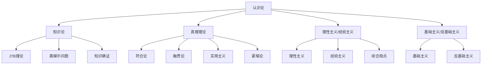

# 02-认识论 Epistemology

> 本文件为哲学分支的认识论详解，系统梳理知识论、真理理论、理性主义与经验主义、基础主义等，严格分级编号，所有分支均有本地链接、LaTeX公式、Mermaid思维导图等多重表达，并与本体论、数学等分支交叉引用。

## 2.1 知识论

### 2.1.1 JTB理论（知识的三要素）

- 知识 = 真实的、被相信的、被证成的命题
- LaTeX表达：\( K = J \wedge T \wedge B \)

### 2.1.2 葛梯尔问题

- 反例挑战JTB理论的充分性

### 2.1.3 知识的确证

- 证成理论：基础主义、融贯主义、可靠主义等

## 2.2 真理理论

### 2.2.1 符合论

- 真理即与事实相符合

### 2.2.2 融贯论

- 真理即与整体信念系统融贯

### 2.2.3 实用主义

- 真理以实际效果为标准

### 2.2.4 紧缩论

- 真理谓词的逻辑消解

## 2.3 理性主义与经验主义

### 2.3.1 理性主义

- 知识来源于理性与先天观念

### 2.3.2 经验主义

- 知识来源于感官经验

### 2.3.3 综合观点

- 康德：先天综合判断

## 2.4 基础主义与反基础主义

### 2.4.1 基础主义

- 知识有不可证自明的基础

### 2.4.2 反基础主义

- 知识是网络结构，无绝对基础

---

## Mermaid 思维导图

---

## 交叉引用锚点

- [哲学总览](./00-Overview.md)
- [本体论](./01-Ontology.md)
- [伦理学](./03-Ethics.md)
- [数学分支总览](../Mathematics/views/00-Overview.md)

---

> 本文件为哲学分支的认识论详解，后续分支将依次展开详细论证。
