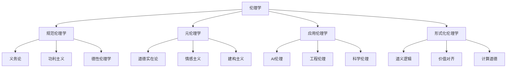

# 03-伦理学 Ethics

> 本文件为哲学分支的伦理学详解，系统梳理规范伦理学、元伦理学、应用伦理学、形式化伦理学等，严格分级编号，所有分支均有本地链接、LaTeX公式、Mermaid思维导图等多重表达，并与认识论、AI等分支交叉引用。

## 3.1 规范伦理学

### 3.1.1 义务论（Deontology）

- 康德：道德法则的普遍性与义务优先
- 典型公式：\( \forall x, \text{if } x \text{是人} \Rightarrow x \text{应被尊重} \)

### 3.1.2 功利主义（Utilitarianism）

- 最大幸福原则，行为以结果最大化整体幸福为标准

### 3.1.3 德性伦理学（Virtue Ethics）

- 亚里士多德：关注品格与美德的培养

## 3.2 元伦理学

### 3.2.1 道德实在论

- 道德判断有客观真值

### 3.2.2 情感主义

- 道德判断表达情感态度

### 3.2.3 建构主义

- 道德规范是社会建构的结果

## 3.3 应用伦理学

### 3.3.1 AI伦理

- 算法偏见、自动决策、责任归属等问题

### 3.3.2 工程伦理

- 安全、责任、可持续性等原则

### 3.3.3 科学伦理

- 研究诚信、数据共享、实验伦理等

## 3.4 形式化伦理学

### 3.4.1 道义逻辑

- 用模态逻辑等工具形式化道德规范
- LaTeX示例：\( \Box A \rightarrow A \)（若A为义务，则A应成立）

### 3.4.2 价值对齐

- AI系统目标与人类价值一致性问题

### 3.4.3 计算道德

- 用算法和形式系统描述道德推理

---

## Mermaid 思维导图

---

## 交叉引用锚点

- [哲学总览](./00-Overview.md)
- [认识论](./02-Epistemology.md)
- [AI分支总览](../AI/00-Overview.md)
- [数学分支总览](../Mathematics/views/00-Overview.md)

---

> 本文件为哲学分支的伦理学详解，后续分支将依次展开详细论证。
