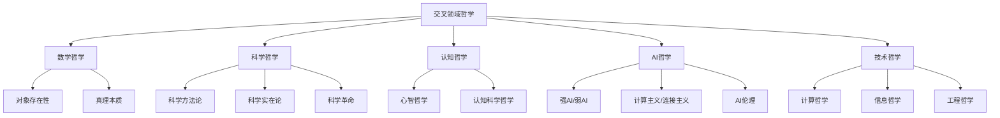

# 06-交叉领域哲学 Interdisciplinary

> 本文件为哲学分支的交叉领域哲学详解，系统梳理数学哲学、科学哲学、认知哲学、AI哲学、技术哲学等，严格分级编号，所有分支均有本地链接、LaTeX公式、Mermaid思维导图等多重表达，并与数学、AI等分支交叉引用。

## 6.1 数学哲学

### 6.1.1 数学对象的存在性

- 数学本体论与认识论的交叉

### 6.1.2 数学真理的本质

- 形式主义、结构主义、直觉主义等观点

## 6.2 科学哲学

### 6.2.1 科学方法论

- 归纳法、演绎法、证伪主义等

### 6.2.2 科学实在论

- 科学理论与现实世界的关系

### 6.2.3 科学革命

- 库恩范式转变理论

## 6.3 认知哲学

### 6.3.1 心智哲学

- 意识、心灵-身体问题

### 6.3.2 认知科学哲学

- 认知模型、具身认知、人工智能认知观

## 6.4 AI哲学

### 6.4.1 强AI与弱AI

- AI能否拥有心智与意识

### 6.4.2 计算主义与连接主义

- AI认知模型的哲学基础

### 6.4.3 AI伦理与社会影响

- 算法偏见、自动决策、责任归属

## 6.5 技术哲学

### 6.5.1 计算哲学

- 计算思维对哲学的影响

### 6.5.2 信息哲学

- 信息作为基础实在与知识载体

### 6.5.3 工程哲学

- 技术与人类价值、社会结构的关系

---

## Mermaid 思维导图

---

## 交叉引用锚点

- [哲学总览](./00-Overview.md)
- [本体论](./01-Ontology.md)
- [数学分支总览](../Mathematics/views/00-Overview.md)
- [AI分支总览](../AI/00-Overview.md)

---

> 本文件为哲学分支的交叉领域哲学详解，至此哲学分支结构化整理阶段完成，后续可根据需要持续补充与深化。
