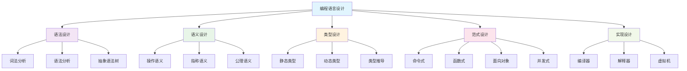

# 编程语言总览与理论基础

## 1. 理论框架

### 1.1 编程语言五元组理论

编程语言可以形式化表示为五元组：

$$\mathcal{PL} = \langle \mathcal{S}, \mathcal{T}, \mathcal{P}, \mathcal{I}, \mathcal{E} \rangle$$

其中：
- $\mathcal{S}$: 语法系统 (Syntax System)
- $\mathcal{T}$: 类型系统 (Type System)  
- $\mathcal{P}$: 范式系统 (Paradigm System)
- $\mathcal{I}$: 实现系统 (Implementation System)
- $\mathcal{E}$: 生态系统 (Ecosystem System)

### 1.2 语言设计层次结构

## 2. 核心概念体系

### 2.1 语法系统 $\mathcal{S}$

语法系统定义了程序的结构规则：

$$\mathcal{S} = \langle \Sigma, N, P, S \rangle$$

其中：
- $\Sigma$: 终结符集合
- $N$: 非终结符集合  
- $P$: 产生式规则集合
- $S$: 起始符号

#### 2.1.1 上下文无关文法

对于语言 $L$，其语法可以表示为：

$$G = (V_N, V_T, P, S)$$

其中 $P$ 包含形如 $A \rightarrow \alpha$ 的产生式。

#### 2.1.2 抽象语法树 (AST)

AST 是程序结构的树形表示：

$$\text{AST}(p) = \begin{cases}
\text{Leaf}(v) & \text{if } p \text{ is value } v \\
\text{Node}(op, \text{AST}(p_1), \ldots, \text{AST}(p_n)) & \text{if } p = op(p_1, \ldots, p_n)
\end{cases}$$

### 2.2 类型系统 $\mathcal{T}$

类型系统提供程序的结构化抽象：

$$\mathcal{T} = \langle \mathcal{B}, \mathcal{C}, \mathcal{R}, \mathcal{I} \rangle$$

其中：
- $\mathcal{B}$: 基本类型集合
- $\mathcal{C}$: 复合类型构造器
- $\mathcal{R}$: 类型规则集合
- $\mathcal{I}$: 类型推导算法

#### 2.2.1 类型推导

对于表达式 $e$，类型推导函数：

$$\text{typeof}: \text{Expr} \rightarrow \text{Type}$$

满足类型规则：

$$\frac{\Gamma \vdash e_1 : \tau_1 \quad \Gamma \vdash e_2 : \tau_2}{\Gamma \vdash e_1 + e_2 : \text{number}}$$

#### 2.2.2 多态类型

参数化多态：

$$\forall \alpha. \tau$$

其中 $\alpha$ 是类型变量，$\tau$ 是类型表达式。

### 2.3 范式系统 $\mathcal{P}$

编程范式定义了程序的组织方式：

$$\mathcal{P} = \{\text{Imperative}, \text{Functional}, \text{Object-Oriented}, \text{Concurrent}\}$$

#### 2.3.1 函数式编程

基于 $\lambda$ 演算：

$$\lambda x. e$$

函数应用：

$$(\lambda x. e_1) e_2 \rightarrow e_1[x := e_2]$$

#### 2.3.2 面向对象编程

对象模型：

$$\text{Object} = \langle \text{State}, \text{Methods} \rangle$$

继承关系：

$$\text{Inheritance}(C, P) \iff C \subseteq P$$

### 2.4 实现系统 $\mathcal{I}$

实现系统包括编译、解释和执行：

$$\mathcal{I} = \langle \text{Compiler}, \text{Interpreter}, \text{VirtualMachine} \rangle$$

#### 2.4.1 编译过程

$$\text{Source} \xrightarrow{\text{Lexical Analysis}} \text{Tokens} \xrightarrow{\text{Parsing}} \text{AST} \xrightarrow{\text{Type Checking}} \text{Typed AST} \xrightarrow{\text{Code Generation}} \text{Target}$$

#### 2.4.2 虚拟机执行

$$\text{VM State} = \langle \text{Stack}, \text{Heap}, \text{Environment} \rangle$$

## 3. 语言分类体系

### 3.1 按类型系统分类

| 类型系统 | 特征 | 代表语言 |
|---------|------|----------|
| 静态强类型 | 编译时类型检查，类型安全 | Rust, Haskell, Scala |
| 静态弱类型 | 编译时检查，类型转换 | C, C++ |
| 动态强类型 | 运行时类型检查，类型安全 | Python, Ruby |
| 动态弱类型 | 运行时检查，类型转换 | JavaScript, PHP |

### 3.2 按范式分类

| 范式 | 核心概念 | 代表语言 |
|------|----------|----------|
| 命令式 | 状态修改，副作用 | C, Pascal, Basic |
| 函数式 | 不可变性，纯函数 | Haskell, ML, Erlang |
| 面向对象 | 封装，继承，多态 | Java, C#, Smalltalk |
| 并发式 | 消息传递，进程 | Go, Erlang, Clojure |

### 3.3 按实现方式分类

| 实现方式 | 特征 | 代表语言 |
|----------|------|----------|
| 编译型 | 直接编译为机器码 | C, C++, Rust |
| 解释型 | 逐行解释执行 | Python, Ruby, JavaScript |
| 混合型 | 编译为字节码，虚拟机执行 | Java, C#, Go |

## 4. 语言设计原则

### 4.1 正交性 (Orthogonality)

语言特性应该相互独立：

$$\forall f_i, f_j \in \mathcal{F}: f_i \perp f_j$$

### 4.2 一致性 (Consistency)

相似操作应该有相似的语法：

$$\text{Consistency}(op_1, op_2) \iff \text{Syntax}(op_1) \sim \text{Syntax}(op_2)$$

### 4.3 简洁性 (Simplicity)

语言应该避免不必要的复杂性：

$$\text{Simplicity}(L) = \frac{|\text{Features}|}{|\text{Expressiveness}|}$$

### 4.4 表达能力 (Expressiveness)

语言应该能够简洁地表达复杂概念：

$$\text{Expressiveness}(L) = \frac{|\text{Concepts}|}{|\text{Code}|}$$

## 5. 语言评估框架

### 5.1 技术指标

| 指标 | 定义 | 评估方法 |
|------|------|----------|
| 性能 | 执行效率 | 基准测试 |
| 安全性 | 类型安全，内存安全 | 静态分析 |
| 可读性 | 代码清晰度 | 代码审查 |
| 可维护性 | 修改和扩展的容易程度 | 重构测试 |

### 5.2 生态系统指标

| 指标 | 定义 | 评估方法 |
|------|------|----------|
| 社区活跃度 | 开发者数量和贡献 | GitHub统计 |
| 库生态系统 | 可用库的数量和质量 | 包管理器统计 |
| 工具支持 | IDE、调试器、分析工具 | 工具链评估 |
| 文档质量 | 官方文档和教程 | 文档审查 |

## 6. 发展趋势

### 6.1 类型系统演进

1. **渐进式类型系统**: TypeScript, Flow
2. **依赖类型**: Idris, Agda
3. **线性类型**: Rust, Clean
4. **效果系统**: Koka, Eff

### 6.2 并发模型发展

1. **CSP模型**: Go, Occam
2. **Actor模型**: Erlang, Akka
3. **数据并行**: CUDA, OpenCL
4. **函数式并发**: Haskell STM, Clojure

### 6.3 新兴技术

1. **WebAssembly**: 跨平台字节码
2. **GraalVM**: 多语言运行时
3. **JIT编译**: 动态优化
4. **形式化验证**: 程序正确性证明

## 7. 跨学科整合

### 7.1 与数学的整合

- **类型理论**: 基于范畴论的现代类型系统
- **逻辑学**: 程序逻辑和证明理论
- **代数**: 抽象数据类型和代数结构

### 7.2 与计算机科学的整合

- **编译原理**: 语言实现技术
- **算法复杂度**: 程序性能分析
- **系统设计**: 语言运行时设计

### 7.3 与形式方法的整合

- **程序验证**: 形式化程序正确性证明
- **模型检查**: 并发程序验证
- **定理证明**: 程序性质证明

## 8. 实践指导

### 8.1 语言选择原则

1. **项目需求匹配**: 根据项目特点选择合适语言
2. **团队技能考虑**: 考虑团队的技术栈
3. **生态系统评估**: 评估语言生态的成熟度
4. **长期维护性**: 考虑项目的长期发展

### 8.2 学习路径建议

1. **基础阶段**: 掌握一门主流语言（如Python、Java）
2. **范式阶段**: 学习不同编程范式（函数式、面向对象）
3. **系统阶段**: 理解语言实现原理（编译、运行时）
4. **前沿阶段**: 跟踪语言发展前沿（WebAssembly、Rust等）

### 8.3 最佳实践

1. **代码规范**: 遵循语言编码规范
2. **测试驱动**: 采用测试驱动开发
3. **文档维护**: 保持代码文档的更新
4. **性能优化**: 在必要时进行性能优化 