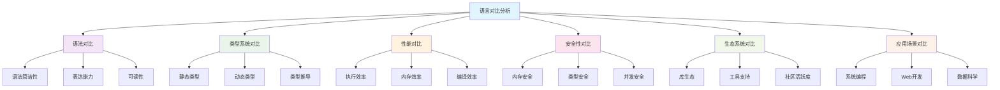

# 语言对比与分析

## 1. 对比分析框架

### 1.1 对比维度体系

语言对比可以从多个维度进行：

$$\mathcal{Comparison} = \langle \mathcal{S}, \mathcal{T}, \mathcal{P}, \mathcal{I}, \mathcal{E}, \mathcal{S} \rangle$$

其中：

- $\mathcal{S}$: 语法系统 (Syntax System)
- $\mathcal{T}$: 类型系统 (Type System)
- $\mathcal{P}$: 性能特征 (Performance Characteristics)
- $\mathcal{I}$: 实现方式 (Implementation)
- $\mathcal{E}$: 生态系统 (Ecosystem)
- $\mathcal{S}$: 安全性 (Safety)

### 1.2 对比方法论



## 2. Rust与其他语言对比

### 2.1 Rust vs C/C++

#### 2.1.1 内存安全对比

| 特性 | C/C++ | Rust |
|------|-------|------|
| 内存管理 | 手动管理 | 所有权系统 |
| 空指针 | 可能产生 | 编译时检查 |
| 数据竞争 | 运行时检查 | 编译时检查 |
| 缓冲区溢出 | 可能发生 | 编译时检查 |

#### 2.1.2 性能对比

$$\text{Performance}(Rust) \approx \text{Performance}(C/C++)$$

Rust在保持C/C++性能的同时提供内存安全保证：

```rust
// Rust内存安全示例
fn rust_memory_safety() {
    let v = vec![1, 2, 3];
    // 自动管理内存，离开作用域时释放
} // v在此处自动释放

// C++等价实现
/*
void cpp_memory_management() {
    std::vector<int> v = {1, 2, 3};
    // 使用RAII，离开作用域时自动释放
} // v在此处自动释放
*/
```

#### 2.1.3 语法对比

| 特性 | C++ | Rust |
|------|-----|------|
| 模板 | 复杂语法 | 泛型，更简洁 |
| 智能指针 | 手动使用 | 内置所有权 |
| 错误处理 | 异常或错误码 | Result类型 |
| 并发 | 线程库 | 内置并发原语 |

### 2.2 Rust vs Go

#### 2.2.1 设计哲学对比

| 方面 | Go | Rust |
|------|----|------|
| 简洁性 | 极简设计 | 功能丰富 |
| 学习曲线 | 平缓 | 陡峭 |
| 性能控制 | 有限 | 精细控制 |
| 内存管理 | GC | 所有权系统 |

#### 2.2.2 并发模型对比

```rust
// Rust并发示例
use std::thread;
use std::sync::mpsc;

fn rust_concurrency() {
    let (tx, rx) = mpsc::channel();
    
    thread::spawn(move || {
        tx.send("Hello from thread").unwrap();
    });
    
    let message = rx.recv().unwrap();
    println!("{}", message);
}
```

```go
// Go并发示例
func go_concurrency() {
    ch := make(chan string)
    
    go func() {
        ch <- "Hello from goroutine"
    }()
    
    message := <-ch
    fmt.Println(message)
}
```

#### 2.2.3 性能特征对比

| 指标 | Go | Rust |
|------|----|------|
| 启动时间 | 快 | 快 |
| 内存使用 | 较高（GC） | 低 |
| 并发性能 | 优秀 | 优秀 |
| 系统编程 | 有限 | 强大 |

### 2.3 Rust vs Java

#### 2.3.1 运行时对比

| 特性 | Java | Rust |
|------|----|------|
| 运行时 | JVM | 无运行时 |
| 内存管理 | GC | 所有权系统 |
| 启动时间 | 较慢 | 快 |
| 内存占用 | 较高 | 低 |

#### 2.3.2 类型系统对比

```rust
// Rust类型系统
trait Animal {
    fn make_sound(&self) -> String;
}

struct Dog {
    name: String,
}

impl Animal for Dog {
    fn make_sound(&self) -> String {
        format!("{} says: Woof!", self.name)
    }
}
```

```java
// Java类型系统
interface Animal {
    String makeSound();
}

class Dog implements Animal {
    private String name;
    
    public Dog(String name) {
        this.name = name;
    }
    
    @Override
    public String makeSound() {
        return name + " says: Woof!";
    }
}
```

## 3. WebAssembly技术对比

### 3.1 WebAssembly vs JavaScript

#### 3.1.1 性能对比

$$\text{Performance}(WASM) \approx 0.8 \times \text{Performance}(Native)$$

$$\text{Performance}(JS) \approx 0.1 \times \text{Performance}(Native)$$

#### 3.1.2 应用场景对比

| 场景 | JavaScript | WebAssembly |
|------|-----------|-------------|
| 简单交互 | 优秀 | 过度设计 |
| 复杂计算 | 性能有限 | 优秀 |
| 游戏开发 | 性能有限 | 优秀 |
| 图像处理 | 性能有限 | 优秀 |

### 3.2 Rust + WebAssembly

#### 3.2.1 技术栈优势

```rust
// Rust编译为WebAssembly
use wasm_bindgen::prelude::*;

#[wasm_bindgen]
pub fn fibonacci(n: u32) -> u32 {
    match n {
        0 | 1 => n,
        _ => fibonacci(n - 1) + fibonacci(n - 2)
    }
}
```

#### 3.2.2 性能优势

| 操作 | JavaScript | Rust + WASM |
|------|-----------|-------------|
| 数值计算 | 慢 | 快 |
| 内存操作 | 慢 | 快 |
| 字符串处理 | 中等 | 快 |
| DOM操作 | 快 | 慢 |

## 4. 函数式语言对比

### 4.1 Rust vs Haskell

#### 4.1.1 类型系统对比

| 特性 | Haskell | Rust |
|------|---------|------|
| 类型推导 | 全局 | 局部 |
| 高阶类型 | 支持 | 有限支持 |
| 类型类 | 内置 | 特征系统 |
| 纯度 | 强制 | 可选 |

#### 4.1.2 语法对比

```haskell
-- Haskell函数式编程
fibonacci :: Integer -> Integer
fibonacci 0 = 0
fibonacci 1 = 1
fibonacci n = fibonacci (n-1) + fibonacci (n-2)

map' :: (a -> b) -> [a] -> [b]
map' _ [] = []
map' f (x:xs) = f x : map' f xs
```

```rust
// Rust函数式编程
fn fibonacci(n: u32) -> u32 {
    match n {
        0 | 1 => n,
        _ => fibonacci(n - 1) + fibonacci(n - 2)
    }
}

fn map<T, U, F>(f: F, list: Vec<T>) -> Vec<U>
where
    F: Fn(T) -> U,
{
    list.into_iter().map(f).collect()
}
```

### 4.2 Rust vs Scala

#### 4.2.1 设计目标对比

| 方面 | Scala | Rust |
|------|-------|------|
| 主要目标 | 函数式+面向对象 | 系统编程+安全 |
| JVM集成 | 深度集成 | 无 |
| 学习曲线 | 复杂 | 复杂 |
| 性能 | 中等 | 高 |

#### 4.2.2 类型系统对比

```scala
// Scala类型系统
trait Animal {
  def makeSound(): String
}

case class Dog(name: String) extends Animal {
  def makeSound(): String = s"$name says: Woof!"
}

// 模式匹配
def describe(animal: Animal): String = animal match {
  case Dog(name) => s"A dog named $name"
  case _ => "An animal"
}
```

```rust
// Rust类型系统
trait Animal {
    fn make_sound(&self) -> String;
}

struct Dog {
    name: String,
}

impl Animal for Dog {
    fn make_sound(&self) -> String {
        format!("{} says: Woof!", self.name)
    }
}

// 模式匹配
fn describe(animal: &dyn Animal) -> String {
    // Rust的模式匹配在match表达式中
    "An animal".to_string()
}
```

## 5. 系统编程语言对比

### 5.1 Rust vs C

#### 5.1.1 内存安全对比

```c
// C语言内存管理
void c_memory_example() {
    int* arr = malloc(10 * sizeof(int));
    // 使用数组
    free(arr); // 必须手动释放
}
```

```rust
// Rust内存管理
fn rust_memory_example() {
    let arr = vec![0; 10];
    // 使用向量，自动管理内存
} // 自动释放
```

#### 5.1.2 错误处理对比

```c
// C错误处理
int divide(int a, int b) {
    if (b == 0) {
        return -1; // 错误码
    }
    return a / b;
}
```

```rust
// Rust错误处理
fn divide(a: i32, b: i32) -> Result<i32, &'static str> {
    if b == 0 {
        Err("Division by zero")
    } else {
        Ok(a / b)
    }
}
```

### 5.2 Rust vs C++

#### 5.2.1 现代特性对比

| 特性 | C++ | Rust |
|------|-----|------|
| 智能指针 | 手动使用 | 内置 |
| 移动语义 | 复杂 | 简单 |
| 错误处理 | 异常 | Result |
| 并发安全 | 手动保证 | 编译时检查 |

#### 5.2.2 模板vs泛型

```cpp
// C++模板
template<typename T>
T add(T a, T b) {
    return a + b;
}
```

```rust
// Rust泛型
fn add<T: std::ops::Add<Output = T>>(a: T, b: T) -> T {
    a + b
}
```

## 6. 动态语言对比

### 6.1 Rust vs Python

#### 6.1.1 性能对比

| 操作 | Python | Rust |
|------|--------|------|
| 数值计算 | 慢 | 快 |
| 字符串处理 | 中等 | 快 |
| 内存使用 | 高 | 低 |
| 启动时间 | 快 | 快 |

#### 6.1.2 开发效率对比

```python
# Python开发效率
def fibonacci(n):
    if n <= 1:
        return n
    return fibonacci(n-1) + fibonacci(n-2)

# 列表推导
squares = [x**2 for x in range(10)]
```

```rust
// Rust开发效率
fn fibonacci(n: u32) -> u32 {
    match n {
        0 | 1 => n,
        _ => fibonacci(n - 1) + fibonacci(n - 2)
    }
}

// 迭代器
let squares: Vec<u32> = (0..10).map(|x| x * x).collect();
```

### 6.2 Rust vs JavaScript

#### 6.2.1 类型系统对比

| 特性 | JavaScript | Rust |
|------|-----------|------|
| 类型检查 | 运行时 | 编译时 |
| 类型安全 | 弱 | 强 |
| 类型推导 | 有限 | 强大 |
| 错误处理 | 异常 | Result |

#### 6.2.2 异步编程对比

```javascript
// JavaScript异步编程
async function fetchData() {
    try {
        const response = await fetch('/api/data');
        const data = await response.json();
        return data;
    } catch (error) {
        console.error('Error:', error);
    }
}
```

```rust
// Rust异步编程
use tokio;

async fn fetch_data() -> Result<serde_json::Value, Box<dyn std::error::Error>> {
    let response = reqwest::get("/api/data").await?;
    let data = response.json::<serde_json::Value>().await?;
    Ok(data)
}
```

## 7. 语言选择指导

### 7.1 选择标准

#### 7.1.1 项目需求匹配

$$\text{LanguageChoice}(requirements) = \text{argmax}_{lang} \text{Suitability}(lang, requirements)$$

其中适合性函数：

$$\text{Suitability}(lang, req) = \sum_{i} w_i \times \text{Score}_i(lang, req)$$

#### 7.1.2 性能要求

| 性能要求 | 推荐语言 | 理由 |
|----------|----------|------|
| 最高性能 | Rust, C/C++ | 零成本抽象 |
| 高并发 | Go, Rust | 优秀并发模型 |
| 快速开发 | Python, JavaScript | 开发效率高 |
| 内存受限 | Rust, C | 内存效率高 |

#### 7.1.3 安全要求

| 安全要求 | 推荐语言 | 理由 |
|----------|----------|------|
| 内存安全 | Rust | 编译时检查 |
| 类型安全 | Rust, Haskell | 强类型系统 |
| 并发安全 | Rust | 编译时检查 |
| 网络安全 | Rust, Go | 内置安全特性 |

### 7.2 学习路径建议

#### 7.2.1 初学者路径

1. **Python**: 学习编程基础
2. **JavaScript**: 学习Web开发
3. **Java/C#**: 学习面向对象
4. **Rust**: 学习系统编程

#### 7.2.2 进阶路径

1. **Haskell**: 学习函数式编程
2. **C/C++**: 学习底层编程
3. **Go**: 学习并发编程
4. **Rust**: 学习内存安全

### 7.3 行业应用指导

#### 7.3.1 Web开发

| 场景 | 推荐语言 | 理由 |
|------|----------|------|
| 前端 | JavaScript/TypeScript | 生态系统丰富 |
| 后端 | Rust, Go, Node.js | 性能好，开发效率高 |
| 全栈 | JavaScript/TypeScript | 统一技术栈 |

#### 7.3.2 系统编程

| 场景 | 推荐语言 | 理由 |
|------|----------|------|
| 操作系统 | Rust, C | 性能和安全 |
| 驱动程序 | Rust, C | 底层控制 |
| 嵌入式 | Rust, C | 资源受限 |

#### 7.3.3 数据科学

| 场景 | 推荐语言 | 理由 |
|------|----------|------|
| 数据分析 | Python, R | 库生态丰富 |
| 机器学习 | Python, Rust | 性能和易用性 |
| 高性能计算 | Rust, C++ | 性能优势 |

## 8. 未来发展趋势

### 8.1 语言演进趋势

#### 8.1.1 类型系统演进

1. **渐进式类型**: TypeScript, Flow
2. **依赖类型**: Idris, Agda
3. **线性类型**: Rust, Clean
4. **效果系统**: Koka, Eff

#### 8.1.2 并发模型发展

1. **CSP模型**: Go, Occam
2. **Actor模型**: Erlang, Akka
3. **数据并行**: CUDA, OpenCL
4. **函数式并发**: Haskell STM, Clojure

### 8.2 新兴技术

#### 8.2.1 WebAssembly生态

- **跨平台**: 一次编译，到处运行
- **性能**: 接近原生性能
- **安全**: 沙箱执行环境
- **互操作**: 与现有Web技术集成

#### 8.2.2 量子编程

- **量子算法**: 量子计算语言
- **混合编程**: 经典+量子编程
- **优化**: 量子编译器优化

### 8.3 语言融合趋势

#### 8.3.1 多范式融合

现代语言趋向支持多种范式：

$$\text{ModernLanguage} = \text{Imperative} + \text{Functional} + \text{ObjectOriented} + \text{Concurrent}$$

#### 8.3.2 跨语言互操作

语言间互操作成为趋势：

$$\text{Interoperability} = \text{FFI} + \text{Serialization} + \text{Runtime Integration}$$

## 9. 实践建议

### 9.1 语言学习策略

1. **基础优先**: 先掌握基础概念
2. **项目驱动**: 通过实际项目学习
3. **对比学习**: 对比不同语言特性
4. **持续更新**: 跟踪语言发展

### 9.2 技术栈选择

1. **需求分析**: 明确项目需求
2. **团队评估**: 考虑团队技能
3. **生态评估**: 评估语言生态
4. **长期规划**: 考虑技术演进

### 9.3 最佳实践

1. **代码规范**: 遵循语言编码规范
2. **测试驱动**: 采用测试驱动开发
3. **文档维护**: 保持代码文档更新
4. **性能优化**: 在必要时进行优化

## 范畴论视角下的 Haskell、Scala 与 Rust：类型系统、控制流与编程范式对比

> 本文系统对比 Haskell、Scala、Rust 三种主流语言的类型系统、控制流与编程范式，采用范畴论与形式化方法，配合表格、公式、代码示例，突出学术严谨性与工程实用性。

## 目录

- [范畴论视角下的 Haskell、Scala 与 Rust：类型系统、控制流与编程范式对比](#范畴论视角下的-haskellscala-与-rust类型系统控制流与编程范式对比)

---

## 一、理论基础：编程语言的范畴学解析

### 1.1 范畴论与编程语言的本质联系

**定义1：编程语言范畴表示**  
编程语言可抽象为范畴：

```text
Lang = (Types, Functions, ∘, id)
```

- Types：对象，对应类型
- Functions：态射，对应函数
- ∘：组合
- id：恒等态射

### 1.2 范畴结构在编程语言中的体现

| 范畴概念 | 编程概念 | Haskell | Scala | Rust |
|---------|---------|---------|-------|------|
| 对象 | 类型 | 完全符合 | 完全符合 | 增加生命周期参数 |
| 态射 | 函数 | 纯函数 | 方法/函数 | 函数/方法 |
| 函子 | 类型构造器 | Functor类 | 特质/构造器 | 特质/泛型 |
| 自然变换 | 多态函数 | 高阶多态 | 高阶多态 | 有限多态 |
| 单子 | 效应封装 | 显式单子 | 隐式单子 | 无显式单子 |
| 积 | 积类型 | (a,b) | (A,B)/类 | (A,B)/结构体 |
| 余积 | 和类型 | Either/ADT | 密封特质/ADT | 枚举/Option |

---

## 二、类型系统的范畴论对比

### 2.1 Haskell 类型系统：纯范畴建模

```haskell
Hask = (Types, Functions, ∘, id, ×, →, 1)
```

- ×：积类型
- →：函数空间
- 1：单位类型

**特性**：高阶函数、代数数据类型、类型类、纯函数

### 2.2 Scala 类型系统：混合范畴模型

```scala
Scala = (Types, Functions, ∘, id, ×, →, 1, <:)
```

- <:：子类型关系

**特性**：混合范式、高阶类型、隐式转换、特质组合

### 2.3 Rust 类型系统：线性类型与所有权范畴

- 增加生命周期与所有权参数，强调资源安全

**特性**：所有权、借用、生命周期、泛型、特质

### 2.4 范畴论角度的类型系统对比

| 语言 | 类型系统 | 多态 | 类型类/特质 | 线性/所有权 | 子类型 |
|------|----------|------|-------------|-------------|--------|
| Haskell | 静态强类型 | 高阶 | 类型类 | 否 | 否 |
| Scala   | 静态强类型 | 高阶 | 特质 | 否 | 支持 |
| Rust    | 静态强类型 | 有限 | 特质 | 支持 | 否 |

---

## 三、控制系统的范畴论对比

### 3.1 Haskell 的单子与效应控制

- 显式 Monad 封装副作用
- IO、Maybe、Either 等单子

### 3.2 Scala 的效应系统

- Option、Try、Future 等
- 隐式单子与 for-comprehension

### 3.3 Rust 的所有权与错误控制

- Result、Option 枚举
- 所有权与生命周期控制资源释放

### 3.4 范畴论视角的控制系统对比

| 语言 | 副作用封装 | 错误处理 | 并发控制 |
|------|------------|----------|----------|
| Haskell | Monad | Either/Maybe | STM/Async |
| Scala   | Monad/特质 | Try/Option | Future/Actor |
| Rust    | 枚举/所有权 | Result/Option | async/await/所有权 |

---

## 四、编程范式的范畴论对比

### 4.1 Haskell 的函数式范式

- 纯函数、不可变、类型推导、惰性求值

### 4.2 Scala 的混合范式

- 面向对象 + 函数式，支持高阶类型、特质、模式匹配

### 4.3 Rust 的所有权驱动范式

- 安全并发、零成本抽象、泛型、特质、模式匹配

### 4.4 范畴论视角的编程范式对比

| 语言 | 主导范式 | 并发模型 | 资源管理 |
|------|----------|----------|----------|
| Haskell | 函数式 | STM/Async | GC |
| Scala   | 混合 | Future/Actor | GC |
| Rust    | 系统/泛型 | async/await | 所有权/RAII |

---

## 五、形式化证明与验证能力

### 5.1 类型级证明能力对比

- Haskell：类型类与 GADT 支持类型级证明
- Scala：特质与隐式参数支持类型级推理
- Rust：特质约束与泛型边界支持有限证明

### 5.2 形式化验证支持对比

- Haskell：QuickCheck、LiquidHaskell
- Scala：ScalaCheck、Dotty
- Rust：proptest、MIRAI、Clippy

---

## 六、综合分析与结论

### 6.1 范畴论视角的语言定位

- Haskell：范畴论最纯粹实现，适合学术与高可靠性场景
- Scala：工程与理论兼备，适合大规模工程与多范式需求
- Rust：系统级安全与高性能，适合底层与并发场景

### 6.2 编程范式与范畴对应

- Haskell：Functor/Monad/Applicative 等范畴结构
- Scala：特质、隐式、类型构造器
- Rust：所有权、生命周期、特质

### 6.3 技术适用性与范畴关联

- Haskell：高可靠、形式化验证、DSL
- Scala：大数据、分布式、工程实践
- Rust：嵌入式、系统编程、高性能并发

### 6.4 范畴论贡献与未来发展

- 推动类型系统、泛型、抽象能力发展
- 促进编程语言理论与工程实践融合

---

> 交叉引用：详见 [编程语言理论基础](01-Overview.md)、[Rust 深度专题](05-RustDomain.md)、[异步编程范式](06-AsyncProgramming.md)
