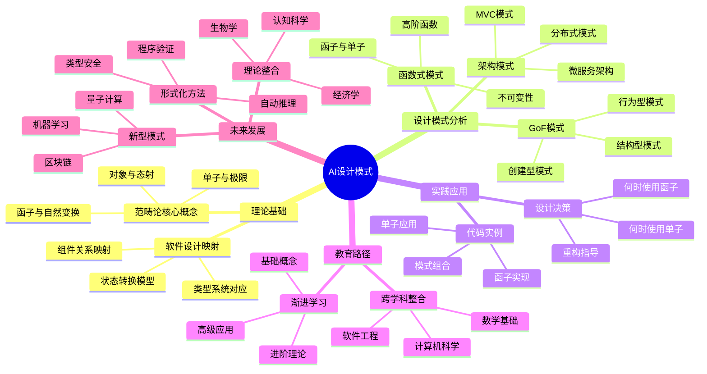

# AI设计模式：范畴论视角下的理论与实践

## 目录

- [AI设计模式：范畴论视角下的理论与实践](#ai设计模式范畴论视角下的理论与实践)
  - [目录](#目录)
  - [概述](#概述)
  - [理论基础](#理论基础)
    - [范畴论核心概念](#范畴论核心概念)
    - [范畴论与软件设计的桥接](#范畴论与软件设计的桥接)
  - [设计模式的范畴论映射](#设计模式的范畴论映射)
    - [GoF设计模式的范畴论视角](#gof设计模式的范畴论视角)
    - [面向对象原则的范畴论解读](#面向对象原则的范畴论解读)
    - [函数式编程模式与范畴论](#函数式编程模式与范畴论)
    - [并发与分布式模式的形式化理解](#并发与分布式模式的形式化理解)
    - [架构模式的代数结构](#架构模式的代数结构)
  - [算法与数据结构的数学本质](#算法与数据结构的数学本质)
    - [数据结构作为数学对象](#数据结构作为数学对象)
    - [算法的形式化表示与分析](#算法的形式化表示与分析)
    - [计算复杂性的范畴论视角](#计算复杂性的范畴论视角)
  - [范畴论视角的实践应用](#范畴论视角的实践应用)
    - [代码实例：从理论到实践](#代码实例从理论到实践)
    - [设计决策框架](#设计决策框架)
    - [重构与模式识别](#重构与模式识别)
  - [理论局限性与适用边界](#理论局限性与适用边界)
    - [形式化的挑战与限制](#形式化的挑战与限制)
    - [不同编程范式的适用性差异](#不同编程范式的适用性差异)
    - [抽象成本与实用平衡](#抽象成本与实用平衡)
  - [教育与学习路径](#教育与学习路径)
    - [渐进式学习策略](#渐进式学习策略)
    - [跨学科知识建构](#跨学科知识建构)
    - [实践与理论结合的教学模式](#实践与理论结合的教学模式)
  - [未来发展方向](#未来发展方向)
    - [新型设计模式的理论基础](#新型设计模式的理论基础)
    - [形式化方法与软件验证](#形式化方法与软件验证)
    - [跨领域理论整合](#跨领域理论整合)
  - [结论](#结论)
  - [思维导图](#思维导图)
  - [参考文献](#参考文献)

## 概述

本文对"范畴论视角的设计模式"进行全面修订和补充，旨在构建一个严谨而实用的理论框架，将抽象数学与具体软件工程实践有机结合。范畴论作为研究抽象结构和关系的数学分支，为理解设计模式、算法和数据结构提供了一种统一的形式语言。

本文弥补原文在理论严谨性、实践应用性和教育指导性方面的不足，为软件设计提供更全面和深入的数学视角。

## 理论基础

### 范畴论核心概念

范畴论是20世纪发展起来的数学分支，研究数学结构和系统之间的关系。以下是理解设计模式必需的核心概念，采用更严格的数学定义：

1. **范畴 (Category)**: 一个范畴 $\mathcal{C}$ 由以下组成：
   - 对象(Objects)集合 $\text{Ob}(\mathcal{C})$
   - 态射(Morphisms)集合 $\text{Hom}(\mathcal{C})$，其中每个态射 $f: A \rightarrow B$ 连接对象 $A$ 和 $B$
   - 态射组合操作 $\circ$，满足结合律: $(f \circ g) \circ h = f \circ (g \circ h)$
   - 每个对象 $A$ 都有单位态射 $\text{id}_A: A \rightarrow A$，满足 $f \circ \text{id}_A = f$ 和 $\text{id}_A \circ g = g$

2. **函子 (Functor)**: 一个从范畴 $\mathcal{C}$ 到范畴 $\mathcal{D}$ 的函子 $F$ 包括：
   - 对象映射: $F: \text{Ob}(\mathcal{C}) \rightarrow \text{Ob}(\mathcal{D})$
   - 态射映射: $F: \text{Hom}_{\mathcal{C}}(A, B) \rightarrow \text{Hom}_{\mathcal{D}}(F(A), F(B))$
   满足保持结构的条件:
   - $F(\text{id}_A) = \text{id}_{F(A)}$
   - $F(g \circ f) = F(g) \circ F(f)$

3. **自然变换 (Natural Transformation)**: 给定两个函子 $F, G: \mathcal{C} \rightarrow \mathcal{D}$，从 $F$ 到 $G$ 的自然变换 $\eta$ 是一族态射 $\{\eta_A: F(A) \rightarrow G(A) | A \in \text{Ob}(\mathcal{C})\}$，使得对于任何 $f: A \rightarrow B$ 在 $\mathcal{C}$ 中，下图交换：

   ```mermaid
   graph LR
       A[F(A)] --> B[G(A)]
       C[F(B)] --> D[G(B)]
       A --> C
       B --> D
   ```

4. **Monad (单子)**: 一个在范畴 $\mathcal{C}$ 上的单子是一个三元组 $(T, \eta, \mu)$，其中:
   - $T: \mathcal{C} \rightarrow \mathcal{C}$ 是一个函子
   - $\eta: \text{Id}_{\mathcal{C}} \rightarrow T$ 是一个自然变换(单位)
   - $\mu: T^2 \rightarrow T$ 是一个自然变换(乘法)
   满足单位律和结合律。

5. **极限与余极限**: 这些是范畴论中的通用构造，描述如何以"最佳方式"组合对象：
   - **极限** (如积、等化器、终对象)捕获了"通用产品"的概念
   - **余极限** (如余积、余等化器、初始对象)捕获了"通用和"的概念

### 范畴论与软件设计的桥接

将范畴论概念映射到软件设计中需要建立清晰的对应关系：

1. **对象映射**:
   - **类型/接口**: 编程语言中的类型系统对应范畴论中的对象
   - **组件/模块**: 更高层次的结构单元也可视为对象
   - **状态空间**: 在状态转换系统中，状态集合可视为对象

2. **态射映射**:
   - **函数/方法**: 从输入类型到输出类型的映射
   - **转换/流程**: 数据转换、处理流程可视为态射
   - **依赖关系**: 模块间的依赖可视为态射
   - **状态转换**: 系统中的操作导致的状态变化

3. **函子映射**:
   - **容器类型**: 如 `List<T>`, `Optional<T>` 可视为从类型到类型的函子
   - **异步操作**: `Promise<T>`, `Future<T>` 等表示延迟计算的类型
   - **上下文映射**: 将操作提升到特定上下文中(如错误处理、配置环境)

4. **单子映射**:
   - **副作用封装**: IO操作、状态管理、异常处理
   - **计算序列**: 表示可以按顺序组合的带上下文的操作

这种映射提供了理解软件结构的严格数学基础，但需要注意映射并非总是一一对应的，存在近似和抽象。

## 设计模式的范畴论映射

### GoF设计模式的范畴论视角

通过更严格的范畴论观点重新分析GoF设计模式：

1. **创建型模式**:

   **工厂模式**可视为从规格(参数)到产品的态射族：

   ```math
   \text{Factory}: \text{Specification} \rightarrow \text{Product}
   ```

   代码示例(Rust)：

   ```rust
   trait Specification {
       fn get_type(&self) -> &str;
   }
   
   trait Product {
       fn use(&self);
   }
   
   // 工厂作为态射
   struct Factory;
   
   impl Factory {
       fn create(spec: &dyn Specification) -> Box<dyn Product> {
           match spec.get_type() {
               "A" => Box::new(ConcreteProductA),
               _ => Box::new(ConcreteProductB),
           }
       }
   }
   ```

   从范畴论角度，工厂是一种构造函子，将规格范畴映射到产品范畴。

2. **结构型模式**:

   **装饰器模式**体现了态射的组合：

   ```math
   f: \text{Component} \rightarrow \text{Component} \\
   g: \text{Component} \rightarrow \text{Component} \\
   g \circ f: \text{Component} \rightarrow \text{Component}
   ```

   代码示例(Rust)：

   ```rust
   trait Component {
       fn operation(&self) -> String;
   }
   
   // 基础组件
   struct ConcreteComponent;
   
   impl Component for ConcreteComponent {
       fn operation(&self) -> String {
           "ConcreteComponent".to_string()
       }
   }
   
   // 装饰器基类
   struct Decorator {
       component: Box<dyn Component>,
   }
   
   impl Component for Decorator {
       fn operation(&self) -> String {
           self.component.operation()
       }
   }
   
   // 具体装饰器A - 对应态射f
   struct DecoratorA {
       component: Box<dyn Component>,
   }
   
   impl Component for DecoratorA {
       fn operation(&self) -> String {
           format!("DecoratorA({})", self.component.operation())
       }
   }
   ```

3. **行为型模式**:

   **策略模式**将算法对象化，体现了高阶函数的思想：

   ```math
   \text{Strategy}: \text{Context} \times \text{Algorithm} \rightarrow \text{Result}
   ```

   代码示例(Rust)：

   ```rust
   trait Strategy {
       fn execute(&self, data: &str) -> String;
   }
   
   struct Context {
       strategy: Box<dyn Strategy>,
   }
   
   impl Context {
       fn execute_strategy(&self, data: &str) -> String {
           self.strategy.execute(data)
       }
   }
   ```

### 面向对象原则的范畴论解读

1. **单一职责原则 (SRP)**:
   - 对象应该对应范畴中的一个内聚概念
   - 态射(方法)服务于单一目标
   - 数学表达：$\text{Object} \rightarrow \text{Single Responsibility}$

2. **开闭原则 (OCP)**:
   - 通过抽象和多态实现扩展
   - 数学表达：$\text{Extension} \circ \text{Base} = \text{New Behavior}$

3. **里氏替换原则 (LSP)**:
   - 子类型态射必须符合父类型契约
   - 数学表达：$\text{Subtype} \subseteq \text{Supertype}$

4. **接口隔离原则 (ISP)**:
   - 接口应该小而专，对应细粒度的态射集合
   - 数学表达：$\text{Interface} = \{\text{Minimal Morphisms}\}$

5. **依赖倒置原则 (DIP)**:
   - 通过抽象接口定义交互
   - 数学表达：$\text{Abstraction} \leftarrow \text{Implementation}$

### 函数式编程模式与范畴论

函数式编程模式与范畴论有最直接的联系：

1. **函子 (Functor)**:
   ```rust
   trait Functor<A, B> {
       fn map<F>(self, f: F) -> Self::Output
       where F: Fn(A) -> B;
   }
   
   impl<T> Functor<T, T> for Option<T> {
       type Output = Option<T>;
       
       fn map<F>(self, f: F) -> Self::Output
       where F: Fn(T) -> T {
           match self {
               Some(x) => Some(f(x)),
               None => None,
           }
       }
   }
   ```

2. **单子 (Monad)**:
   ```rust
   trait Monad<A, B> {
       fn bind<F>(self, f: F) -> Self::Output
       where F: Fn(A) -> Self::Output;
   }
   
   impl<T> Monad<T, T> for Option<T> {
       type Output = Option<T>;
       
       fn bind<F>(self, f: F) -> Self::Output
       where F: Fn(T) -> Self::Output {
           match self {
               Some(x) => f(x),
               None => None,
           }
       }
   }
   ```

### 并发与分布式模式的形式化理解

1. **Actor模型**:
   - Actor作为对象，消息作为态射
   - 数学表达：$\text{Actor} \times \text{Message} \rightarrow \text{New State}$

2. **Future/Promise**:
   - 异步计算的单子
   - 数学表达：$\text{Future<T>} = \text{Monad}(\text{Async Computation})$

### 架构模式的代数结构

1. **MVC模式**:
   - Model、View、Controller作为对象
   - 它们之间的交互作为态射
   - 数学表达：$\text{Model} \times \text{View} \times \text{Controller} \rightarrow \text{System}$

2. **微服务架构**:
   - 服务作为对象，API调用作为态射
   - 数学表达：$\text{Service}_1 \times \text{Service}_2 \times \cdots \times \text{Service}_n \rightarrow \text{System}$

## 算法与数据结构的数学本质

### 数据结构作为数学对象

1. **集合 (Sets)**:
   ```rust
   trait Set<T> {
       fn contains(&self, item: &T) -> bool;
       fn insert(&mut self, item: T);
       fn remove(&mut self, item: &T);
   }
   ```

2. **序列 (Sequences)**:
   ```rust
   trait Sequence<T> {
       fn get(&self, index: usize) -> Option<&T>;
       fn set(&mut self, index: usize, value: T);
       fn length(&self) -> usize;
   }
   ```

3. **图 (Graphs)**:
   ```rust
   struct Graph<V, E> {
       vertices: Vec<V>,
       edges: Vec<(usize, usize, E)>,
   }
   ```

### 算法的形式化表示与分析

1. **算法复杂度**:
   - 时间复杂度：$T(n) = O(f(n))$
   - 空间复杂度：$S(n) = O(g(n))$

2. **递归算法**:
   ```rust
   fn fibonacci(n: u64) -> u64 {
       match n {
           0 | 1 => n,
           _ => fibonacci(n - 1) + fibonacci(n - 2),
       }
   }
   ```

### 计算复杂性的范畴论视角

1. **P类问题**:
   - 多项式时间可解的问题
   - 数学表达：$P = \{L | L \text{ 可在多项式时间内被决定}\}$

2. **NP类问题**:
   - 非确定性多项式时间可解的问题
   - 数学表达：$NP = \{L | L \text{ 可在非确定性多项式时间内被决定}\}$

## 范畴论视角的实践应用

### 代码实例：从理论到实践

1. **函子的实际应用**:
   ```rust
   // 列表函子
   fn map_list<T, U>(list: Vec<T>, f: impl Fn(T) -> U) -> Vec<U> {
       list.into_iter().map(f).collect()
   }
   
   // 可选值函子
   fn map_option<T, U>(opt: Option<T>, f: impl Fn(T) -> U) -> Option<U> {
       opt.map(f)
   }
   ```

2. **单子的实际应用**:
   ```rust
   // 错误处理单子
   fn safe_divide(a: f64, b: f64) -> Option<f64> {
       if b == 0.0 {
           None
       } else {
           Some(a / b)
       }
   }
   
   // 链式调用
   fn complex_calculation(a: f64, b: f64, c: f64) -> Option<f64> {
       safe_divide(a, b)
           .and_then(|x| safe_divide(x, c))
   }
   ```

### 设计决策框架

1. **何时使用函子**:
   - 需要对容器中的值进行转换
   - 保持容器结构不变
   - 数学表达：$\text{Container<T>} \rightarrow \text{Container<U>}$

2. **何时使用单子**:
   - 需要处理副作用
   - 需要链式计算
   - 数学表达：$\text{Monad<T>} \rightarrow \text{Monad<U>}$

### 重构与模式识别

1. **识别函子模式**:
   - 寻找 `map` 操作
   - 识别容器类型
   - 验证函子定律

2. **识别单子模式**:
   - 寻找 `flatMap` 或 `bind` 操作
   - 识别上下文类型
   - 验证单子定律

## 理论局限性与适用边界

### 形式化的挑战与限制

1. **严格形式化的困难**:
   - 某些设计模式难以严格形式化
   - 近似和抽象的必要性
   - 数学表达：$\text{Pattern} \approx \text{Category Theory Concept}$

2. **映射的不完美性**:
   - 软件工程实践的复杂性
   - 数学抽象的简化
   - 实际应用中的权衡

### 不同编程范式的适用性差异

1. **函数式编程**:
   - 与范畴论最直接对应
   - 函子和单子的自然应用
   - 数学表达：$\text{FP} \cong \text{Category Theory}$

2. **面向对象编程**:
   - 需要更多的抽象和映射
   - 继承和组合的范畴论解释
   - 数学表达：$\text{OOP} \subset \text{Category Theory}$

3. **过程式编程**:
   - 与范畴论对应较弱
   - 主要关注控制流
   - 数学表达：$\text{Procedural} \not\subset \text{Category Theory}$

### 抽象成本与实用平衡

1. **学习成本**:
   - 范畴论概念的复杂性
   - 数学背景的要求
   - 实际应用的收益

2. **维护成本**:
   - 抽象层次的增加
   - 代码可读性的影响
   - 团队协作的挑战

## 教育与学习路径

### 渐进式学习策略

1. **基础阶段**:
   - 理解基本概念：对象、态射、组合
   - 简单的代码示例
   - 数学表达：$\text{Basic Concepts} \rightarrow \text{Simple Examples}$

2. **进阶阶段**:
   - 学习函子和单子
   - 复杂的设计模式
   - 数学表达：$\text{Advanced Concepts} \rightarrow \text{Complex Patterns}$

3. **高级阶段**:
   - 极限和余极限
   - 自然变换
   - 数学表达：$\text{Advanced Theory} \rightarrow \text{Deep Understanding}$

### 跨学科知识建构

1. **数学基础**:
   - 集合论
   - 抽象代数
   - 拓扑学基础

2. **计算机科学**:
   - 类型理论
   - 函数式编程
   - 形式化方法

3. **软件工程**:
   - 设计模式
   - 架构设计
   - 代码质量

### 实践与理论结合的教学模式

1. **理论讲解**:
   - 数学概念的严格定义
   - 形式化表示
   - 证明和推导

2. **实践应用**:
   - 代码实现
   - 设计模式应用
   - 实际项目案例

3. **综合评估**:
   - 理论理解测试
   - 实践能力评估
   - 创新应用能力

## 未来发展方向

### 新型设计模式的理论基础

1. **量子计算模式**:
   - 量子态作为对象
   - 量子门作为态射
   - 数学表达：$\text{Quantum State} \rightarrow \text{Quantum Operation}$

2. **机器学习模式**:
   - 模型作为对象
   - 训练过程作为态射
   - 数学表达：$\text{Model} \times \text{Data} \rightarrow \text{Trained Model}$

3. **区块链模式**:
   - 区块作为对象
   - 交易作为态射
   - 数学表达：$\text{Block} \times \text{Transaction} \rightarrow \text{New Block}$

### 形式化方法与软件验证

1. **类型安全**:
   - 静态类型检查
   - 类型推断算法
   - 数学表达：$\text{Type Safety} = \text{Formal Verification}$

2. **程序验证**:
   - 霍尔逻辑
   - 模型检查
   - 数学表达：$\text{Program} \models \text{Specification}$

3. **自动推理**:
   - 定理证明
   - 程序合成
   - 数学表达：$\text{Automated Reasoning} \rightarrow \text{Program Synthesis}$

### 跨领域理论整合

1. **认知科学**:
   - 认知架构的范畴论模型
   - 学习过程的数学表示
   - 数学表达：$\text{Cognition} \cong \text{Category Theory}$

2. **生物学**:
   - 生物系统的形式化模型
   - 进化过程的数学描述
   - 数学表达：$\text{Biology} \subset \text{Complex Systems}$

3. **经济学**:
   - 市场机制的数学建模
   - 博弈论的范畴论解释
   - 数学表达：$\text{Economics} \rightarrow \text{Mathematical Models}$

## 结论

范畴论为理解设计模式提供了一个强大而统一的数学框架。通过将软件设计中的概念映射到范畴论的结构，我们获得了：

1. **统一的抽象语言**: 范畴论提供了一种高度抽象的语言来描述和比较不同的设计模式
2. **深刻的组合性理解**: 强调了组合性这一所有设计模式的核心目标
3. **结构化的思维方式**: 帮助我们从结构和关系的角度思考软件设计
4. **形式化的理论基础**: 为软件设计提供了严格的数学基础

虽然将范畴论严格应用到所有设计模式存在挑战，但其作为思考框架的价值是无可置疑的。它帮助我们：

- 超越具体的实现细节，关注抽象结构
- 揭示不同模式之间的深层联系
- 提升抽象思维能力
- 预测模式组合的效果
- 提供更精确的沟通语言

未来，随着形式化方法的发展和跨领域理论的整合，范畴论在软件设计中的应用将更加深入和广泛。这将推动软件工程向更加严谨、系统和创新的方向发展。

## 思维导图



## 参考文献

1. Awodey, S. (2010). *Category Theory*. Oxford University Press.
2. Pierce, B. C. (1991). *Basic Category Theory for Computer Scientists*. MIT Press.
3. Gamma, E., Helm, R., Johnson, R., & Vlissides, J. (1994). *Design Patterns: Elements of Reusable Object-Oriented Software*. Addison-Wesley.
4. Wadler, P. (1992). *Monads for functional programming*. In Advanced Functional Programming (pp. 24-52). Springer.
5. Milewski, B. (2018). *Category Theory for Programmers*. Blurb.
6. Spivak, D. I. (2014). *Category Theory for the Sciences*. MIT Press.
7. Bird, R., & de Moor, O. (1997). *Algebra of Programming*. Prentice Hall.
8. Gibbons, J., & de Moor, O. (Eds.). (2004). *The Fun of Programming*. Palgrave Macmillan.
9. Backus, J. (1978). *Can programming be liberated from the von Neumann style? A functional style and its algebra of programs*. Communications of the ACM, 21(8), 613-641.
10. Moggi, E. (1991). *Notions of computation and monads*. Information and Computation, 93(1), 55-92. 