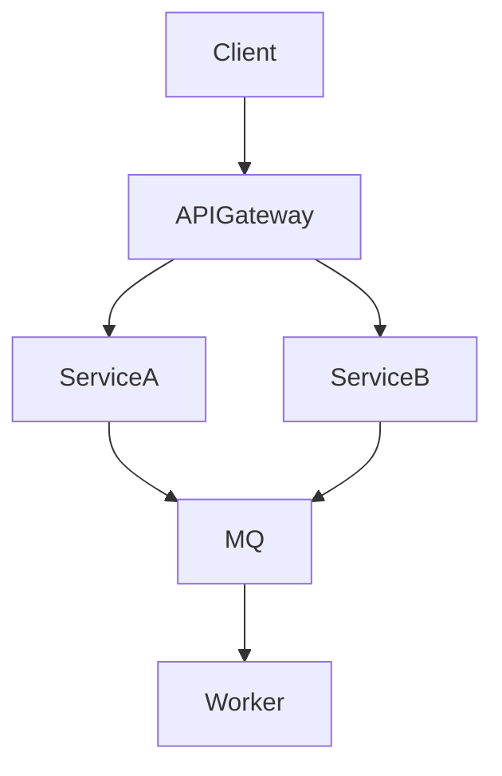
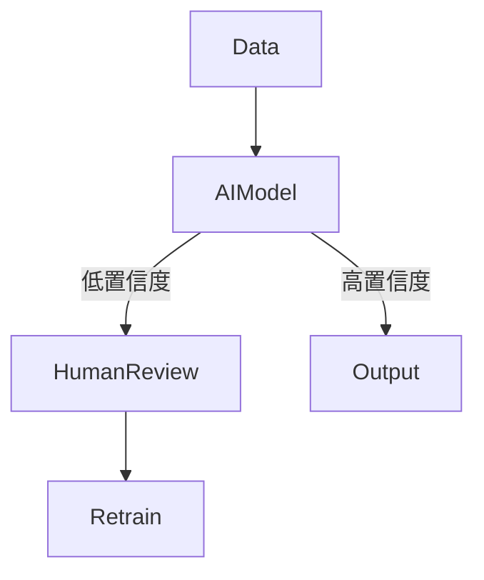

# 分布式AI系统设计模式：理论、模式与工程实践

## 目录

- [1. 形式化基础与理论](#1-形式化基础与理论)
  - 1.1 分布式系统与AI协同的定义与公理
  - 1.2 关键定理与一致性模型
  - 1.3 故障模型与容错性
- [2. 关键算法与机制](#2-关键算法与机制)
  - 2.1 共识与复制算法
  - 2.2 联邦学习与分布式AI算法
  - 2.3 负载均衡与资源调度
  - 2.4 故障检测与自愈
- [3. 设计模式体系](#3-设计模式体系)
  - 3.1 基础分布式设计模式
  - 3.2 AI与人协同模式
  - 3.3 融合与事件驱动模式
  - 3.4 CQRS与事件溯源
  - 3.5 云原生与反应式模式
- [4. 工程实践与落地](#4-工程实践与落地)
  - 4.1 形式化方法与模型检验
  - 4.2 接口与协议设计
  - 4.3 测试、CI/CD与混沌工程
  - 4.4 监控、反馈与自愈
- [5. 未来展望与最佳实践](#5-未来展望与最佳实践)
  - 5.1 AI驱动自愈与Explainable AI
  - 5.2 边缘计算与自治系统
  - 5.3 量子分布式与可持续性

---

## 1. 形式化基础与理论

### 1.1 分布式系统与AI协同的定义与公理

- 分布式系统 $DS = (N, C, P)$，节点集$N$、通信网络$C$、进程集$P$，满足并发、无全局时钟、独立故障等性质。
- 设计成熟度$DM(DS)$多维度度量：可靠性、可扩展性、可维护性、可观测性、安全性、容错性、效率。
- AI与人协同系统$AI$-$HCS$：AI组件$A$与人类$H$在共享目标$G$下交互协作，模式包括监督、协作、委托。
- 公理：CAP定理、FLP不可能性，需在一致性、可用性、分区容错间权衡。

### 1.2 关键定理与一致性模型

- 线性一致性、因果一致性、最终一致性等模型，数学定义与适用场景。
- 拜占庭容错（BFT）：系统可容忍任意错误节点，常用于区块链等高安全场景。
- Lamport逻辑时钟、向量时钟，事件因果关系建模。

### 1.3 故障模型与容错性

- 崩溃故障、遗漏故障、拜占庭故障等模型。
- 容错性定义：系统在$f$个故障下仍满足安全性与活性。
- 形式化证明：FLP、CAP等定理的工程启示。

---

## 2. 关键算法与机制

### 2.1 共识与复制算法

- Paxos、Raft、PBFT等共识算法，角色、流程、数学属性。
- 主从复制、多主复制、Quorum机制，副本一致性与冲突解决。
- 代码示例（Rust）：

```rust
// Raft日志条目结构
struct LogEntry {
    term: u64,
    command: String,
}
```

### 2.2 联邦学习与分布式AI算法

- 联邦学习、参数服务器、去中心化学习等分布式AI算法。
- AI增强共识、自适应法定人数、AI辅助领导者选举。
- 数学表达：$AI = (H, L, P)$，假设空间$H$、损失函数$L$、性能度量$P$。

### 2.3 负载均衡与资源调度

- 一致性哈希、最少连接、加权轮询、最短响应时间等算法。
- 目标函数：最小化$\sum_{i,j} x_{ij} \cdot cost(i,j)$。
- AI辅助调度、弹性伸缩、资源感知任务分配。

### 2.4 故障检测与自愈

- 完备性与准确性、Gossip协议、消息复杂度与传播时间。
- 自愈函数$h: S' \rightarrow S''$，系统自动恢复不变量。
- 混沌工程与韧性测试。

---

## 3. 设计模式体系

### 3.1 基础分布式设计模式

- 服务发现、API网关、负载均衡、熔断器、舱壁、消息队列等。
- Mermaid结构图：



### 3.2 AI与人协同模式

- 人机回路（HITL）、AI增强决策、主动学习回路、协同过滤与编辑、解释性接口、监控与响应。
- 工作流Mermaid图：



### 3.3 融合与事件驱动模式

- 事件驱动架构、发布-订阅、事件流处理、事件协调。
- CQRS与事件溯源，命令/查询模型分离，事件序列驱动状态。

### 3.4 CQRS与事件溯源

- 命令模型$M_C$、查询模型$M_Q$，事件溯源$S = f(E)$。
- 最终一致性、事件版本管理、投影与物化视图。

### 3.5 云原生与反应式模式

- 微服务、服务网格、健康探针、边车模式、分布式配置。
- 反应式系统：响应性、弹性、消息驱动、隔离与复制、背压处理。

---

## 4. 工程实践与落地

### 4.1 形式化方法与模型检验

- 规范语言（TLA+、Alloy、Z）、模型检查、定理证明。
- 工程价值：提前发现并发/一致性错误，提高可靠性。

### 4.2 接口与协议设计

- 显式契约、版本化、最小权限、幂等性。
- IDL/API规范、接口形式化描述。

### 4.3 测试、CI/CD与混沌工程

- 单元/集成/端到端/契约测试，自动化部署。
- 混沌工程：主动注入故障，测试系统韧性。

### 4.4 监控、反馈与自愈

- 指标体系、日志架构、分布式追踪、异常检测、反馈循环。
- AI辅助运维与AIOps。

---

## 5. 未来展望与最佳实践

### 5.1 AI驱动自愈与Explainable AI

- AI自动检测与修复、Explainable AI接口、混合智能决策。

### 5.2 边缘计算与自治系统

- 边缘AI、自治系统、弹性架构、动态资源管理。

### 5.3 量子分布式与可持续性

- 量子计算与分布式系统、可持续性与能效优化。

---

## 参考文献

1. Lamport, L. (2001). Paxos Made Simple. Distributed Computing.
2. Ongaro, D., & Ousterhout, J. (2014). In Search of an Understandable Consensus Algorithm (Raft).
3. Castro, M., & Liskov, B. (1999). Practical Byzantine Fault Tolerance.
4. Dean, J., & Ghemawat, S. (2008). MapReduce: Simplified Data Processing on Large Clusters.
5. Bernstein, P. A., & Newcomer, E. (2009). Principles of Transaction Processing.
6. Fowler, M. (2010). Patterns of Enterprise Application Architecture.
7. Newman, S. (2015). Building Microservices.
8. Bass, L., Clements, P., & Kazman, R. (2012). Software Architecture in Practice.
9. Spivak, D. I. (2014). Category Theory for the Sciences.
10. Garlan, D., & Shaw, M. (1993). An Introduction to Software Architecture. 