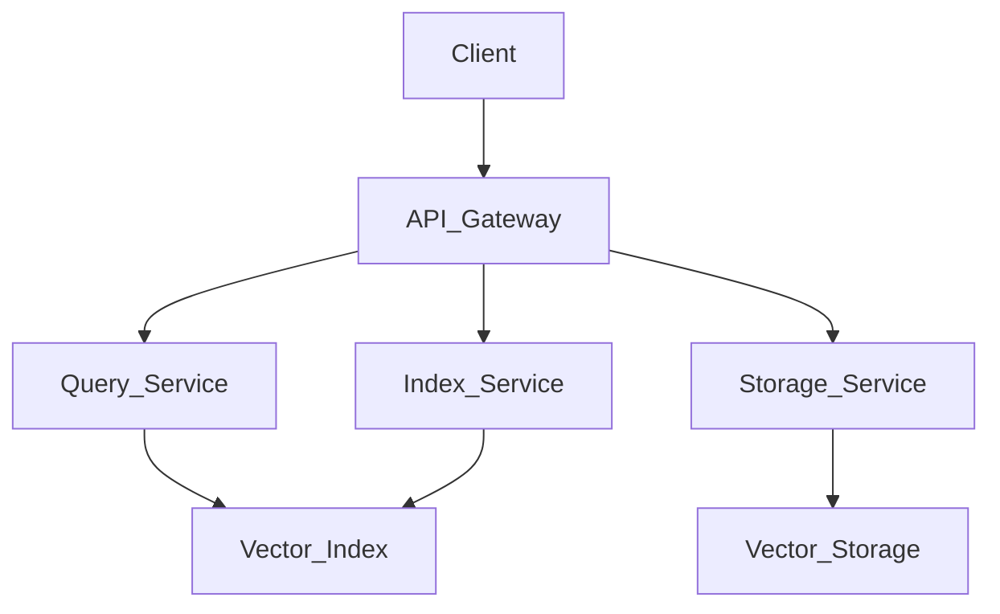
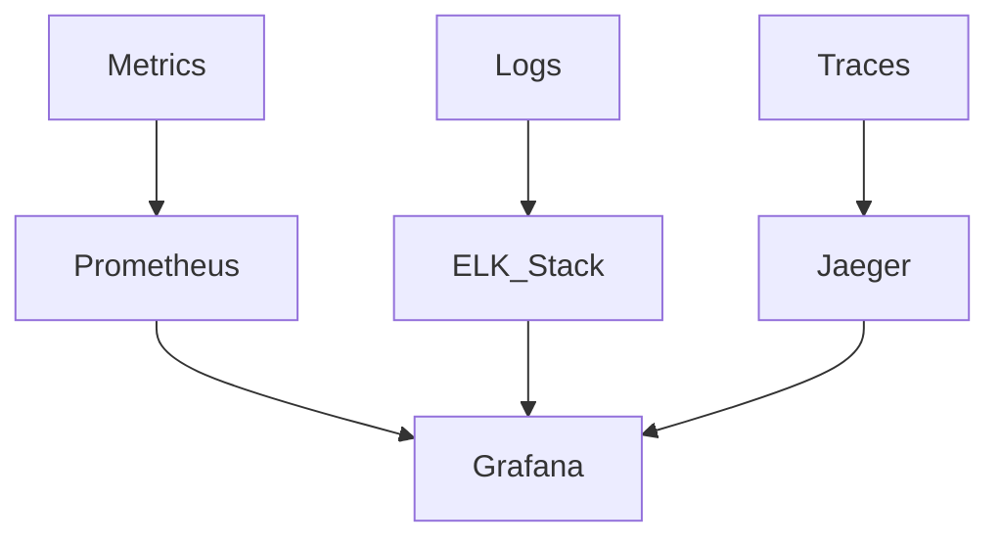
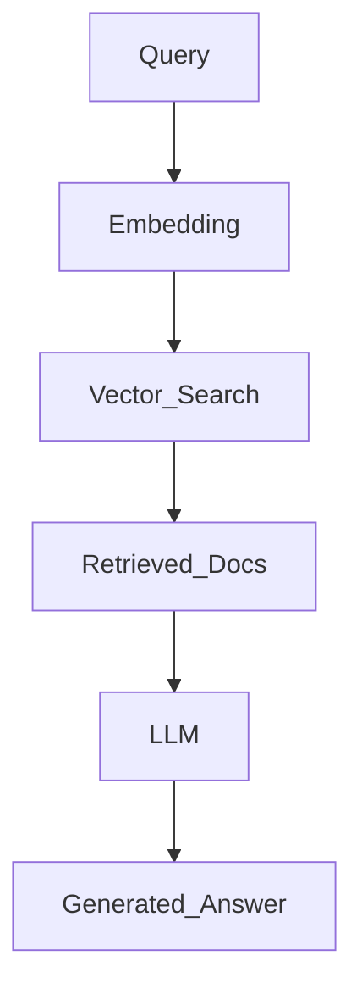

# 向量数据库设计模式：理论、算法与工程实践

## 目录

- [向量数据库设计模式：理论、算法与工程实践](#向量数据库设计模式理论算法与工程实践)
  - [目录](#目录)
  - [1. 理论基础与基本概念](#1-理论基础与基本概念)
    - [1.1 向量嵌入与相似度计算](#11-向量嵌入与相似度计算)
    - [1.2 向量索引与元模型](#12-向量索引与元模型)
    - [1.3 本地AI与云AI模型对比](#13-本地ai与云ai模型对比)
  - [2. 核心算法与数据结构](#2-核心算法与数据结构)
    - [2.1 近似最近邻算法(ANN)](#21-近似最近邻算法ann)
    - [2.2 向量量化与压缩技术](#22-向量量化与压缩技术)
    - [2.3 分布式存储与扩展性](#23-分布式存储与扩展性)
  - [3. 设计模式与架构](#3-设计模式与架构)
    - [3.1 向量数据库架构模式](#31-向量数据库架构模式)
    - [3.2 CPU/GPU优化策略](#32-cpugpu优化策略)
    - [3.3 混合部署与边缘计算](#33-混合部署与边缘计算)
  - [4. 工程实践与实现](#4-工程实践与实现)
    - [4.1 Rust实现示例](#41-rust实现示例)
    - [4.2 主流数据库比较](#42-主流数据库比较)
    - [4.3 性能优化与监控](#43-性能优化与监控)
  - [5. 应用场景与未来展望](#5-应用场景与未来展望)
    - [5.1 RAG与语义搜索](#51-rag与语义搜索)
    - [5.2 推荐系统与多模态检索](#52-推荐系统与多模态检索)
    - [5.3 边缘计算与量子向量](#53-边缘计算与量子向量)
  - [参考文献](#参考文献)

---

## 1. 理论基础与基本概念

### 1.1 向量嵌入与相似度计算

向量嵌入是将语义信息转换为高维向量空间中的点，使语义相似的内容在向量空间中距离较近。

**数学定义**：给定文本$t$，嵌入函数$f: T \rightarrow \mathbb{R}^d$将文本映射到$d$维向量空间。

**相似度度量**：

- **余弦相似度**：$\cos(\theta) = \frac{\mathbf{A} \cdot \mathbf{B}}{|\mathbf{A}||\mathbf{B}|}$
- **欧氏距离**：$d(\mathbf{A}, \mathbf{B}) = \sqrt{\sum_{i=1}^{n}(A_i - B_i)^2}$
- **点积**：$\mathbf{A} \cdot \mathbf{B} = \sum_{i=1}^{n}A_i B_i$

### 1.2 向量索引与元模型

**向量索引**：为高效检索设计的数据结构，将高维空间中的向量组织为可快速查询的形式。

**元模型定义**：元模型是对模型本身结构和规则的抽象描述，定义向量的组织方式、索引结构和查询规则。

```math
元模型 ─────► 模型实例 ─────► 数据实例
(索引策略)    (具体索引)      (向量集合)
```

### 1.3 本地AI与云AI模型对比

| 特性 | 本地AI模型 | 云AI模型 |
|------|-----------|----------|
| 部署位置 | 用户设备/本地服务器 | 云端数据中心 |
| 计算资源 | 受本地硬件限制 | 可动态扩展，资源丰富 |
| 模型规模 | 通常较小（0.5B-13B参数） | 可达超大规模（>100B参数） |
| 隐私保护 | 数据本地处理，高隐私性 | 数据需传输至云端 |
| 响应速度 | 无网络延迟，但受本地算力影响 | 有网络延迟，但算力强大 |
| 成本结构 | 一次性购买/开源免费 | 按API调用次数/token计费 |
| 离线能力 | 完全支持离线使用 | 依赖网络连接 |
| 定制灵活性 | 高（可完全掌控训练与优化） | 有限（受平台提供商限制） |

---

## 2. 核心算法与数据结构

### 2.1 近似最近邻算法(ANN)

**HNSW算法**：分层导航小世界网络，构建多层图索引结构。

**形式化描述**：第$i$层为$G_i=(V_i,E_i)$，其中$V_i$是节点集合，随层数增加逐渐稀疏，$E_i$是边集合，满足小世界网络特性。

**理论复杂度**：查询时间复杂度为$O(\log n)$，空间复杂度为$O(n \log n)$。

**其他算法**：

- **Annoy**：树形索引结构
- **IVF**：反向索引+聚类
- **PQ**：向量压缩技术

### 2.2 向量量化与压缩技术

**量化理论**：给定向量$v \in \mathbb{R}^d$，量化函数$Q: \mathbb{R}^d \rightarrow C$将$v$映射到编码本$C$中的某个向量$c_i$。

**量化误差理论上限**：$\|v - Q(v)\|^2 \leq \frac{d}{k} \cdot \|v\|^2$，其中$k$为子空间数量。

**优化技术**：

- **量化技术**：FP32→INT8/INT4量化，减少内存需求和计算强度
- **稀疏性利用**：CSR/CSC格式，剪枝技术，动态稀疏化
- **批处理优化**：固定适中批量(16-64)，有效利用CPU缓存

### 2.3 分布式存储与扩展性

**分片策略**：按向量ID或哈希值分片，实现水平扩展。

**复制机制**：主从复制、多主复制，保证高可用性。

**一致性保证**：最终一致性、强一致性，根据业务需求选择。

---

## 3. 设计模式与架构

### 3.1 向量数据库架构模式

**微服务架构**：



**事件驱动架构**：

- 向量插入事件触发索引更新
- 查询事件触发负载均衡
- 故障事件触发自动恢复

### 3.2 CPU/GPU优化策略

**CPU向量计算能力**：

| CPU向量指令集 | 支持宽度 | 适用场景 | 性能特点 |
|-------------|---------|---------|----------|
| AVX-512 | 512位 | 大批量向量运算 | 高度并行，单指令多数据 |
| AVX2 | 256位 | 中等规模向量计算 | 广泛支持，适中性能 |
| SSE4 | 128位 | 轻量级向量运算 | 基础向量化支持 |
| ARM NEON | 128位 | 移动设备向量计算 | 能效比高 |
| AMX (Intel) | 矩阵加速 | 低精度矩阵运算 | 针对AI工作负载优化 |

**优化库对比**：

| 优化库 | 支持平台 | 特点 | 适用AI任务 |
|-------|---------|------|-----------|
| ONNX Runtime | 跨平台 | 自动利用可用指令集 | 模型推理加速 |
| OpenVINO | x86/ARM | Intel优化，低功耗场景 | 边缘AI部署 |
| FBGEMM | x86 | Facebook开发，量化优化 | 推荐系统、嵌入查找 |
| Apple ANE | Apple硅 | 神经引擎专用加速 | iOS/macOS应用 |
| oneDNN | 跨平台 | 深度学习原语优化 | 通用深度学习任务 |

### 3.3 混合部署与边缘计算

**混合架构**：

- 前端本地小模型 + 后端云端大模型协同
- 敏感数据本地处理，复杂任务云端计算
- 根据网络和电池状况动态调整计算位置

**边缘计算**：

- 手机芯片专门优化AI工作负载
- 特制神经网络处理单元（NPU）
- 智能家居设备集成本地AI能力

---

## 4. 工程实践与实现

### 4.1 Rust实现示例

**简易向量存储与检索**：

```rust
use ndarray::{Array1, ArrayView1};
use std::collections::HashMap;

/// 简单向量数据库实现
pub struct VectorDB {
    vectors: HashMap<String, Array1<f32>>,
    dimension: usize,
}

impl VectorDB {
    /// 创建新的向量数据库
    pub fn new(dimension: usize) -> Self {
        VectorDB {
            vectors: HashMap::new(),
            dimension,
        }
    }
    
    /// 添加向量
    pub fn add_vector(&mut self, id: String, vector: Array1<f32>) -> Result<(), String> {
        if vector.len() != self.dimension {
            return Err(format!(
                "向量维度不匹配: 期望 {}, 实际 {}", 
                self.dimension, vector.len()
            ));
        }
        
        self.vectors.insert(id, vector);
        Ok(())
    }
    
    /// 计算余弦相似度
    fn cosine_similarity(&self, a: ArrayView1<f32>, b: ArrayView1<f32>) -> f32 {
        let dot_product = a.dot(&b);
        let norm_a = a.dot(&a).sqrt();
        let norm_b = b.dot(&b).sqrt();
        
        if norm_a == 0.0 || norm_b == 0.0 {
            return 0.0;
        }
        
        dot_product / (norm_a * norm_b)
    }
    
    /// 相似向量搜索
    pub fn search(&self, query: Array1<f32>, top_k: usize) -> Vec<(String, f32)> {
        let mut results = Vec::new();
        
        for (id, vector) in &self.vectors {
            let similarity = self.cosine_similarity(query.view(), vector.view());
            results.push((id.clone(), similarity));
        }
        
        // 按相似度排序并返回top_k
        results.sort_by(|a, b| b.1.partial_cmp(&a.1).unwrap());
        results.truncate(top_k);
        results
    }
}
```

**HNSW索引简化实现**：

```rust
use std::collections::{HashMap, HashSet};

/// HNSW图节点
struct HNSWNode {
    id: String,
    vector: Vec<f32>,
    connections: HashMap<usize, HashSet<usize>>, // layer -> neighbors
    max_layer: usize,
}

/// 简化HNSW索引
pub struct HNSWIndex {
    nodes: HashMap<String, HNSWNode>,
    entry_point: Option<String>,
    m: usize, // 每层最大连接数
    ef_construction: usize, // 构建时的搜索参数
}

impl HNSWIndex {
    pub fn new(m: usize, ef_construction: usize) -> Self {
        HNSWIndex {
            nodes: HashMap::new(),
            entry_point: None,
            m,
            ef_construction,
        }
    }
    
    /// 插入新节点
    pub fn insert(&mut self, id: String, vector: Vec<f32>) {
        let max_layer = self.random_layer();
        let mut node = HNSWNode {
            id: id.clone(),
            vector,
            connections: HashMap::new(),
            max_layer,
        };
        
        // 构建连接
        self.build_connections(&mut node);
        
        self.nodes.insert(id, node);
        
        // 更新入口点
        if self.entry_point.is_none() {
            self.entry_point = Some(id);
        }
    }
    
    /// 搜索最近邻
    pub fn search(&self, query: &[f32], k: usize) -> Vec<(String, f32)> {
        if self.entry_point.is_none() {
            return Vec::new();
        }
        
        // 从顶层开始搜索
        let mut candidates = HashSet::new();
        let mut visited = HashSet::new();
        
        // 简化搜索逻辑
        for (id, node) in &self.nodes {
            let distance = self.euclidean_distance(query, &node.vector);
            candidates.insert((id.clone(), distance));
        }
        
        // 转换为结果格式
        let mut results: Vec<_> = candidates.into_iter().collect();
        results.sort_by(|a, b| a.1.partial_cmp(&b.1).unwrap());
        results.truncate(k);
        
        results
    }
    
    fn random_layer(&self) -> usize {
        // 简化层数分配
        (rand::random::<f32>() * 4.0) as usize
    }
    
    fn build_connections(&mut self, node: &mut HNSWNode) {
        // 简化连接构建逻辑
        for layer in 0..=node.max_layer {
            node.connections.insert(layer, HashSet::new());
        }
    }
    
    fn euclidean_distance(&self, a: &[f32], b: &[f32]) -> f32 {
        a.iter()
            .zip(b.iter())
            .map(|(x, y)| (x - y).powi(2))
            .sum::<f32>()
            .sqrt()
    }
}
```

### 4.2 主流数据库比较

| 数据库 | 开源状态 | 索引算法 | 特点 | 适用场景 |
|-------|---------|---------|------|---------|
| Milvus | 开源 | HNSW, IVF, PQ | 功能全面，性能强 | 大规模生产环境 |
| Qdrant | 开源 | HNSW | 设计简洁，易于使用 | 中小型应用 |
| Pinecone | 闭源 | 专有 | 完全托管，零运维 | 快速部署验证 |
| Weaviate | 开源 | HNSW | 结合图数据库特性 | 复杂语义查询 |
| Chroma | 开源 | HNSW | 轻量级，易集成 | 原型和小型项目 |

### 4.3 性能优化与监控

**性能指标**：

- 查询延迟：P50, P95, P99
- 吞吐量：QPS (Queries Per Second)
- 准确率：召回率与精确度
- 资源利用率：CPU, 内存, 磁盘I/O

**监控体系**：



---

## 5. 应用场景与未来展望

### 5.1 RAG与语义搜索

**检索增强生成(RAG)**：将大语言模型与向量检索结合，提升生成内容的准确性和相关性。

**工作流程**：



**应用案例**：

- 企业知识库问答系统
- 个性化助手
- 文档智能分析

### 5.2 推荐系统与多模态检索

**推荐系统**：利用用户行为和内容的向量表示实现个性化推荐。

**多模态检索**：跨媒体类型(文本、图像、音频)的相似性搜索。

**技术栈**：

- 文本嵌入：BERT, GPT, SentenceTransformers
- 图像嵌入：CLIP, ResNet, Vision Transformer
- 音频嵌入：Wav2Vec, AudioCLIP

### 5.3 边缘计算与量子向量

**边缘计算趋势**：

- 手机芯片专门优化AI工作负载
- 特制神经网络处理单元（NPU）
- 智能家居设备集成本地AI能力

**量子向量计算**：

- 量子机器学习算法
- 量子近似优化算法(QAOA)
- 量子-经典混合计算

**未来发展方向**：

1. **轻量化与高效化**：蒸馏技术、量化技术、逐步弥补本地与云端模型能力差距
2. **混合部署架构**：前端本地小模型 + 后端云端大模型协同
3. **特定领域优化**：行业专用模型激增，面向特定任务的优化版本
4. **隐私优先设计**：联邦学习、同态加密、差分隐私

---

## 参考文献

1. Malkov, Y. A., & Yashunin, D. A. (2018). Efficient and robust approximate nearest neighbor search using Hierarchical Navigable Small World graphs. IEEE transactions on pattern analysis and machine intelligence.
2. Johnson, J., Douze, M., & Jégou, H. (2019). Billion-scale similarity search with GPUs. IEEE Transactions on Big Data.
3. Jégou, H., Douze, M., & Schmid, C. (2011). Product quantization for nearest neighbor search. IEEE transactions on pattern analysis and machine intelligence.
4. Guo, R., Sun, P., Lindgren, E., Geng, Q., Simcha, D., Chern, F., & Kumar, S. (2020). Accelerating large-scale inference with anisotropic vector quantization. In International Conference on Machine Learning.
5. Aumüller, M., Bernhardsson, E., & Faithfull, A. (2020). ANN-benchmarks: A benchmarking tool for approximate nearest neighbor algorithms. Information Systems.
6. Wang, J., Zhang, T., Sebe, N., & Shen, H. T. (2017). A survey on learning to hash. IEEE transactions on pattern analysis and machine intelligence.
7. Li, W., Zhang, Y., Sun, Y., Wang, W., Li, M., Zhang, W., & Lin, X. (2019). Approximate nearest neighbor search on high dimensional data—experiments, analyses, and improvement. IEEE Transactions on Knowledge and Data Engineering.
8. Chen, M., Tworek, J., Jun, H., Yuan, Q., Pinto, H. P. D. O., Kaplan, J., ... & Zettlemoyer, L. (2021). Evaluating large language models trained on code. arXiv preprint arXiv:2107.03374.
9. Radford, A., Kim, J. W., Hallacy, C., Ramesh, A., Goh, G., Agarwal, S., ... & Sutskever, I. (2021). Learning transferable visual models from natural language supervision. In International conference on machine learning.
10. Devlin, J., Chang, M. W., Lee, K., & Toutanova, K. (2018). Bert: Pre-training of deep bidirectional transformers for language understanding. arXiv preprint arXiv:1810.04805.
