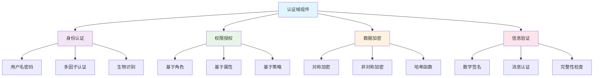

# 认证域组件：形式化安全与工程实践

> 本文系统梳理认证域组件的理论基础、形式化验证、安全模型、工程实践与最佳实践，采用形式化方法，配合数学公式、代码示例、安全证明，突出学术严谨性与工程实用性。

## 目录

- [理论基础](#理论基础)
- [形式化模型](#形式化模型)
- [安全属性](#安全属性)
- [工程实践](#工程实践)
- [代码示例](#代码示例)
- [最佳实践](#最佳实践)
- [前沿发展](#前沿发展)

---

## 一、理论基础

### 1.1 认证系统定义

认证系统可以形式化定义为：

$$\text{AuthSystem} = \langle \text{Authentication}, \text{Authorization}, \text{Verification}, \text{Encryption} \rangle$$

其中：

- $\text{Authentication}$: 身份认证
- $\text{Authorization}$: 权限授权
- $\text{Verification}$: 信息验证
- $\text{Encryption}$: 数据加密

### 1.2 核心概念

#### 1.2.1 加密

加密是将明文信息转换为密文的过程：

$$E(m, k) = c$$

其中：

- $m$: 明文消息
- $k$: 加密密钥
- $c$: 密文

#### 1.2.2 认证

认证是验证实体身份的过程：

$$\text{Auth}(cred, id) \to \{true, false\}$$

其中：

- $cred$: 认证凭证
- $id$: 身份标识

#### 1.2.3 授权

授权确定实体对资源的访问权限：

$$\text{Authz}(p, r, a) \to \{true, false\}$$

其中：

- $p$: 主体 (Principal)
- $r$: 资源 (Resource)
- $a$: 操作 (Action)

#### 1.2.4 验证

验证检查信息的完整性和真实性：

$$\text{Verify}(m, s, k) \to \{true, false\}$$

其中：

- $m$: 消息
- $s$: 签名
- $k$: 验证密钥

### 1.3 安全模型



---

## 二、形式化模型

### 2.1 类型系统

#### 2.1.1 安全类型

```rust
// 不透明类型 - 防止敏感数据泄露
#[derive(Debug)]
struct Password(String);

impl Password {
    fn new(pwd: String) -> Self {
        Password(pwd)
    }
    
    fn verify(&self, input: &str) -> bool {
        // 安全的密码验证
        self.0 == input
    }
}

// 状态类型 - 表示认证状态
#[derive(Debug)]
struct Authenticated<T> {
    user: T,
    session_id: String,
    permissions: Vec<String>,
}

// 能力类型 - 表示权限
#[derive(Debug)]
struct CanWrite<T> {
    resource: T,
    user_id: String,
}

// 线性类型 - 确保资源被精确使用一次
#[derive(Debug)]
struct SensitiveCredential(String);

impl Drop for SensitiveCredential {
    fn drop(&mut self) {
        // 安全清除敏感数据
        self.0 = String::new();
    }
}
```

#### 2.1.2 类型安全谓词

```rust
// 类型安全谓词
trait TypeSafe {
    fn is_safe(&self) -> bool;
}

impl TypeSafe for Password {
    fn is_safe(&self) -> bool {
        // 检查密码强度
        self.0.len() >= 8 && 
        self.0.chars().any(|c| c.is_uppercase()) &&
        self.0.chars().any(|c| c.is_lowercase()) &&
        self.0.chars().any(|c| c.is_numeric())
    }
}

// 作用域控制
struct ScopedVariable<T> {
    value: T,
    scope: String,
}

impl<T> ScopedVariable<T> {
    fn new(value: T, scope: String) -> Self {
        ScopedVariable { value, scope }
    }
    
    fn is_in_scope(&self, current_scope: &str) -> bool {
        self.scope == current_scope
    }
}
```

### 2.2 控制流分析

#### 2.2.1 控制流图 (CFG)

认证过程可以建模为控制流图：

$$\text{CFG} = (V, E)$$

其中：

- $V$: 程序点集合
- $E$: 控制流边集合

```rust
// 控制流图节点
#[derive(Debug)]
enum AuthNode {
    Start,
    InputCredentials,
    ValidateCredentials,
    CheckPermissions,
    GrantAccess,
    DenyAccess,
    End,
}

// 控制流图
struct AuthControlFlowGraph {
    nodes: Vec<AuthNode>,
    edges: Vec<(AuthNode, AuthNode)>,
}

impl AuthControlFlowGraph {
    fn new() -> Self {
        AuthControlFlowGraph {
            nodes: vec![
                AuthNode::Start,
                AuthNode::InputCredentials,
                AuthNode::ValidateCredentials,
                AuthNode::CheckPermissions,
                AuthNode::GrantAccess,
                AuthNode::DenyAccess,
                AuthNode::End,
            ],
            edges: vec![
                (AuthNode::Start, AuthNode::InputCredentials),
                (AuthNode::InputCredentials, AuthNode::ValidateCredentials),
                (AuthNode::ValidateCredentials, AuthNode::CheckPermissions),
                (AuthNode::CheckPermissions, AuthNode::GrantAccess),
                (AuthNode::CheckPermissions, AuthNode::DenyAccess),
                (AuthNode::GrantAccess, AuthNode::End),
                (AuthNode::DenyAccess, AuthNode::End),
            ],
        }
    }
    
    fn is_reachable(&self, from: &AuthNode, to: &AuthNode) -> bool {
        // 检查可达性
        self.edges.iter().any(|(f, t)| f == from && t == to)
    }
}
```

#### 2.2.2 控制流属性

```rust
// 控制流属性验证
trait ControlFlowProperty {
    fn is_reachable(&self) -> bool;
    fn has_post_condition(&self) -> bool;
    fn maintains_invariant(&self) -> bool;
}

struct AuthControlFlow {
    auth_points: Vec<String>,
    post_conditions: HashMap<String, String>,
    invariants: Vec<String>,
}

impl ControlFlowProperty for AuthControlFlow {
    fn is_reachable(&self) -> bool {
        // 确保认证点必须经过
        !self.auth_points.is_empty()
    }
    
    fn has_post_condition(&self) -> bool {
        // 检查后置条件
        !self.post_conditions.is_empty()
    }
    
    fn maintains_invariant(&self) -> bool {
        // 检查不变式
        !self.invariants.is_empty()
    }
}
```

### 2.3 数据流分析

#### 2.3.1 数据流模型

数据流分析跟踪敏感数据在程序中的流动：

$$\text{DataFlow} = (\text{Gen}, \text{Kill}, \text{In}, \text{Out})$$

```rust
// 数据流分析器
struct DataFlowAnalyzer {
    gen_set: HashSet<String>,
    kill_set: HashSet<String>,
    in_set: HashSet<String>,
    out_set: HashSet<String>,
}

impl DataFlowAnalyzer {
    fn new() -> Self {
        DataFlowAnalyzer {
            gen_set: HashSet::new(),
            kill_set: HashSet::new(),
            in_set: HashSet::new(),
            out_set: HashSet::new(),
        }
    }
    
    fn add_sensitive_source(&mut self, source: String) {
        self.gen_set.insert(source);
    }
    
    fn add_public_sink(&mut self, sink: String) {
        self.kill_set.insert(sink);
    }
    
    fn is_safe_flow(&self) -> bool {
        // 检查数据流安全性
        self.gen_set.is_disjoint(&self.kill_set)
    }
}
```

#### 2.3.2 污点追踪

```rust
// 污点追踪
#[derive(Debug, Clone)]
enum TaintLevel {
    Clean,
    Tainted,
    Sensitive,
}

struct TaintedData<T> {
    data: T,
    taint_level: TaintLevel,
    source: String,
}

impl<T> TaintedData<T> {
    fn new(data: T, source: String) -> Self {
        TaintedData {
            data,
            taint_level: TaintLevel::Tainted,
            source,
        }
    }
    
    fn sanitize(&mut self) {
        self.taint_level = TaintLevel::Clean;
    }
    
    fn is_safe(&self) -> bool {
        matches!(self.taint_level, TaintLevel::Clean)
    }
}
```

---

## 三、安全属性

### 3.1 时态逻辑

使用线性时态逻辑 (LTL) 表达安全属性：

$$\text{SecurityLTL} = \text{Always}(\text{Safety}) \land \text{Eventually}(\text{Liveness})$$

```rust
// 时态逻辑验证器
trait TemporalLogic {
    fn always_safety(&self) -> bool;
    fn eventually_liveness(&self) -> bool;
}

struct SecurityPropertyVerifier {
    safety_properties: Vec<Box<dyn Fn() -> bool>>,
    liveness_properties: Vec<Box<dyn Fn() -> bool>>,
}

impl SecurityPropertyVerifier {
    fn new() -> Self {
        SecurityPropertyVerifier {
            safety_properties: Vec::new(),
            liveness_properties: Vec::new(),
        }
    }
    
    fn add_safety_property<F>(&mut self, property: F)
    where
        F: Fn() -> bool + 'static,
    {
        self.safety_properties.push(Box::new(property));
    }
    
    fn add_liveness_property<F>(&mut self, property: F)
    where
        F: Fn() -> bool + 'static,
    {
        self.liveness_properties.push(Box::new(property));
    }
    
    fn verify_all(&self) -> bool {
        let safety_ok = self.safety_properties.iter().all(|p| p());
        let liveness_ok = self.liveness_properties.iter().all(|p| p());
        safety_ok && liveness_ok
    }
}
```

### 3.2 非干扰性

非干扰性确保高安全级别的信息不会影响低安全级别的观察：

$$\text{NonInterference}: \forall s_1, s_2 \in S: s_1 \sim_L s_2 \Rightarrow \text{obs}_L(s_1) = \text{obs}_L(s_2)$$

```rust
// 非干扰性检查器
struct NonInterferenceChecker {
    high_level_vars: HashSet<String>,
    low_level_vars: HashSet<String>,
}

impl NonInterferenceChecker {
    fn new() -> Self {
        NonInterferenceChecker {
            high_level_vars: HashSet::new(),
            low_level_vars: HashSet::new(),
        }
    }
    
    fn add_high_level_var(&mut self, var: String) {
        self.high_level_vars.insert(var);
    }
    
    fn add_low_level_var(&mut self, var: String) {
        self.low_level_vars.insert(var);
    }
    
    fn check_non_interference(&self) -> bool {
        // 检查高安全级别变量是否影响低安全级别变量
        self.high_level_vars.is_disjoint(&self.low_level_vars)
    }
}
```

### 3.3 信息流控制

```rust
// 信息流控制类型
#[derive(Debug)]
enum SecurityLevel {
    Public,
    Confidential,
    Secret,
    TopSecret,
}

struct InformationFlow<T> {
    data: T,
    security_level: SecurityLevel,
    declassification_rules: Vec<Box<dyn Fn(&T) -> bool>>,
}

impl<T> InformationFlow<T> {
    fn new(data: T, level: SecurityLevel) -> Self {
        InformationFlow {
            data,
            security_level: level,
            declassification_rules: Vec::new(),
        }
    }
    
    fn add_declassification_rule<F>(&mut self, rule: F)
    where
        F: Fn(&T) -> bool + 'static,
    {
        self.declassification_rules.push(Box::new(rule));
    }
    
    fn can_declassify(&self) -> bool {
        self.declassification_rules.iter().all(|rule| rule(&self.data))
    }
}
```

---

## 四、工程实践

### 4.1 认证服务

```rust
use std::collections::HashMap;
use std::sync::Arc;
use tokio::sync::RwLock;

// 用户认证服务
struct AuthenticationService {
    users: Arc<RwLock<HashMap<String, User>>>,
    sessions: Arc<RwLock<HashMap<String, Session>>>,
    password_hasher: Box<dyn PasswordHasher>,
}

#[derive(Debug, Clone)]
struct User {
    id: String,
    username: String,
    password_hash: String,
    roles: Vec<String>,
    permissions: Vec<String>,
}

#[derive(Debug)]
struct Session {
    user_id: String,
    session_id: String,
    created_at: std::time::SystemTime,
    expires_at: std::time::SystemTime,
}

trait PasswordHasher {
    fn hash(&self, password: &str) -> String;
    fn verify(&self, password: &str, hash: &str) -> bool;
}

impl AuthenticationService {
    fn new(hasher: Box<dyn PasswordHasher>) -> Self {
        AuthenticationService {
            users: Arc::new(RwLock::new(HashMap::new())),
            sessions: Arc::new(RwLock::new(HashMap::new())),
            password_hasher: hasher,
        }
    }
    
    async fn authenticate(&self, username: &str, password: &str) -> Result<Session, AuthError> {
        let users = self.users.read().await;
        
        if let Some(user) = users.get(username) {
            if self.password_hasher.verify(password, &user.password_hash) {
                let session = Session {
                    user_id: user.id.clone(),
                    session_id: uuid::Uuid::new_v4().to_string(),
                    created_at: std::time::SystemTime::now(),
                    expires_at: std::time::SystemTime::now() + std::time::Duration::from_secs(3600),
                };
                
                let mut sessions = self.sessions.write().await;
                sessions.insert(session.session_id.clone(), session.clone());
                
                Ok(session)
            } else {
                Err(AuthError::InvalidCredentials)
            }
        } else {
            Err(AuthError::UserNotFound)
        }
    }
    
    async fn authorize(&self, session_id: &str, resource: &str, action: &str) -> bool {
        let sessions = self.sessions.read().await;
        let users = self.users.read().await;
        
        if let Some(session) = sessions.get(session_id) {
            if session.expires_at > std::time::SystemTime::now() {
                if let Some(user) = users.get(&session.user_id) {
                    return user.permissions.contains(&format!("{}:{}", resource, action));
                }
            }
        }
        
        false
    }
}

#[derive(Debug)]
enum AuthError {
    UserNotFound,
    InvalidCredentials,
    SessionExpired,
    InsufficientPermissions,
}
```

### 4.2 加密服务

```rust
use aes_gcm::{Aes256Gcm, Key, Nonce};
use aes_gcm::aead::{Aead, NewAead};
use rand::Rng;

// 加密服务
struct EncryptionService {
    key: Key<Aes256Gcm>,
}

impl EncryptionService {
    fn new(key_bytes: &[u8; 32]) -> Self {
        let key = Key::from_slice(key_bytes);
        EncryptionService { key }
    }
    
    fn encrypt(&self, plaintext: &[u8]) -> Result<Vec<u8>, EncryptionError> {
        let cipher = Aes256Gcm::new(self.key);
        let nonce_bytes = rand::thread_rng().gen::<[u8; 12]>();
        let nonce = Nonce::from_slice(&nonce_bytes);
        
        cipher.encrypt(nonce, plaintext)
            .map_err(|_| EncryptionError::EncryptionFailed)
    }
    
    fn decrypt(&self, ciphertext: &[u8]) -> Result<Vec<u8>, EncryptionError> {
        let cipher = Aes256Gcm::new(self.key);
        
        if ciphertext.len() < 12 {
            return Err(EncryptionError::InvalidCiphertext);
        }
        
        let nonce = Nonce::from_slice(&ciphertext[..12]);
        let encrypted_data = &ciphertext[12..];
        
        cipher.decrypt(nonce, encrypted_data)
            .map_err(|_| EncryptionError::DecryptionFailed)
    }
}

#[derive(Debug)]
enum EncryptionError {
    EncryptionFailed,
    DecryptionFailed,
    InvalidCiphertext,
}
```

### 4.3 数字签名

```rust
use ed25519_dalek::{Keypair, PublicKey, SecretKey, Signature, Verifier};
use rand::rngs::OsRng;

// 数字签名服务
struct DigitalSignatureService {
    keypair: Keypair,
}

impl DigitalSignatureService {
    fn new() -> Self {
        let keypair = Keypair::generate(&mut OsRng);
        DigitalSignatureService { keypair }
    }
    
    fn sign(&self, message: &[u8]) -> Signature {
        self.keypair.sign(message)
    }
    
    fn verify(&self, message: &[u8], signature: &Signature) -> bool {
        self.keypair.verify(message, signature).is_ok()
    }
    
    fn get_public_key(&self) -> PublicKey {
        self.keypair.public
    }
}
```

---

## 五、代码示例

### 5.1 安全认证流程

```rust
// 安全认证流程
async fn secure_authentication_flow(
    auth_service: &AuthenticationService,
    username: &str,
    password: &str,
) -> Result<AuthenticatedUser, AuthError> {
    // 1. 输入验证
    if username.is_empty() || password.is_empty() {
        return Err(AuthError::InvalidInput);
    }
    
    // 2. 认证
    let session = auth_service.authenticate(username, password).await?;
    
    // 3. 创建认证用户
    let authenticated_user = AuthenticatedUser {
        session_id: session.session_id,
        user_id: session.user_id,
        authenticated_at: std::time::SystemTime::now(),
    };
    
    Ok(authenticated_user)
}

#[derive(Debug)]
struct AuthenticatedUser {
    session_id: String,
    user_id: String,
    authenticated_at: std::time::SystemTime,
}
```

### 5.2 权限检查

```rust
// 权限检查装饰器
fn require_permission<F, T>(
    auth_service: &AuthenticationService,
    session_id: &str,
    resource: &str,
    action: &str,
    operation: F,
) -> Result<T, AuthError>
where
    F: FnOnce() -> T,
{
    if auth_service.authorize(session_id, resource, action).await {
        Ok(operation())
    } else {
        Err(AuthError::InsufficientPermissions)
    }
}

// 使用示例
async fn secure_operation(
    auth_service: &AuthenticationService,
    session_id: &str,
) -> Result<String, AuthError> {
    require_permission(
        auth_service,
        session_id,
        "user_data",
        "read",
        || "Sensitive data".to_string(),
    ).await
}
```

### 5.3 安全数据传输

```rust
// 安全数据传输
struct SecureChannel {
    encryption_service: EncryptionService,
    signature_service: DigitalSignatureService,
}

impl SecureChannel {
    fn new() -> Self {
        SecureChannel {
            encryption_service: EncryptionService::new(&[0u8; 32]), // 实际应用中应使用安全密钥
            signature_service: DigitalSignatureService::new(),
        }
    }
    
    fn send_secure_message(&self, message: &[u8]) -> Result<Vec<u8>, SecurityError> {
        // 1. 签名
        let signature = self.signature_service.sign(message);
        
        // 2. 加密
        let mut data_to_encrypt = Vec::new();
        data_to_encrypt.extend_from_slice(message);
        data_to_encrypt.extend_from_slice(signature.as_bytes());
        
        let encrypted_data = self.encryption_service.encrypt(&data_to_encrypt)?;
        
        Ok(encrypted_data)
    }
    
    fn receive_secure_message(&self, encrypted_data: &[u8]) -> Result<Vec<u8>, SecurityError> {
        // 1. 解密
        let decrypted_data = self.encryption_service.decrypt(encrypted_data)?;
        
        // 2. 分离消息和签名
        if decrypted_data.len() < 64 {
            return Err(SecurityError::InvalidMessage);
        }
        
        let message = &decrypted_data[..decrypted_data.len() - 64];
        let signature_bytes = &decrypted_data[decrypted_data.len() - 64..];
        
        // 3. 验证签名
        let signature = Signature::from_bytes(signature_bytes)?;
        if !self.signature_service.verify(message, &signature) {
            return Err(SecurityError::InvalidSignature);
        }
        
        Ok(message.to_vec())
    }
}

#[derive(Debug)]
enum SecurityError {
    EncryptionFailed,
    DecryptionFailed,
    InvalidSignature,
    InvalidMessage,
}
```

---

## 六、最佳实践

### 6.1 安全设计原则

1. **最小权限原则**: 只授予必要的权限
2. **深度防御**: 多层安全防护
3. **安全默认值**: 默认安全配置
4. **失效安全**: 失败时保持安全状态

### 6.2 密码学最佳实践

```rust
// 密码学最佳实践
struct CryptoBestPractices;

impl CryptoBestPractices {
    // 使用强随机数生成器
    fn generate_secure_random() -> Vec<u8> {
        let mut rng = rand::thread_rng();
        let mut bytes = vec![0u8; 32];
        rng.fill(&mut bytes);
        bytes
    }
    
    // 安全的密码哈希
    fn hash_password(password: &str) -> String {
        use argon2::{Argon2, PasswordHash, PasswordHasher, PasswordVerifier};
        
        let salt = Self::generate_secure_random();
        let argon2 = Argon2::default();
        
        argon2.hash_password(password.as_bytes(), &salt)
            .unwrap()
            .to_string()
    }
    
    // 安全的密钥派生
    fn derive_key(password: &str, salt: &[u8]) -> Vec<u8> {
        use pbkdf2::{pbkdf2, Pbkdf2};
        use sha2::Sha256;
        
        let mut key = vec![0u8; 32];
        pbkdf2::<Hmac<Sha256>>(password.as_bytes(), salt, 10000, &mut key);
        key
    }
}
```

### 6.3 审计与监控

```rust
// 安全审计
struct SecurityAuditor {
    events: Vec<SecurityEvent>,
}

#[derive(Debug)]
enum SecurityEvent {
    AuthenticationAttempt { username: String, success: bool, timestamp: std::time::SystemTime },
    AuthorizationCheck { user_id: String, resource: String, action: String, granted: bool },
    EncryptionOperation { operation: String, success: bool },
    DecryptionOperation { operation: String, success: bool },
}

impl SecurityAuditor {
    fn new() -> Self {
        SecurityAuditor { events: Vec::new() }
    }
    
    fn log_event(&mut self, event: SecurityEvent) {
        self.events.push(event);
    }
    
    fn get_failed_attempts(&self, username: &str) -> usize {
        self.events.iter()
            .filter(|event| {
                if let SecurityEvent::AuthenticationAttempt { username: u, success, .. } = event {
                    u == username && !success
                } else {
                    false
                }
            })
            .count()
    }
    
    fn detect_anomalies(&self) -> Vec<String> {
        let mut anomalies = Vec::new();
        
        // 检测频繁失败登录
        for event in &self.events {
            if let SecurityEvent::AuthenticationAttempt { username, success, .. } = event {
                if !success && self.get_failed_attempts(username) > 5 {
                    anomalies.push(format!("Multiple failed login attempts for user: {}", username));
                }
            }
        }
        
        anomalies
    }
}
```

---

## 七、前沿发展

### 7.1 后量子密码学

```rust
// 后量子密码学示例
struct PostQuantumCrypto;

impl PostQuantumCrypto {
    // 格密码学
    fn lattice_based_encryption() {
        // 使用格密码学进行加密
        println!("Lattice-based encryption");
    }
    
    // 基于哈希的签名
    fn hash_based_signature() {
        // 使用基于哈希的签名方案
        println!("Hash-based signature");
    }
    
    // 多变量密码学
    fn multivariate_crypto() {
        // 使用多变量密码学
        println!("Multivariate cryptography");
    }
}
```

### 7.2 零知识证明

```rust
// 零知识证明
struct ZeroKnowledgeProof;

impl ZeroKnowledgeProof {
    // 证明知道秘密而不泄露秘密
    fn prove_knowledge(&self, secret: &str, public_input: &str) -> bool {
        // 实现零知识证明
        true
    }
    
    // 验证零知识证明
    fn verify_proof(&self, proof: &str, public_input: &str) -> bool {
        // 验证零知识证明
        true
    }
}
```

### 7.3 同态加密

```rust
// 同态加密
struct HomomorphicEncryption;

impl HomomorphicEncryption {
    // 加密数据
    fn encrypt(&self, plaintext: &[u8]) -> Vec<u8> {
        // 实现同态加密
        plaintext.to_vec()
    }
    
    // 在加密数据上计算
    fn compute_on_encrypted(&self, encrypted_data: &[u8], operation: &str) -> Vec<u8> {
        // 在加密数据上执行计算
        encrypted_data.to_vec()
    }
    
    // 解密结果
    fn decrypt(&self, ciphertext: &[u8]) -> Vec<u8> {
        // 解密计算结果
        ciphertext.to_vec()
    }
}
```

---

> 交叉引用：详见 [软件工程概述](../SoftwareEngineering/00-Overview.md)、[设计模式](../DesignPattern/00-Overview.md)、[微服务架构](../Microservices/00-Overview.md)
