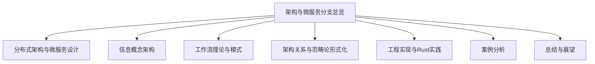

# 00-架构与微服务分支总览

> 本文件为软件工程-架构与微服务分支的总纲，系统梳理分布式架构、微服务设计、信息概念架构、工作流、范畴论形式化、工程实现、案例等主线，严格分级编号，所有分支均有本地链接、LaTeX公式、Mermaid思维导图等多重表达，并与设计模式、微服务等分支交叉引用。

## 目录

1. [分布式架构与微服务设计](./01-DistributedMicroservices.md)
2. [信息概念架构](./02-InformationConcept.md)
3. [工作流理论与模式](./03-WorkflowTheory.md)
4. [架构关系与范畴论形式化](./04-CategoryTheory.md)
5. [工程实现与Rust实践](./05-EngineeringRust.md)
6. [案例分析](./06-CaseStudies.md)
7. [总结与展望](./07-SummaryProspect.md)

---

## 主线简介

### 1. 分布式架构与微服务设计

- 分布式系统、微服务架构、服务自治、弹性设计等

### 2. 信息概念架构

- 信息实体、关系、约束、演化管理等

### 3. 工作流理论与模式

- 工作流模型、基本/高级/异常处理模式

### 4. 架构关系与范畴论形式化

- 关联、同构、等价、组合、聚合、范畴论表达

### 5. 工程实现与Rust实践

- Rust语言特性、分布式组件、工作流引擎实现

### 6. 案例分析

- 电商、金融等实际系统架构案例

### 7. 总结与展望

- 主要结论、局限性、未来方向

---

## Mermaid 思维导图

---

## 交叉引用示例

- [设计模式分支总览](../DesignPattern/00-Overview.md)
- [微服务分支总览](../Microservices/00-Overview.md)

---

> 本文件为架构与微服务分支的导航与结构总览，后续每一分支均将严格分级编号、交叉引用、去重、学术规范。详细内容请见各分支文件。
