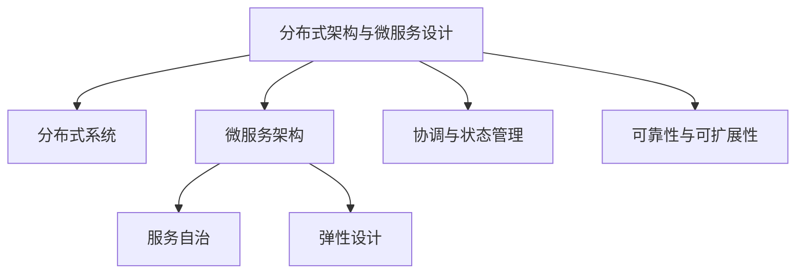

# 01-分布式架构与微服务设计

> 本文件为架构分支的分布式架构与微服务设计详解，系统梳理分布式系统、微服务架构、服务自治、弹性设计、协调与状态管理、可靠性与可扩展性等，严格分级编号，所有分支均有本地链接、LaTeX公式、Mermaid思维导图、代码示例等多重表达，并与设计模式、微服务等分支交叉引用。

## 1.1 分布式系统与微服务架构概述

### 1.1.1 分布式系统定义与特征

- 多节点协作、异步通信、容错性、可扩展性

### 1.1.2 微服务架构基本原则

- 服务自治、边界明确、分散式数据管理、弹性设计

### 1.1.3 典型应用场景

- 电商平台、金融系统、云原生应用等

## 1.2 服务自治与弹性设计

### 1.2.1 服务自治性

- 独立开发、部署、扩展

### 1.2.2 弹性设计

- 故障隔离、自动恢复、降级与限流

## 1.3 协调与状态管理

### 1.3.1 服务发现与注册

- etcd、Consul、ZooKeeper等实现

### 1.3.2 分布式锁与一致性

- 分布式锁、CAP理论、一致性协议（如Paxos、Raft）

### 1.3.3 分布式事务与幂等性

- Saga、TCC、事件溯源、幂等处理

## 1.4 可靠性与可扩展性

### 1.4.1 故障检测与恢复

- 心跳检测、自动重启、负载转移

### 1.4.2 负载均衡与扩展

- 轮询、最少连接、一致性哈希、动态扩容

### 1.4.3 队列积压与背压机制

- 任务队列、背压、动态资源分配

---

## Mermaid 思维导图

---

## 交叉引用锚点

- [架构分支总览](./00-Overview.md)
- [信息概念架构](./02-InformationConcept.md)
- [设计模式分支总览](../DesignPattern/00-Overview.md)
- [微服务分支总览](../Microservices/00-Overview.md)

---

> 本文件为架构分支的分布式架构与微服务设计详解，后续分支将依次展开详细论证。
