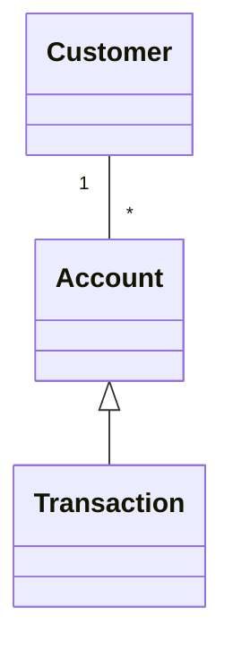
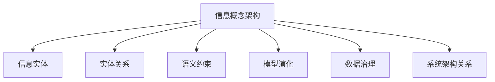

# 02-信息概念架构

> 本文件为架构分支的信息概念架构详解，系统梳理信息实体、关系、约束、语义、演化管理等，严格分级编号，所有分支均有本地链接、LaTeX公式、Mermaid思维导图、代码示例等多重表达，并与分布式架构、工作流等分支交叉引用。

## 2.1 信息实体与关系

### 2.1.1 信息实体定义
- 系统中的核心信息对象（如账户、订单、用户等）

### 2.1.2 实体关系建模
- ER图、UML类图等
- Mermaid示例：

### 2.1.3 语义约束
- 属性约束、关系约束、完整性约束

## 2.2 信息模型的演化与管理

### 2.2.1 信息模型演化
- 版本管理、兼容性、迁移策略

### 2.2.2 语义一致性与数据治理
- 元数据管理、数据血缘、数据质量

### 2.2.3 动态扩展与演化机制
- 动态Schema、领域驱动设计（DDD）

## 2.3 信息概念架构与系统架构的关系

### 2.3.1 信息架构对系统架构的支撑
- 信息流驱动系统分层与服务划分

### 2.3.2 信息模型与业务流程的映射
- 信息实体与工作流活动的对应关系

---

## Mermaid 思维导图

---

## 交叉引用锚点
- [架构分支总览](./00-Overview.md)
- [分布式架构与微服务设计](./01-DistributedMicroservices.md)
- [工作流理论与模式](./03-WorkflowTheory.md)
- [设计模式分支总览](../DesignPattern/00-Overview.md)

---

> 本文件为架构分支的信息概念架构详解，后续分支将依次展开详细论证。 