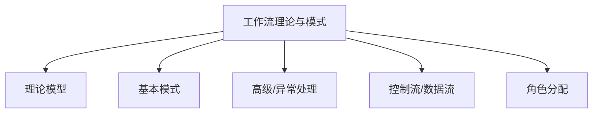

# 03-工作流理论与模式

> 本文件为架构分支的工作流理论与模式详解，系统梳理工作流理论模型、基本/高级/异常处理模式、流程建模、控制流与数据流、角色分配等，严格分级编号，所有分支均有本地链接、LaTeX公式、Mermaid思维导图、代码示例等多重表达，并与分布式架构、信息概念架构等分支交叉引用。

## 3.1 工作流理论模型概述

### 3.1.1 工作流定义与要素

- 活动、参与者、数据、控制流

### 3.1.2 工作流建模方法

- Petri网、BPMN、状态机等

## 3.2 基本工作流模式

### 3.2.1 顺序模式

- 活动按固定顺序依次执行

### 3.2.2 并行分支模式

- 多个活动可并发执行

### 3.2.3 条件分支模式

- 根据条件选择不同路径

### 3.2.4 循环模式

- 活动重复执行直到满足条件

## 3.3 高级与异常处理模式

### 3.3.1 动态分支与合并

- 动态生成/合并流程分支

### 3.3.2 事件驱动与补偿

- 事件触发流程、异常补偿机制

### 3.3.3 超时与重试

- 活动超时处理、自动重试

## 3.4 控制流与数据流

### 3.4.1 控制流建模

- 活动间的执行依赖与顺序

### 3.4.2 数据流建模

- 信息在活动间的传递与变换

## 3.5 角色分配与权限管理

- 参与者与活动的映射、权限控制

---

## Mermaid 思维导图

---

## 交叉引用锚点

- [架构分支总览](./00-Overview.md)
- [分布式架构与微服务设计](./01-DistributedMicroservices.md)
- [信息概念架构](./02-InformationConcept.md)
- [设计模式分支总览](../DesignPattern/00-Overview.md)

---

> 本文件为架构分支的工作流理论与模式详解，后续分支将依次展开详细论证。
