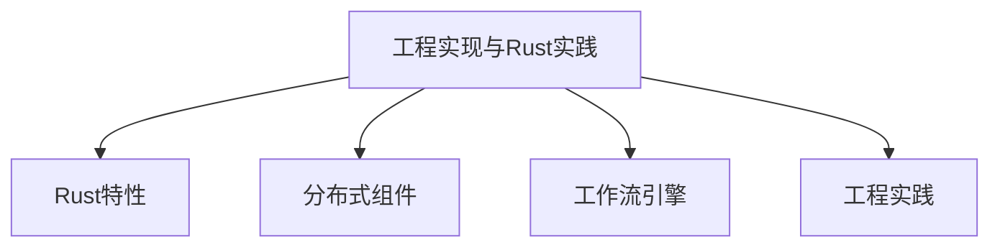

# 05-工程实现与Rust实践

> 本文件为架构分支的工程实现与Rust实践详解，系统梳理Rust语言特性、分布式系统组件、工作流引擎实现、工程实践要点、代码示例等，严格分级编号，所有分支均有本地链接、LaTeX公式、Mermaid思维导图等多重表达，并与分布式架构、工作流等分支交叉引用。

## 5.1 Rust语言特性与优势

### 5.1.1 内存安全与并发模型

- 所有权、借用、生命周期、无数据竞争

### 5.1.2 性能与生态

- 零成本抽象、异步编程、丰富的库（tokio、actix等）

## 5.2 分布式系统组件实现

### 5.2.1 服务注册与发现

- etcd/Consul客户端、gRPC/REST接口

### 5.2.2 分布式锁与一致性

- Raft/Paxos算法库、分布式锁实现

### 5.2.3 任务队列与消息中间件

- RabbitMQ/Kafka客户端、异步任务调度

## 5.3 工作流引擎实现

### 5.3.1 状态机与流程建模

- Rust枚举/状态机库建模工作流

### 5.3.2 持久化与恢复

- 事件溯源、快照、数据库集成

### 5.3.3 错误处理与补偿机制

- Result、Option、错误传播、补偿逻辑

## 5.4 工程实践要点

### 5.4.1 测试与CI/CD

- 单元测试、集成测试、自动化部署

### 5.4.2 性能优化与监控

- 性能分析、Prometheus/Grafana集成

### 5.4.3 安全与容错

- 安全编码、异常处理、自动恢复

---

## Mermaid 思维导图

---

## 交叉引用锚点

- [架构分支总览](./00-Overview.md)
- [分布式架构与微服务设计](./01-DistributedMicroservices.md)
- [工作流理论与模式](./03-WorkflowTheory.md)
- [设计模式分支总览](../DesignPattern/00-Overview.md)

---

> 本文件为架构分支的工程实现与Rust实践详解，后续分支将依次展开详细论证。
