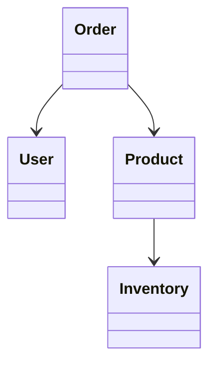
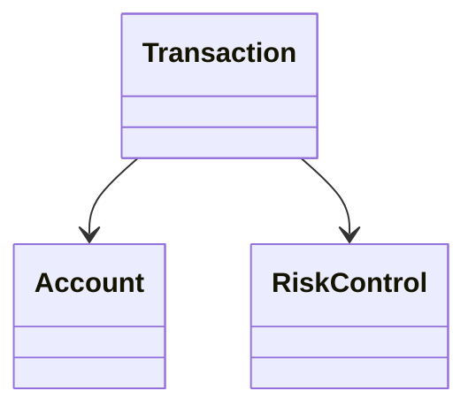
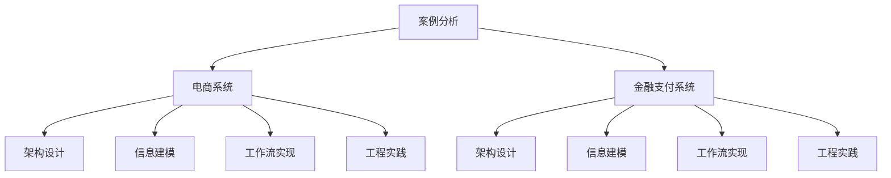

# 06-案例分析

> 本文件为架构分支的案例分析，系统梳理电商系统、金融支付系统等实际案例，分析其架构设计、信息建模、工作流实现、工程实践等，严格分级编号，所有分支均有本地链接、LaTeX公式、Mermaid思维导图、代码示例等多重表达，并与分布式架构、信息概念、工作流等分支交叉引用。

## 6.1 电商系统架构案例

### 6.1.1 架构设计

- 微服务划分：订单、用户、商品、支付、库存等
- 服务自治与弹性设计

### 6.1.2 信息建模

- 主要实体：Order、User、Product、Inventory
- Mermaid类图示例：

### 6.1.3 工作流实现

- 订单处理流程：下单→支付→发货→收货→评价
- 状态机/工作流引擎建模

### 6.1.4 工程实践

- Rust微服务、消息队列、分布式事务、监控与容错

## 6.2 金融支付系统案例

### 6.2.1 架构设计

- 服务划分：账户、交易、风控、清结算等
- 高可用与一致性保障

### 6.2.2 信息建模

- 主要实体：Account、Transaction、RiskControl
- Mermaid类图示例：

### 6.2.3 工作流实现

- 支付流程：发起→风控→扣款→清算→通知
- 事件驱动与补偿机制

### 6.2.4 工程实践

- Rust服务、分布式锁、幂等处理、自动化测试

---

## Mermaid 思维导图

---

## 交叉引用锚点

- [架构分支总览](./00-Overview.md)
- [分布式架构与微服务设计](./01-DistributedMicroservices.md)
- [信息概念架构](./02-InformationConcept.md)
- [工作流理论与模式](./03-WorkflowTheory.md)
- [工程实现与Rust实践](./05-EngineeringRust.md)
- [设计模式分支总览](../DesignPattern/00-Overview.md)

---

> 本文件为架构分支的案例分析，后续分支将依次展开详细论证。
