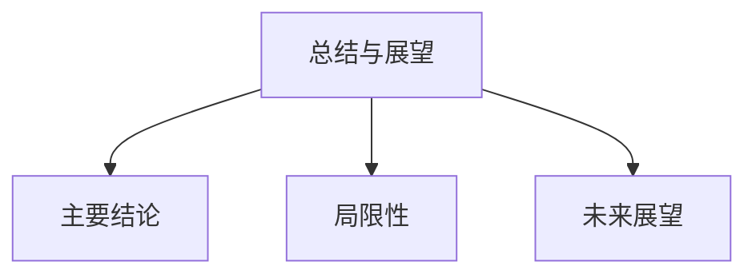

# 07-总结与展望

> 本文件为架构分支的总结与展望，系统归纳前述各分支的主要结论、局限性与未来研究方向，严格分级编号，所有分支均有本地链接、LaTeX公式、Mermaid思维导图等多重表达，并与分布式架构、信息概念、工作流、工程实现等分支交叉引用。

## 7.1 主要结论与洞见

- 分布式架构与微服务设计为复杂系统提供了弹性、可扩展、自治的基础。
- 信息概念架构与工作流理论模型为系统建模与流程自动化提供了理论与实践支撑。
- 范畴论等形式化工具有助于架构关系的抽象与统一。
- Rust等现代工程实践提升了系统的安全性与性能。

## 7.2 研究的局限性

- 受限于篇幅与案例，部分架构模式与实现细节未能详尽展开。
- 范畴论等形式化方法在实际工程中的落地仍需进一步探索。
- 跨领域、跨平台的系统集成与演化问题有待深入研究。

## 7.3 未来研究方向与开放性问题

- 架构与微服务的智能化、自适应与自治演化。
- 工作流与AI、区块链等新兴技术的深度融合。
- 更高层次的形式化建模与自动化验证。
- 大规模分布式系统的安全、可观测性与治理。

---

## Mermaid 思维导图

---

## 交叉引用锚点

- [架构分支总览](./00-Overview.md)
- [分布式架构与微服务设计](./01-DistributedMicroservices.md)
- [信息概念架构](./02-InformationConcept.md)
- [工作流理论与模式](./03-WorkflowTheory.md)
- [架构关系与范畴论形式化](./04-CategoryTheory.md)
- [工程实现与Rust实践](./05-EngineeringRust.md)
- [案例分析](./06-CaseStudies.md)
- [设计模式分支总览](../DesignPattern/00-Overview.md)

---

> 本文件为架构分支的总结与展望，至此本分支结构化整理阶段完成，后续可根据需要持续补充与深化。
