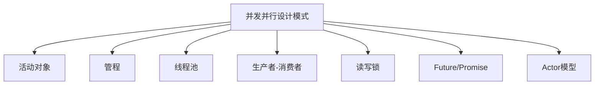

# 02-并发并行设计模式

> 本文件为设计模式分支的并发并行设计模式详解，系统梳理活动对象、管程、线程池、Actor、生产者-消费者、Future/Promise等，严格分级编号，所有分支均有本地链接、LaTeX公式、Mermaid思维导图、代码示例等多重表达，并与GoF、分布式、架构等分支交叉引用。

## 2.1 概念与定义

- 并发：多个任务在同一时间段内交替执行
- 并行：多个任务在同一时刻同时执行

## 2.2 常见并发并行设计模式

### 2.2.1 活动对象模式（Active Object）

- 将方法调用与执行解耦，实现异步消息处理

### 2.2.2 管程模式（Monitor）

- 封装共享资源与同步机制，保证互斥与条件同步

### 2.2.3 线程池模式（Thread Pool）

- 复用线程资源，提升并发性能

### 2.2.4 生产者-消费者模式（Producer-Consumer）

- 通过缓冲区解耦生产与消费速率

### 2.2.5 读写锁模式（Readers-Writer Lock）

- 允许多个读线程并发访问，写线程独占

### 2.2.6 Future/Promise模式

- 表示异步计算的结果

### 2.2.7 Actor模型（Actor Model）

- 以Actor为基本单元，消息驱动并发

---

## Mermaid 思维导图

---

## 交叉引用锚点

- [设计模式总览](./00-Overview.md)
- [GoF设计模式](./01-GoF.md)
- [分布式设计模式](./03-Distributed.md)
- [工作流设计模式](./04-Workflow.md)
- [软件工程架构分支总览](../Architecture/00-Overview.md)

---

> 本文件为设计模式分支的并发并行设计模式详解，后续分支将依次展开详细论证。
