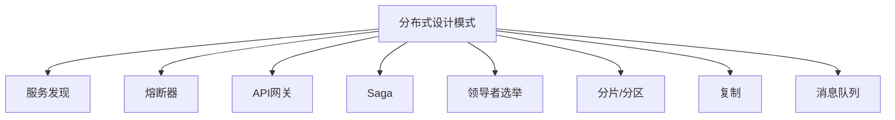

# 03-分布式设计模式

> 本文件为设计模式分支的分布式设计模式详解，系统梳理服务发现、熔断器、API网关、Saga、领导者选举、分片/分区、复制、消息队列等，严格分级编号，所有分支均有本地链接、LaTeX公式、Mermaid思维导图、代码示例等多重表达，并与GoF、并发、微服务等分支交叉引用。

## 3.1 概念与定义

- 分布式系统：多个独立计算节点协同完成任务的系统

## 3.2 常见分布式设计模式

### 3.2.1 服务发现（Service Discovery）

- 动态注册与发现服务实例

### 3.2.2 熔断器模式（Circuit Breaker）

- 防止故障蔓延，提升系统健壮性

### 3.2.3 API网关（API Gateway）

- 统一入口，路由、鉴权、聚合等

### 3.2.4 Saga模式

- 分布式事务的补偿机制

### 3.2.5 领导者选举（Leader Election）

- 在分布式环境中选举唯一主节点

### 3.2.6 分片/分区（Sharding/Partitioning）

- 数据或任务的水平切分

### 3.2.7 复制（Replication）

- 数据冗余与高可用

### 3.2.8 消息队列（Message Queue）

- 异步解耦、缓冲、削峰填谷

---

## Mermaid 思维导图

---

## 交叉引用锚点

- [设计模式总览](./00-Overview.md)
- [GoF设计模式](./01-GoF.md)
- [并发并行设计模式](./02-ConcurrentParallel.md)
- [工作流设计模式](./04-Workflow.md)
- [微服务分支总览](../Microservices/00-Overview.md)

---

> 本文件为设计模式分支的分布式设计模式详解，后续分支将依次展开详细论证。
