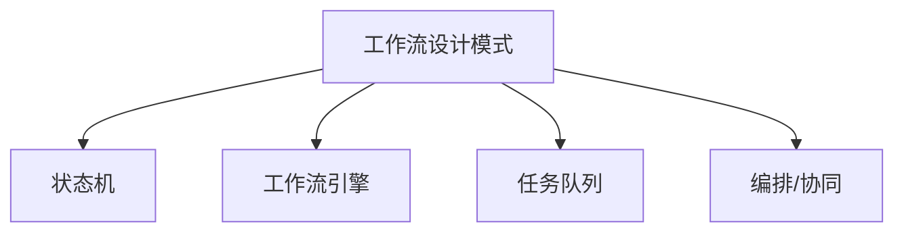

# 04-工作流设计模式

> 本文件为设计模式分支的工作流设计模式详解，系统梳理状态机、工作流引擎、任务队列、编排与协同等，严格分级编号，所有分支均有本地链接、LaTeX公式、Mermaid思维导图、代码示例等多重表达，并与GoF、并发、分布式等分支交叉引用。

## 4.1 概念与定义

- 工作流：一组有序的任务、状态和转移，自动化业务流程

## 4.2 常见工作流设计模式

### 4.2.1 状态机模式（State Machine）

- 用状态和转移描述流程控制

### 4.2.2 工作流引擎（Workflow Engine）

- 解析和执行流程定义，实现自动化调度

### 4.2.3 任务队列（Task Queue）

- 异步任务分发与调度，解耦生产与消费

### 4.2.4 编排（Orchestration）与协同（Choreography）

- 编排：中心化流程控制
- 协同：分布式事件驱动

---

## Mermaid 思维导图

---

## 交叉引用锚点

- [设计模式总览](./00-Overview.md)
- [GoF设计模式](./01-GoF.md)
- [并发并行设计模式](./02-ConcurrentParallel.md)
- [分布式设计模式](./03-Distributed.md)
- [软件工程架构分支总览](../Architecture/00-Overview.md)

---

> 本文件为设计模式分支的工作流设计模式详解，至此设计模式分支结构化整理阶段完成，后续可根据需要持续补充与深化。
