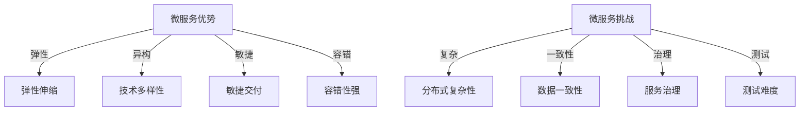

# 01-微服务架构基础

> 本文件系统梳理微服务架构的定义、发展历程、核心特征、优势与挑战及典型应用场景，所有内容严格分级编号，包含本地交叉引用、LaTeX公式、Mermaid思维导图等多重表达。

## 1.1 微服务架构定义

微服务架构（Microservices Architecture）是一种将应用系统划分为一组小型、自治服务的架构风格。每个服务围绕特定业务能力构建，独立部署、扩展与演化。

- 形式化定义：
  $$
  \text{System} = \{ S_1, S_2, \ldots, S_n \} \\
  \forall S_i, S_i \perp S_j, \text{且}~S_i~\text{围绕单一业务能力}
  $$

- 交叉引用：[架构分支总览](../Architecture/00-Overview.md)

## 1.2 发展历程

- 单体架构 → SOA → 微服务 → 云原生
- 关键节点：
  - 2011年 James Lewis & Martin Fowler 正式提出微服务概念
  - 云计算、容器化、DevOps 推动微服务普及

## 1.3 核心特征

1.3.1 单一职责与自治

1.3.2 独立部署与扩展

1.3.3 去中心化治理

1.3.4 技术多样性

1.3.5 自动化运维与弹性伸缩

## 1.4 优势与挑战

### 1.4.1 优势

- 弹性伸缩、技术异构、敏捷交付、容错性强

### 1.4.2 挑战

- 分布式复杂性、数据一致性、服务治理、测试难度

## 1.5 典型应用场景

- 大型互联网平台（如 Netflix、阿里巴巴）
- 金融、电商、物联网、云原生应用

---

## 本地交叉引用

- [微服务分支总览](./00-Overview.md)
- [架构分支总览](../Architecture/00-Overview.md)
- [设计模式分支总览](../DesignPattern/00-Overview.md)

---

> 本文件为微服务架构基础详细内容，后续将继续推进各主线分支的系统化整理。
