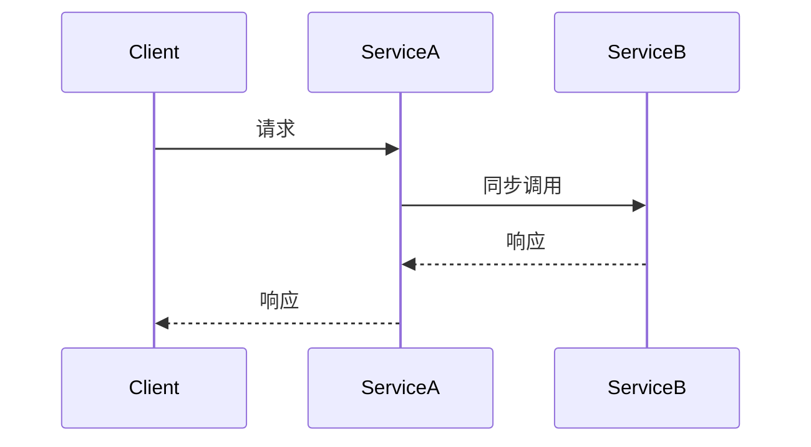
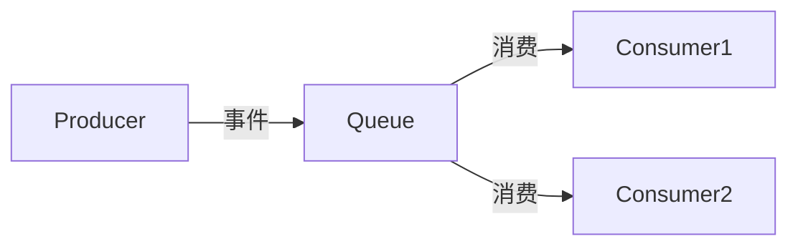
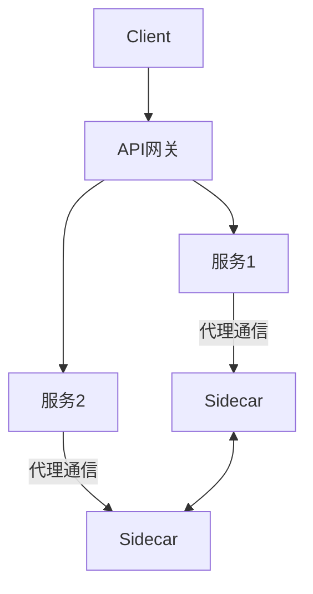

# 04-通信模式

> 本文件系统梳理微服务架构中的通信模式，包括同步通信、异步通信、事件驱动与消息队列、API网关与服务网格、通信协议与序列化等，所有内容严格分级编号，包含本地交叉引用、LaTeX公式、Mermaid思维导图等多重表达。

## 4.1 同步通信

同步通信（Synchronous Communication）指服务间请求-响应需实时返回结果，常用协议有 HTTP/REST、gRPC。

- Mermaid 同步通信示意：

## 4.2 异步通信

异步通信（Asynchronous Communication）指服务间消息发送后无需等待响应，常用方式有消息队列、事件总线。

- LaTeX形式化：
  $$
  \text{Send}(M) \rightarrow \text{Queue} \rightarrow \text{Receive}(M)
  $$
- 典型工具：RabbitMQ、Kafka、RocketMQ

## 4.3 事件驱动与消息队列

- 事件驱动架构（EDA）：以事件为中心驱动服务交互。
- 消息队列实现解耦与削峰填谷。
- Mermaid 事件流示意：

## 4.4 API网关与服务网格

- API网关：统一入口，路由、鉴权、限流、聚合等。
- 服务网格（Service Mesh）：以sidecar代理实现服务间通信治理（如 Istio、Linkerd）。
- Mermaid 服务网格结构：

## 4.5 通信协议与序列化

- 常用协议：HTTP/REST、gRPC、WebSocket、GraphQL
- 序列化格式：JSON、Protobuf、Avro、Thrift
- 交叉引用：[架构分支-分布式架构](../Architecture/01-DistributedMicroservices.md)

---

## 本地交叉引用

- [微服务分支总览](./00-Overview.md)
- [架构模式与关系](./03-PatternsRelations.md)
- [架构分支-分布式架构](../Architecture/01-DistributedMicroservices.md)
- [设计模式分支-分布式模式](../DesignPattern/03-Distributed.md)

---

> 本文件为微服务通信模式详细内容，后续将继续推进各主线分支的系统化整理。
