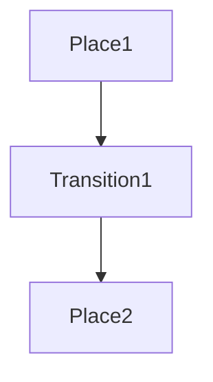
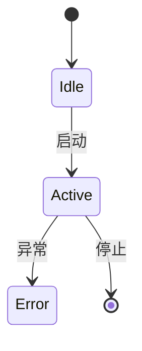

# 06-形式化建模与推理

> 本文件系统梳理微服务架构的形式化建模与推理方法，包括建模方法、Petri网、状态机、时序逻辑、模型检测、服务交互证明与验证、典型工具与案例等，所有内容严格分级编号，包含本地交叉引用、LaTeX公式、Mermaid思维导图等多重表达。

## 6.1 微服务形式化建模方法

- 形式化建模目标：描述服务行为、交互、约束，支持自动验证与推理。
- 常用方法：过程代数、Petri网、状态机、时序逻辑等。
- LaTeX形式化：
  $$
  \text{MS} = (S, I, O, T),~S=\text{服务集},~I=\text{输入},~O=\text{输出},~T=\text{转移}
  $$

## 6.2 Petri网与状态机

- Petri网建模服务并发、同步、资源分配等。
- 状态机描述服务生命周期与状态转移。
- Mermaid Petri网示意：

- Mermaid 状态机示意：

## 6.3 时序逻辑与模型检测

- 时序逻辑（LTL/CTL）描述服务行为的时序约束。
- 模型检测用于自动验证系统属性（安全性、活性等）。
- LaTeX公式：
  $$
  \Box (\text{Request} \rightarrow \Diamond \text{Response})
  $$
- 交叉引用：[理论分支-时序逻辑](../../../../Matter/Theory/Temporal_Logic_Control_Deepening/)

## 6.4 服务交互证明与验证

- 形式化证明服务间交互的正确性与一致性。
- 典型方法：协议验证、契约推理、交互自动机等。
- Mermaid 服务交互自动机：

## 6.5 典型工具与案例

- 工具：SPIN、NuSMV、TLA+、UPPAAL、CPN Tools
- 案例：微服务支付系统的Petri网建模与验证

---

## 本地交叉引用

- [微服务分支总览](./00-Overview.md)
- [现代演进与新范式](./05-Evolution.md)
- [理论分支-时序逻辑](../../../../Matter/Theory/Temporal_Logic_Control_Deepening/)
- [形式化建模分支](../../../../Matter/FormalModel/)

---

> 本文件为微服务形式化建模与推理详细内容，后续将继续推进各主线分支的系统化整理。
