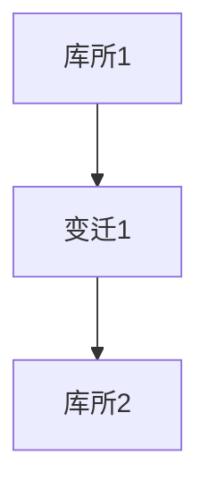
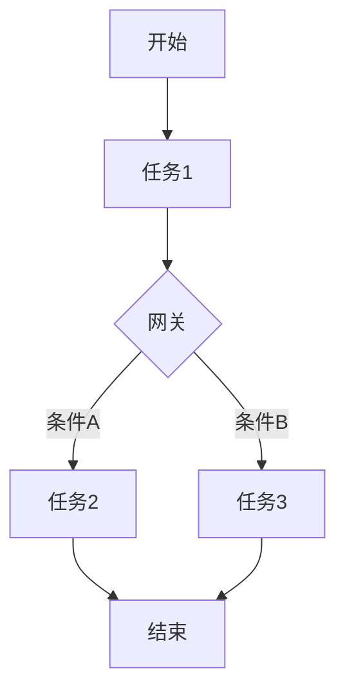
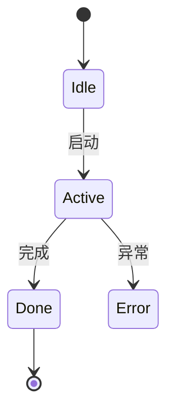

# 02-工作流建模方法

> 本文件系统梳理工作流的主流建模方法，包括Petri网、BPMN、状态机、流程图、形式化表达与验证、建模工具与实践等，所有内容严格分级编号，包含本地交叉引用、LaTeX公式、Mermaid思维导图、建模示例等多重表达。

## 2.1 Petri网建模

- Petri网适用于描述并发、同步、资源分配等复杂工作流。
- LaTeX形式化：
  $$
  \text{Petri} = (P, T, F),~P=\text{库所},~T=\text{变迁},~F=\text{流向}
  $$
- Mermaid Petri网示意：

## 2.2 BPMN建模

- BPMN（Business Process Model and Notation）是业务流程建模的国际标准，支持丰富的流程元素。
- 典型元素：事件、任务、网关、泳道等
- Mermaid BPMN简化示意：

## 2.3 状态机与流程图

- 状态机适合描述工作流的状态转移与生命周期。
- 流程图用于直观表达任务流转路径。
- Mermaid 状态机示意：

## 2.4 形式化表达与验证

- 形式化方法（如时序逻辑、模型检测）用于验证工作流的正确性与安全性。
- LaTeX表达：
  $$
  \Box (\text{Task}_i \rightarrow \Diamond \text{Task}_j)
  $$
- 交叉引用：[微服务分支-形式化建模](./Microservices/06-Formalization.md)

## 2.5 建模工具与实践

- 工具：CPN Tools、Camunda Modeler、Bizagi、yEd等
- 实践案例：企业审批流、数据处理流、CI/CD流程等

---

## 本地交叉引用

- [工作流分支总览](./Workflow.md)
- [工作流基础](./Workflow-01-Basics.md)
- [微服务分支-形式化建模](./Microservices/06-Formalization.md)

---

> 本文件为工作流建模方法详细内容，后续将继续推进各主线分支的系统化整理。
