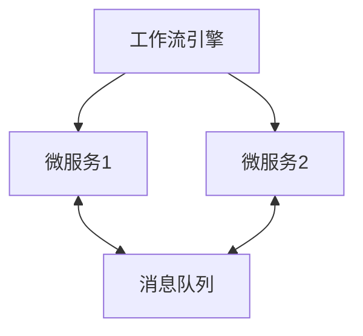
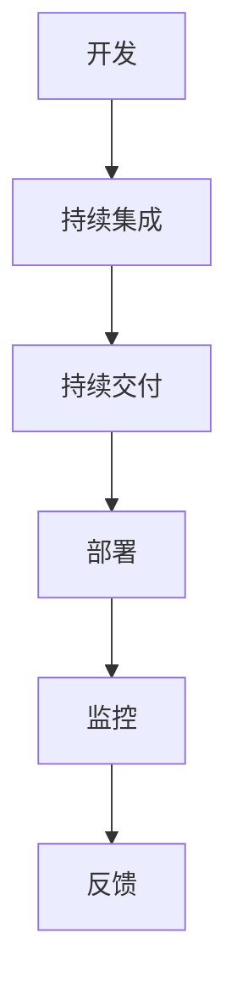

# 04-工作流与微服务/架构/DevOps的关系

> 本文件系统梳理工作流与微服务、分布式架构、DevOps的集成关系，包括集成模式、协同机制、典型案例、挑战与趋势等，所有内容严格分级编号，包含本地交叉引用、LaTeX公式、Mermaid结构图等多重表达。

## 4.1 工作流与微服务的集成

- 工作流作为微服务编排与业务流程自动化的核心工具
- 典型集成方式：服务编排、事件驱动、API调用、消息队列
- Mermaid 集成结构图：

## 4.2 工作流与分布式架构的协同

- 工作流实现跨服务、跨节点的流程调度与状态管理
- 支持分布式事务、容错、弹性伸缩
- LaTeX表达：
  $$
  \text{Workflow}_{dist} = (S, N, F),~S=\text{服务集},~N=\text{节点集},~F=\text{流转函数}
  $$

## 4.3 工作流在DevOps中的作用

- 持续集成/持续交付（CI/CD）流程自动化
- 自动化测试、部署、回滚、监控
- Mermaid DevOps流程集成：

## 4.4 典型集成模式与案例

- 企业级审批流、自动化运维、数据处理管道、CI/CD流水线
- 案例：基于Airflow的多服务数据处理、基于Jenkins的自动化部署

## 4.5 挑战与发展趋势

- 挑战：分布式一致性、复杂性管理、可观测性、安全性
- 趋势：智能编排、无服务器化、跨域集成、低代码/无代码平台

---

## 本地交叉引用

- [工作流分支总览](./Workflow.md)
- [微服务分支总览](./Microservices/00-Overview.md)
- [架构分支总览](./Architecture/00-Overview.md)
- [微服务分支-工程实践](./Microservices/07-EngineeringRust.md)

---

> 本文件为工作流与微服务/架构/DevOps关系详细内容，后续将继续推进各主线分支的系统化整理。
