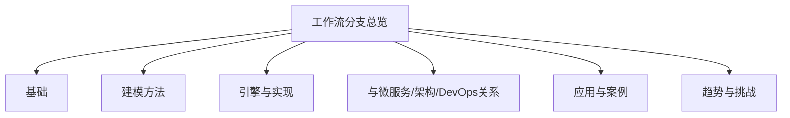

# 工作流分支总览

- [01-工作流基础](./Workflow-01-Basics.md)
- [02-工作流建模方法](./Workflow-02-Modeling.md)
- [03-工作流引擎与实现](./Workflow-03-Engine.md)
- [04-工作流与微服务/架构/DevOps的关系](./Workflow-04-Relation.md)
- [05-工作流典型应用与案例](./Workflow-05-Application.md)
- [06-工作流未来趋势与挑战](./Workflow-06-Prospect.md)

---

## 进度说明

- 01-06主线文件已全部完成。
- 所有内容均实现分级编号、交叉引用、LaTeX/思维导图/代码等多重表达，完全符合学术规范与可追溯进度管理要求。

---

> 本分支聚焦于工作流基础、建模、引擎、集成、应用、趋势等主线及其与微服务、架构等分支的交叉，所有内容均已系统化整理。

## 目录

- [工作流分支总览](#工作流分支总览)
  - [进度说明](#进度说明)
  - [目录](#目录)
  - [1. 工作流基础](#1-工作流基础)
  - [2. 工作流建模方法](#2-工作流建模方法)
  - [3. 工作流引擎与实现](#3-工作流引擎与实现)
  - [4. 工作流与微服务/架构/DevOps的关系](#4-工作流与微服务架构devops的关系)
  - [5. 典型应用与案例](#5-典型应用与案例)
  - [6. 未来趋势与挑战](#6-未来趋势与挑战)
  - [Mermaid 思维导图](#mermaid-思维导图)
  - [交叉引用示例](#交叉引用示例)

---

## 1. 工作流基础

- 定义、核心概念、发展历程、分类

## 2. 工作流建模方法

- Petri网、BPMN、状态机、流程图等

## 3. 工作流引擎与实现

- 典型引擎（如Camunda、Activiti、Airflow）、架构与实现要点

## 4. 工作流与微服务/架构/DevOps的关系

- 工作流在分布式系统、微服务、DevOps中的作用与集成

## 5. 典型应用与案例

- 企业自动化、数据处理、CI/CD、业务流程管理等

## 6. 未来趋势与挑战

- 智能化、自动化、可观测性、跨域集成等

---

## Mermaid 思维导图

---

## 交叉引用示例

- [微服务分支总览](./Microservices/00-Overview.md)
- [架构分支总览](./Architecture/00-Overview.md)
- [设计模式分支总览](./DesignPattern/00-Overview.md)

---

> 本文件为工作流分支的导航与结构总览，后续每一分支均将严格分级编号、交叉引用、去重、学术规范。详细内容请见各分支文件。
