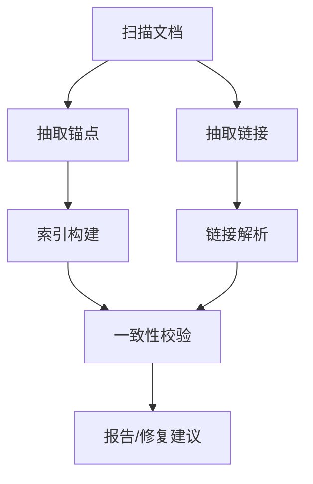

# 同层理论联系深化分析 - 第四周：交叉引用验证流程

## 一、目标

- 建立统一的交叉引用约束与验证流程，保证全库链接/锚点/反向引用一致与可达。

---

## 二、约束模型

- 链接类型：
  - 内部文件链接：path/to/file.md
  - 带锚点链接：path/to/file.md#section-title
  - 页内锚点：#section-title
  - 外链：https://...
- 约束：
  - 锚点必须来源于标题（#~######），大小写/空白标准化
  - 不允许循环别名与重复锚 ID
  - 相对路径必须规范化，无 .. 跨越仓库根

---

## 三、验证流水线



### 3.1 抽取与索引

```python
# 伪代码：锚点抽取与标准化
import re

def slugify(title: str) -> str:
    s = title.strip().lower()
    s = re.sub(r"[^a-z0-9\-\s]","", s)
    s = re.sub(r"\s+","-", s)
    return s
```

### 3.2 校验项

- 断链：目标文件不存在或锚点缺失
- 孤儿锚：无任何入边引用
- 重复锚：同文件内重复 slug
- 循环：强连通大于 1 的环（可容忍但需报告）

### 3.3 修复建议

- 近似匹配标题（编辑距离）给出候选
- 重定向映射表（路径迁移历史）
- 自动补全锚点（按标题生成）

---

## 四、报告与阈值

- 输出：JSON（机器可读）+ Markdown（人读）
- 阈值：断链>0 fail；孤儿锚>k 警告；环>0 警告
- 最短反例：为每类问题给出最短路径/最短标题

---

## 五、集成

- 变更驱动：仅验证变更闭包
- 全量夜间：刷新全库索引，输出全貌报告
- 与链接修复脚本对接（如 `Analysis/03-Quality/scripts/link_check_optimized.py`）

---

## 六、结论

- 交叉引用验证流程明确：索引-校验-修复-报告闭环。
- 下一步：与动态更新机制、自动化质量检查集成，形成稳定 CI。
