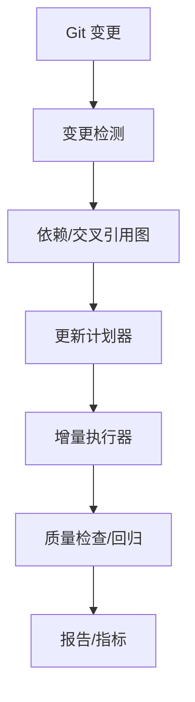

# 同层理论联系深化分析 - 第四周：动态更新机制

## 一、目标

- 建立面向大规模文档库的动态更新机制：变更检测 → 依赖分析 → 增量生成 → 校验与报告。
- 自动触发交叉引用修复、索引与目录更新、可视化产物刷新、质量检查与回归。

---

## 二、整体架构



- 触发：
  - Push/PR 触发；
  - 定时任务（每日/每周）触发；
  - 手动触发（紧急修复）。

---

## 三、变更检测

### 3.1 来源

- Git diff（HEAD..origin/main）
- 文件时间戳（本地批处理）

### 3.2 变更分类

- 内容变更（.md/.ipynb）
- 结构变更（新增/删除/移动）
- 资源变更（图片/图表/外链）

```python
# 伪代码：变更检测
from pathlib import Path
import subprocess, json

def detect_changes() -> dict:
    diff = subprocess.check_output(["git","diff","--name-status","origin/main..."]).decode()
    changes = {"added":[],"modified":[],"deleted":[]}
    for line in diff.splitlines():
        status, path = line.split("\t",1)
        if status == 'A': changes["added"].append(path)
        elif status == 'M': changes["modified"].append(path)
        elif status == 'D': changes["deleted"].append(path)
    return changes
```

---

## 四、依赖/交叉引用图

### 4.1 解析规则

- Markdown 内链（#锚点）、相对链接（./path/file.md#h）
- Mermaid 引用块基本校验
- 代码块语言标签统计（用于质量度量）

```python
# 伪代码：交叉引用图
import re
from collections import defaultdict

LINK_RE = re.compile(r"\[(?P<text>[^\]]+)\]\((?P<link>[^\)]+)\)")
ANCHOR_RE = re.compile(r"^#{1,6}\s+(?P<anchor>.+)$")

def build_crossref_graph(root: Path) -> dict:
    refs = defaultdict(set)
    anchors = defaultdict(set)
    for p in root.rglob("*.md"):
        text = p.read_text(encoding='utf-8', errors='ignore')
        for m in ANCHOR_RE.finditer(text):
            slug = m.group('anchor').strip().lower()
            anchors[str(p)].add(slug)
        for m in LINK_RE.finditer(text):
            refs[str(p)].add(m.group('link'))
    return {"refs":refs, "anchors":anchors}
```

### 4.2 依赖闭包

- 依据引用关系计算受影响集（反向边 + 祖先/后代闭包）

---

## 五、增量执行器

### 5.1 更新项

- 目录与索引（SUMMARY/README/视图页）
- Mermaid 图预检（语法/环）
- 引用重写与补全（相对路径规范化）

### 5.2 失败回退

- 原子性：单任务失败不影响其他任务
- 回滚：保存前后版本差异，失败即还原

```python
# 伪代码：执行器骨架
class UpdatePlanner:
    def plan(self, changes, graph):
        # 返回待执行任务队列（拓扑序）
        return []

class Executor:
    def run(self, tasks):
        results = []
        for t in tasks:
            try:
                results.append(t())
            except Exception as e:
                results.append({"task":t.__name__,"status":"fail","err":str(e)})
        return results
```

---

## 六、质量检查与回归

- 交叉引用完整性：无断链/孤立锚
- 外链可达率：HTTP 状态与超时重试
- 结构一致性：标题层级、编号、文件大小/行数阈值
- 报告：JSON + Markdown 摘要；最短反例（触发样例）

---

## 七、指标与可视化

- 断链数量、修复率、平均修复时延
- 交叉引用覆盖率、孤立节点/强连通比
- 外链健康率、重定向比

---

## 八、集成与调度

- 本地：make/脚本一键运行
- CI：Push/PR + nightly；缓存 crossref 图
- 安全：受控写操作（仅增量区）

---

## 九、结论

- 动态更新机制完成设计：从变更到增量执行与质量闭环。
- 下一步：落地“交叉引用验证流程”与“自动化质量检查”并集成到调度。
