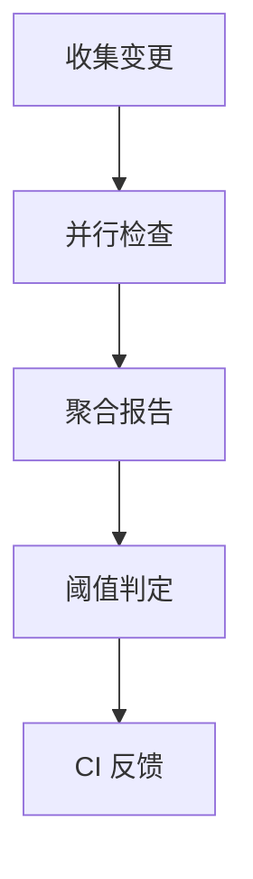

# 同层理论联系深化分析 - 第四周：自动化质量检查

## 一、目标

- 构建统一的自动化质量门禁：结构/语义/链接/可视化/性能多维度检查，出具可追溯报告。

---

## 二、检查矩阵

| 维度 | 检查项 | 规则/阈值 | 失败处理 |
|---|---|---|---|
| 结构 | 标题层级、编号、重复锚 | 连续递增，slug 唯一 | fail |
| 链接 | 内链/锚/外链 | 内链必须存在，外链 2 次重试 | fail/warn |
| 语义 | 代码块语言、数学公式 | 语言标签齐全，LaTeX 基本校验 | warn |
| 可视化 | Mermaid 语法与渲染 | 解析通过，无致命错误 | fail |
| 规模 | 文件行数/大小 | 行数/大小上限 | warn |

---

## 三、执行流水线



### 3.1 并行检查器

```python
# 伪代码：并行质量检查
from concurrent.futures import ThreadPoolExecutor

def run_checks(files):
    with ThreadPoolExecutor(max_workers=8) as ex:
        futs = [ex.submit(check_file, f) for f in files]
        return [f.result() for f in futs]
```

### 3.2 报告聚合

- 结构化 JSON：问题类型/文件/位置/证据
- 人类可读摘要：Top-N 问题、趋势图

---

## 四、阈值与策略

- fail-fast：断链/致命可视化错误立即失败
- 宽严分级：PR（严格）与 nightly（宽松）
- 静态白名单：已知外链波动域的降级

---

## 五、CI 集成建议

- 触发：Push/PR、nightly
- 缓存：交叉引用图、外链 DNS 解析
- 产物：`quality-report.json` + `QUALITY.md` 摘要

```yaml
# 片段：CI 步骤示意（表达性示意，非绑定）
steps:
  - run: python Analysis/03-Quality/scripts/link_check_optimized.py --report quality-report.json || true
  - run: python Analysis/03-Quality/scripts/fix_links.py --apply --plan
```

---

## 六、结论

- 自动化质量检查设计完成：检查矩阵 + 流水线 + 阈值 + 集成建议。
- 下一步：连通前三周成果，形成“从类型不变量到系统验证到质量门禁”的统一执行通道。
