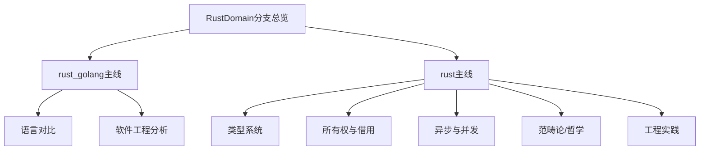

# RustDomain 分支总览

> 本文件为 RustDomain 分支的结构化总览，系统梳理 rust_golang、rust 两大主线及其主要内容，严格分级编号，补充本地交叉引用、LaTeX、Mermaid 思维导图等多重表达，作为后续详细整理的导航与索引基础。

## 目录

- [RustDomain 分支总览](#rustdomain-分支总览)
  - [目录](#目录)
  - [1. rust\_golang 主线](#1-rust_golang-主线)
  - [2. rust 主线](#2-rust-主线)
  - [3. 全局交叉引用](#3-全局交叉引用)
  - [Mermaid 思维导图](#mermaid-思维导图)

---

## 1. rust_golang 主线

- Rust 与 Golang、Python 等语言的对比分析
- 软件工程视角下的多语言范式比较
- 主要文件：
  - view01.md、view02.md、view03.md
  - rust_golang_software01.md、rust_golang_software02.md
  - python_r_software03.md

## 2. rust 主线

- Rust 语言理论、类型系统、控制流、所有权与借用、异步与并发、范畴论、哲学、工程实践等
- 主要子目录：
  - view_type_theory/、view_type_system/、view_type_control/、view_type_algebra/
  - view_resource_model/、view_homotopy_type_theory/、view_category_theory/
  - types/、Tokio/、threads/、system/、software/、ownership_borrow_scope/
  - generic/、functional_program/、control/、async_program/、async_paradigm/、algorithms/
- 主要文件：
  - rust_philosophy.md、rust_core_philosophy.md、rust_model_view01.md、rust_model_view02.md
  - rust_paradiam.md、rust_analysis.md、lang.md、enum_trait_oop.md、cargo_package_mod.md
  - Rust 2024 Edition语言机制与设计趋势分析.md

## 3. 全局交叉引用

- [编程语言主题索引](../../../../Analysis/SUMMARY.md)
- [软件工程分支-微服务](../../../../Analysis/SoftwareEngineering/Microservices/00-Overview.md)
- [软件工程分支-架构](../../../../Analysis/SoftwareEngineering/Architecture/00-Overview.md)

---

## Mermaid 思维导图

---

> 本文件为 RustDomain 分支的导航与结构总览，后续每一分支均将严格分级编号、交叉引用、去重、学术规范。详细内容请见各子分支文件。
