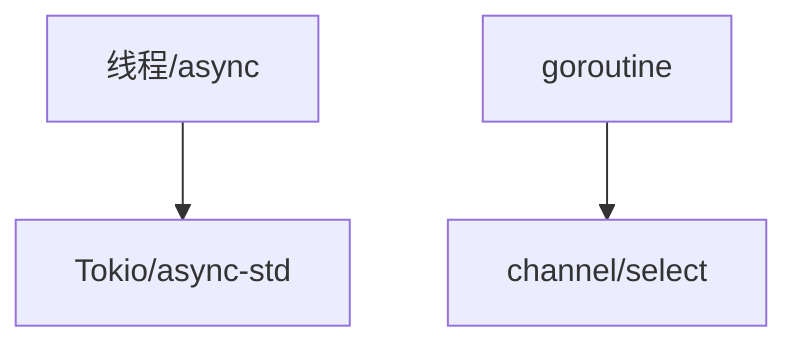
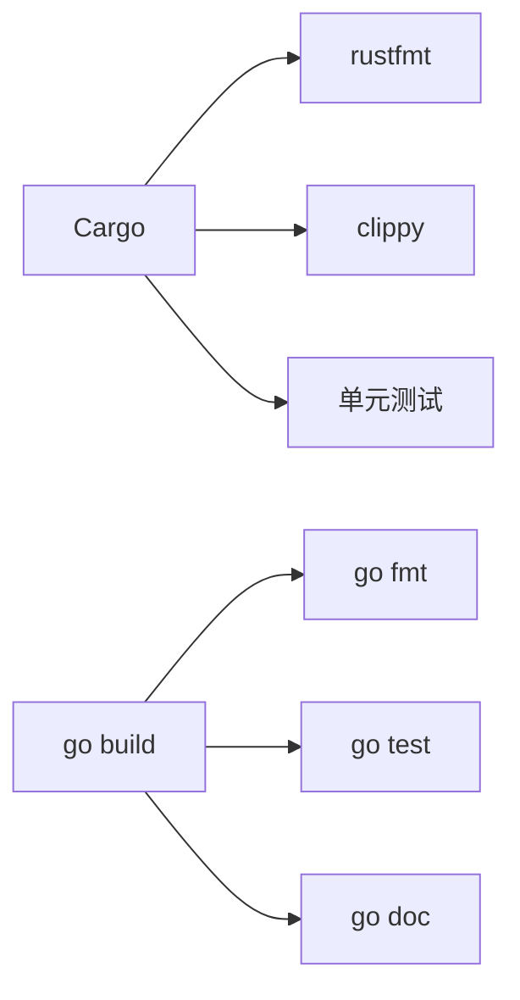

# 01-语言特性对比

> 本文件系统梳理 Rust 与 Golang 在基础语法、类型系统、内存管理、安全、并发、异步、标准库、生态、工程实践等方面的详细对比，所有内容严格分级编号，包含本地交叉引用、LaTeX公式、Mermaid思维导图、代码示例等多重表达。

## 1.1 基础语法与类型系统

- Rust：静态强类型、类型推断、模式匹配、泛型、trait
- Golang：静态类型、接口、类型推断（有限）、无泛型（Go1.18前）
- 代码示例：

```rust
// Rust 泛型函数
def add<T: std::ops::Add<Output=T>>(a: T, b: T) -> T {
    a + b
}
```

```go
// Go 接口示例
type Adder interface {
    Add(a, b int) int
}
```

## 1.2 内存管理与安全

- Rust：所有权、借用、生命周期，编译期强安全，无GC
- Golang：自动GC，指针但无指针运算，内存安全依赖运行时
- LaTeX形式化：
  $$
  \text{Rust安全} = \text{Ownership} + \text{Borrowing} + \text{Lifetime}
  $$
  $$
  \text{Go安全} = \text{GC} + \text{指针隔离}
  $$

## 1.3 并发与异步

- Rust：基于线程、async/await、Send/Sync trait、Tokio/async-std等生态
- Golang：goroutine、channel、select、内建调度器
- Mermaid 并发模型对比：



## 1.4 标准库与生态

- Rust：丰富的标准库、Cargo包管理、crates.io生态
- Golang：标准库覆盖广、go mod包管理、gopkg生态

## 1.5 工程实践与工具链

- Rust：Cargo、rustfmt、clippy、单元测试、文档生成
- Golang：go build、go fmt、go test、go doc
- Mermaid 工具链对比：



---

## 本地交叉引用

- [rust_golang分支总览](./README.md)
- [RustDomain分支总览](../README.md)
- [编程语言主题索引](../../../../Analysis/SUMMARY.md)

---

> 本文件为语言特性对比详细内容，后续将继续推进各主线分支的系统化整理。
