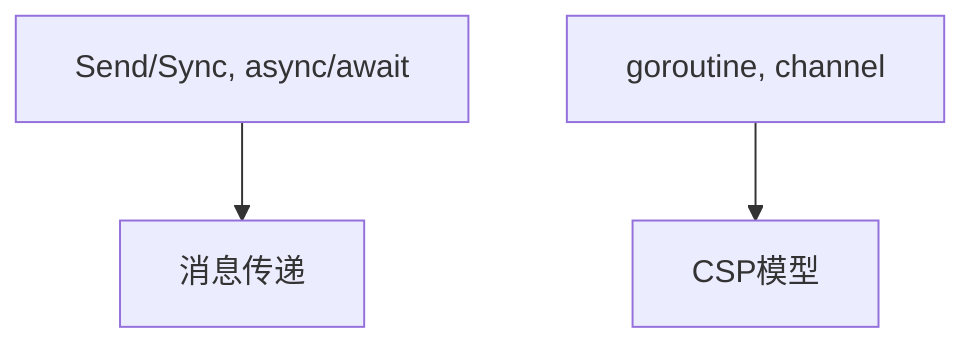
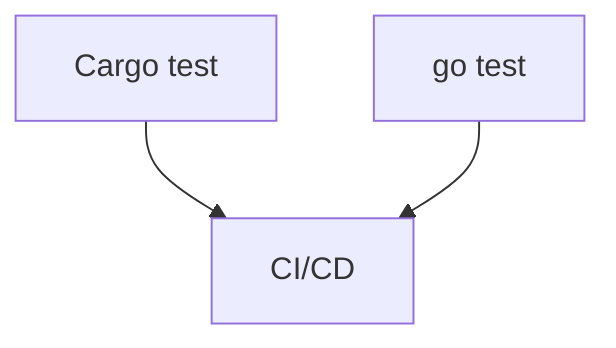

# 02-软件工程范式分析

> 本文件系统梳理 Rust 与 Golang 在面向对象、函数式、并发、模块化、测试等软件工程范式上的对比，所有内容严格分级编号，包含本地交叉引用、LaTeX公式、Mermaid思维导图、代码示例等多重表达。

## 2.1 面向对象范式对比

- Rust：无传统OOP继承，trait为核心抽象，组合优于继承
- Golang：无继承，接口为核心抽象，组合优于继承
- 代码示例：

```rust
// Rust trait
trait Drawable {
    fn draw(&self);
}
```

```go
// Go interface
type Drawable interface {
    Draw()
}
```

## 2.2 函数式与过程式范式

- Rust：高阶函数、闭包、模式匹配、不可变性
- Golang：支持函数作为一等公民，闭包有限，过程式为主
- LaTeX表达：
  $$
  \text{Rust}_{FP} = \{\text{Closure}, \text{PatternMatch}, \text{Immutability}\}
  $$
  $$
  \text{Go}_{FP} = \{\text{Closure}, \text{FunctionAsValue}\}
  $$

## 2.3 并发与异步范式

- Rust：Send/Sync trait、async/await、消息传递、无数据竞争
- Golang：goroutine、channel、select、CSP模型
- Mermaid 并发范式对比：



## 2.4 模块化与依赖管理

- Rust：模块（mod）、包（crate）、Cargo.toml依赖管理
- Golang：包（package）、go.mod依赖管理
- 代码示例：

```rust
// Rust 模块与包
mod math {
    pub fn add(a: i32, b: i32) -> i32 { a + b }
}
```

```go
// Go 包与依赖
package math
func Add(a int, b int) int { return a + b }
```

## 2.5 测试与持续集成

- Rust：内建单元测试、集成测试、Cargo test、CI集成
- Golang：go test、基准测试、CI集成
- Mermaid 测试流程对比：



---

## 本地交叉引用

- [rust_golang分支总览](./README.md)
- [RustDomain分支总览](../README.md)
- [编程语言主题索引](../../../../Analysis/SUMMARY.md)

---

> 本文件为软件工程范式分析详细内容，后续将继续推进各主线分支的系统化整理。
