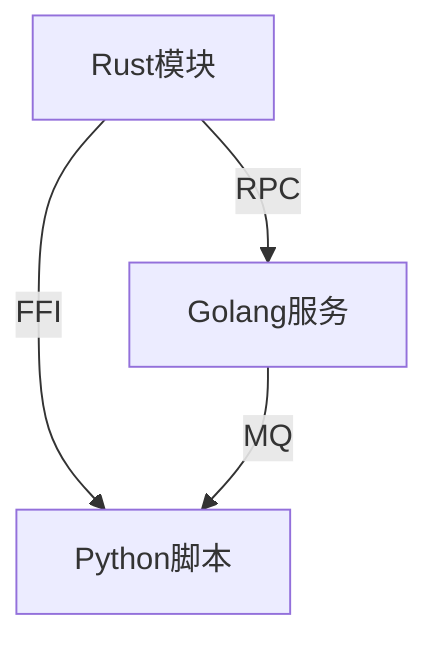
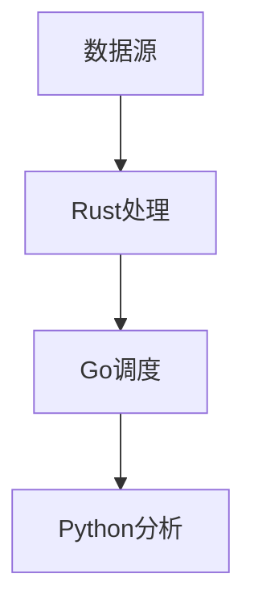

# 03-多语言协同与案例

> 本文件系统梳理 Rust、Golang、Python 等多语言协同开发模式、典型场景与案例，所有内容严格分级编号，包含本地交叉引用、LaTeX公式、Mermaid思维导图、代码示例等多重表达。

## 3.1 多语言协同开发模式

- FFI（Foreign Function Interface）、RPC、微服务、消息队列等
- Mermaid 协同模式示意：



## 3.2 Rust与Golang在数据处理场景的协同

- Rust高性能数据处理，Golang负责服务编排与分发
- 代码示例（Rust导出C接口，Go调用）：

```rust
// Rust 端
#[no_mangle]
pub extern "C" fn add(a: i32, b: i32) -> i32 {
    a + b
}
```

```go
// Go 端
// import "C"
// result := C.add(1, 2)
```

## 3.3 Rust与Python在系统开发中的集成

- Rust实现核心性能模块，Python负责业务逻辑与脚本
- PyO3、rust-cpython等工具
- 代码示例：

```rust
// Rust 端（PyO3）
use pyo3::prelude::*;
#[pyfunction]
fn add(a: i32, b: i32) -> i32 { a + b }
#[pymodule]
fn mymod(_py: Python, m: &PyModule) -> PyResult<()> {
    m.add_function(wrap_pyfunction!(add, m)?)?;
    Ok(())
}
```

```python
# Python 端
import mymod
print(mymod.add(1, 2))
```

## 3.4 典型案例分析

- 数据处理管道：Rust高效处理、Golang调度、Python分析
- 系统开发：Rust核心、Python脚本、Go服务
- Mermaid 案例结构：



## 3.5 挑战与未来趋势

- 挑战：接口兼容性、类型安全、调试复杂性、部署运维
- 趋势：WebAssembly、统一IDL、低代码平台、智能编排
- LaTeX趋势表达：
  $$
  \text{Future}_{ML} = \{\text{WASM}, \text{UnifiedIDL}, \text{LowCode}, \text{AIOrchestration}\}
  $$

---

## 本地交叉引用

- [rust_golang分支总览](./README.md)
- [RustDomain分支总览](../README.md)
- [编程语言主题索引](../../../../Analysis/SUMMARY.md)

---

> 本文件为多语言协同与案例详细内容，至此 rust_golang 分支主线内容系统化整理已完成。
