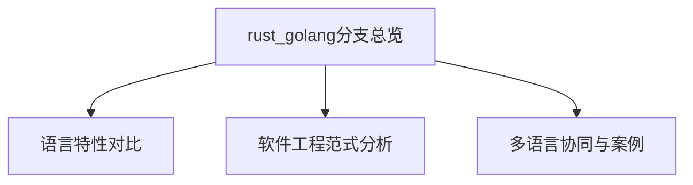

# rust_golang 分支总览

> 本文件为 rust_golang 分支的结构化总览，系统梳理 Rust 与 Golang、Python 等语言的对比分析及软件工程视角下的多语言范式比较，严格分级编号，补充本地交叉引用、LaTeX、Mermaid 思维导图等多重表达，作为后续详细整理的导航与索引基础。

## 目录

- [rust\_golang 分支总览](#rust_golang-分支总览)
  - [目录](#目录)
  - [1. 语言特性对比](#1-语言特性对比)
  - [2. 软件工程范式分析](#2-软件工程范式分析)
  - [3. 多语言协同与案例](#3-多语言协同与案例)
  - [4. 全局交叉引用](#4-全局交叉引用)
  - [Mermaid 思维导图](#mermaid-思维导图)

---

## 1. 语言特性对比

- view01.md：Rust 与 Golang 基础特性对比
- view02.md：并发、内存管理、类型系统等深度对比
- view03.md：工程实践与生态对比

## 2. 软件工程范式分析

- rust_golang_software01.md：面向对象、函数式、并发范式对比
- rust_golang_software02.md：模块化、依赖管理、测试等工程实践对比

## 3. 多语言协同与案例

- python_r_software03.md：Rust、Golang、Python 在数据处理、系统开发等场景的协同与案例分析

## 4. 全局交叉引用

- [RustDomain分支总览](../README.md)
- [编程语言主题索引](../../../../Analysis/SUMMARY.md)
- [软件工程分支-微服务](../../../../Analysis/SoftwareEngineering/Microservices/00-Overview.md)

---

## Mermaid 思维导图

---

> 本文件为 rust_golang 分支的导航与结构总览，后续每一分支均将严格分级编号、交叉引用、去重、学术规范。详细内容请见各子分支文件。
