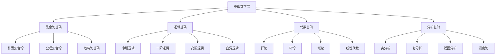
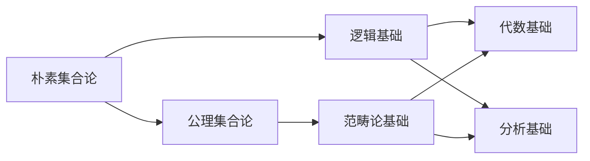

# 基础数学层理论分类图

## 一、概述

基础数学层是整个理论体系的基础，为上层理论提供数学基础支撑。本层包含集合论、逻辑学、代数学和分析学四个核心分支，每个分支都有其独特的理论体系和应用领域。

## 二、理论层次结构

## 三、详细理论分类

### 3.1 集合论基础 (Set Theory Foundation)

#### 3.1.1 朴素集合论 (Naive Set Theory)

**核心概念**：

- 集合的基本概念
- 集合运算（并、交、差、补）
- 集合关系（包含、相等、子集）
- 笛卡尔积和幂集

**理论基础**：

- 外延公理
- 空集公理
- 配对公理
- 并集公理
- 幂集公理

**应用领域**：

- 数学基础
- 计算机科学
- 逻辑学

#### 3.1.2 公理集合论 (Axiomatic Set Theory)

**核心公理**：

- ZFC公理系统
- 选择公理
- 正则公理
- 替换公理
- 无穷公理

**理论基础**：

- 形式化集合论
- 模型论
- 独立性证明

**应用领域**：

- 数学基础研究
- 逻辑学研究
- 计算机科学基础

#### 3.1.3 范畴论基础 (Category Theory Foundation)

**核心概念**：

- 对象和态射
- 函子和自然变换
- 极限和余极限
- 伴随函子

**理论基础**：

- 范畴公理
- 函子理论
- 自然变换理论

**应用领域**：

- 抽象代数
- 拓扑学
- 计算机科学

### 3.2 逻辑基础 (Logic Foundation)

#### 3.2.1 命题逻辑 (Propositional Logic)

**核心概念**：

- 命题变元
- 逻辑连接词
- 真值表
- 逻辑等价

**理论基础**：

- 命题演算
- 真值函数
- 逻辑推理

**应用领域**：

- 计算机科学
- 人工智能
- 哲学

#### 3.2.2 一阶逻辑 (First-Order Logic)

**核心概念**：

- 个体变元
- 谓词符号
- 函数符号
- 量词

**理论基础**：

- 一阶演算
- 模型论
- 完备性定理

**应用领域**：

- 数学基础
- 计算机科学
- 人工智能

#### 3.2.3 高阶逻辑 (Higher-Order Logic)

**核心概念**：

- 高阶变元
- 高阶谓词
- 高阶函数
- 类型系统

**理论基础**：

- 高阶演算
- 类型论
- 高阶模型论

**应用领域**：

- 数学基础
- 计算机科学
- 形式化方法

#### 3.2.4 直觉逻辑 (Intuitionistic Logic)

**核心概念**：

- 构造性证明
- 直觉主义
- 否定
- 排中律

**理论基础**：

- 直觉演算
- 构造性数学
- 直觉模型论

**应用领域**：

- 构造性数学
- 计算机科学
- 哲学

### 3.3 代数基础 (Algebra Foundation)

#### 3.3.1 群论 (Group Theory)

**核心概念**：

- 群的定义
- 子群和陪集
- 正规子群
- 商群

**理论基础**：

- 群公理
- 拉格朗日定理
- 同态定理
- 西罗定理

**应用领域**：

- 抽象代数
- 几何学
- 物理学

#### 3.3.2 环论 (Ring Theory)

**核心概念**：

- 环的定义
- 理想和商环
- 整环和域
- 多项式环

**理论基础**：

- 环公理
- 理想理论
- 因子分解
- 诺特环理论

**应用领域**：

- 抽象代数
- 代数几何
- 数论

#### 3.3.3 域论 (Field Theory)

**核心概念**：

- 域的定义
- 域扩张
- 代数扩张
- 伽罗瓦理论

**理论基础**：

- 域公理
- 域扩张理论
- 伽罗瓦理论
- 代数闭包

**应用领域**：

- 抽象代数
- 代数几何
- 数论

#### 3.3.4 线性代数 (Linear Algebra)

**核心概念**：

- 向量空间
- 线性变换
- 矩阵
- 特征值和特征向量

**理论基础**：

- 向量空间公理
- 线性变换理论
- 矩阵理论
- 特征值理论

**应用领域**：

- 数学
- 物理学
- 工程学
- 计算机科学

### 3.4 分析基础 (Analysis Foundation)

#### 3.4.1 实分析 (Real Analysis)

**核心概念**：

- 实数系统
- 极限和连续性
- 微分和积分
- 级数

**理论基础**：

- 实数公理
- 极限理论
- 微分理论
- 积分理论

**应用领域**：

- 数学
- 物理学
- 工程学

#### 3.4.2 复分析 (Complex Analysis)

**核心概念**：

- 复数系统
- 复函数
- 解析函数
- 留数理论

**理论基础**：

- 复数理论
- 解析函数理论
- 柯西积分定理
- 留数定理

**应用领域**：

- 数学
- 物理学
- 工程学

#### 3.4.3 泛函分析 (Functional Analysis)

**核心概念**：

- 赋范空间
- 希尔伯特空间
- 线性算子
- 谱理论

**理论基础**：

- 赋范空间理论
- 希尔伯特空间理论
- 算子理论
- 谱理论

**应用领域**：

- 数学
- 物理学
- 工程学

#### 3.4.4 测度论 (Measure Theory)

**核心概念**：

- 测度
- 可测函数
- 积分
- 概率测度

**理论基础**：

- 测度公理
- 可测函数理论
- 勒贝格积分
- 概率论基础

**应用领域**：

- 数学
- 概率论
- 统计学

## 四、理论依赖关系

### 4.1 基础依赖关系

### 4.2 交叉依赖关系

- **集合论** ↔ **逻辑学**：集合论为逻辑学提供基础，逻辑学为集合论提供形式化工具
- **逻辑学** ↔ **代数学**：逻辑学为代数学提供证明方法，代数学为逻辑学提供模型
- **逻辑学** ↔ **分析学**：逻辑学为分析学提供严格性，分析学为逻辑学提供应用
- **代数学** ↔ **分析学**：代数学为分析学提供工具，分析学为代数学提供应用

## 五、理论应用领域

### 5.1 计算机科学应用

- **集合论**：数据结构、数据库理论
- **逻辑学**：程序验证、人工智能
- **代数学**：密码学、编码理论
- **分析学**：算法分析、数值计算

### 5.2 物理学应用

- **集合论**：物理系统建模
- **逻辑学**：物理定律形式化
- **代数学**：对称性研究、量子力学
- **分析学**：力学、电磁学、量子力学

### 5.3 工程学应用

- **集合论**：系统建模
- **逻辑学**：控制系统设计
- **代数学**：信号处理、控制理论
- **分析学**：结构分析、流体力学

## 六、理论发展脉络

### 6.1 历史发展

1. **古代数学**：几何学、算术
2. **近代数学**：微积分、代数
3. **现代数学**：抽象代数、拓扑学
4. **当代数学**：范畴论、同伦论

### 6.2 发展趋势

1. **抽象化**：从具体到抽象
2. **统一化**：不同理论的融合
3. **应用化**：理论与应用的结合
4. **计算化**：数学的可计算性

## 七、质量检查标准

### 7.1 理论完整性

- ✅ 每个理论分支都有完整的公理系统
- ✅ 每个理论都有明确的定义和定理
- ✅ 每个理论都有完整的证明体系
- ✅ 每个理论都有明确的应用领域

### 7.2 逻辑一致性

- ✅ 理论内部逻辑一致
- ✅ 理论间关系清晰
- ✅ 依赖关系无循环
- ✅ 交叉关系无矛盾

### 7.3 实用性

- ✅ 理论便于理解
- ✅ 理论便于应用
- ✅ 理论便于扩展
- ✅ 理论便于维护

---

**注意**：本分类图为基础数学层的理论体系提供了完整的分类和结构，为上层理论的发展奠定了坚实的数学基础。
